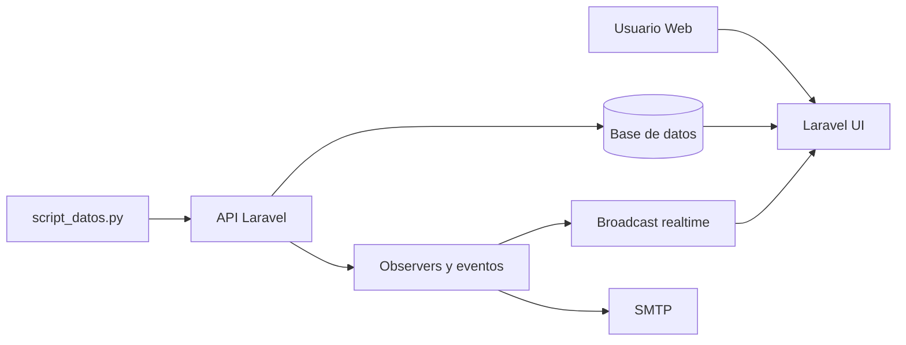
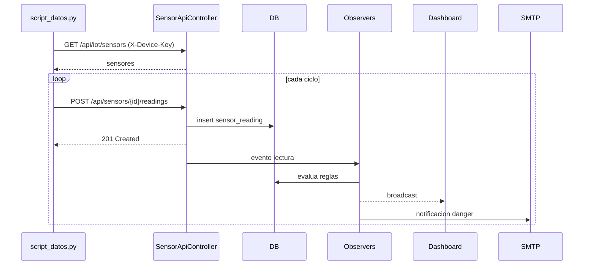
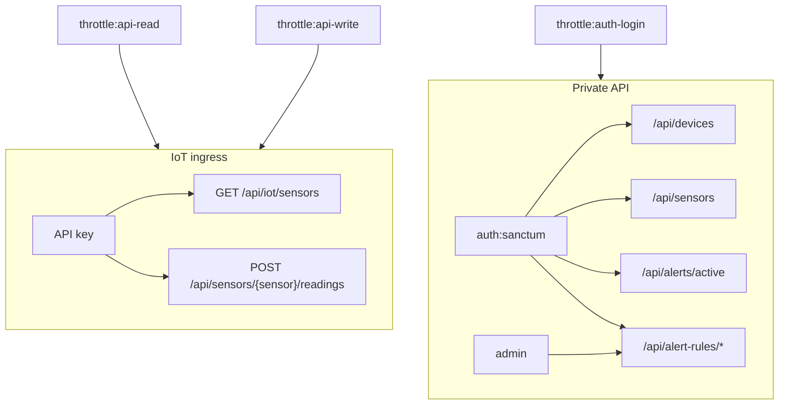
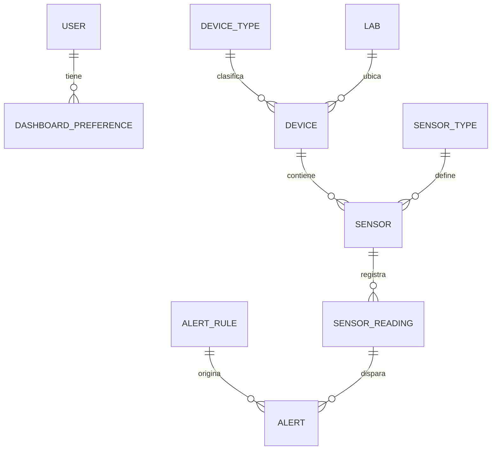

# Documentacion integral - IoT Platform v2

Documento tecnico y funcional del estado real del sistema.
Fecha de verificacion en codigo: 2026-04-26.

## 1. Objetivo del sistema

IoT Platform v2 permite operar un entorno IoT desde web y API:

- Registrar dispositivos, sensores, tipos y laboratorios.
- Ingerir lecturas de sensores via API.
- Evaluar reglas de umbral para generar alertas.
- Visualizar estado en dashboard en tiempo real.
- Enviar correo para alertas de severidad `danger`.

## 2. Alcance actual

### 2.1 Incluido

- Aplicacion Laravel 12 con UI Blade.
- API autenticada con Sanctum.
- Superficie IoT key-based para simuladores/dispositivos.
- Control de permisos con `is_admin` + middleware `admin`.
- Logging estructurado en API y simulador.
- Rate limiting por tipo de operacion.
- Pruebas unitarias/feature enfocadas en reglas, seguridad y regresiones.

### 2.2 Fuera de alcance (actual)

- Multi-tenant.
- Integracion nativa con MQTT/AMQP.
- Motor de analitica predictiva.
- Notificaciones SMS/WhatsApp/Push.

## 3. Usuarios y permisos

### 3.1 Usuario estandar

- Acceso al dashboard y modulos de consulta autenticados.
- No puede ejecutar operaciones administrativas.

### 3.2 Administrador

- Gestion completa de catalogos y configuracion.
- Gestion de reglas de alerta.
- Cambio de roles de usuario.
- Acceso a endpoints API protegidos por middleware `admin`.

## 4. Arquitectura

### 4.1 Capas

- Presentacion: Blade + JS dashboard.
- Aplicacion: controllers web/API + middleware.
- Dominio: modelos, servicios, observers, eventos.
- Infraestructura: BD, cache, broadcast, SMTP.

### 4.2 Componentes

- Backend Laravel.
- API REST.
- Simulador Python (`script_datos.py`).
- Base de datos relacional.
- Broadcast realtime.
- Correo SMTP configurable.

### 4.3 Diagrama de componentes



## 5. Flujo operativo end-to-end

1. Se inicia backend con `php artisan serve`.
2. El simulador obtiene sensores con `GET /api/iot/sensors` enviando `X-Device-Key`.
3. El simulador envia lecturas periodicas a `POST /api/sensors/{sensor}/readings`.
4. API valida payload, API key y estado del dispositivo.
5. Se persiste `sensor_readings`.
6. Se dispara evento `NewSensorReading`.
7. `SensorReadingObserver` evalua reglas y crea alertas.
8. `AlertObserver` emite `NewAlertTriggered` y envia email si corresponde.
9. Dashboard consume datos y alertas actualizadas.

### 5.1 Diagrama de secuencia



## 6. API real y control de acceso

### 6.1 Rutas IoT (sin sesion, con API key)

- `GET /api/iot/sensors`
- `POST /api/sensors/{sensor}/readings`

### 6.2 Rutas autenticadas (`auth:sanctum`)

- `GET /api/auth/me`
- `POST /api/auth/logout`
- `GET /api/devices`
- `GET /api/devices/{device}`
- `POST /api/devices/{device}/status` (`admin`)
- `GET /api/sensors`
- `GET /api/sensors/{sensor}/readings`
- `GET /api/sensors/{sensor}/latest-readings`
- `GET /api/alerts/active`
- `GET /api/devices/{device}/sensor-list`
- `GET /api/devices/{device}/sensors`
- `GET /api/sensors/all/readings`
- `GET/POST/DELETE /api/alert-rules/*` (`admin`)

### 6.3 Rutas de autenticacion API

- `POST /api/auth/login` (throttle `auth-login`)

### 6.4 Diagrama de seguridad por superficie



## 7. Seguridad (estado real del codigo)

### 7.1 Controles implementados

- Autenticacion API con Sanctum en `AuthApiController`.
- Ability de token segun rol: admin `*`, usuario `read`.
- Middleware `admin` para endpoints sensibles.
- Validacion fuerte de payloads en `SensorApiController` y `DeviceApiController`.
- Rechazo de valores no finitos y formatos inesperados.
- Verificacion de `status` e `is_active` antes de aceptar telemetria.
- Actualizacion consistente de estado de dispositivo en API (`status` + `is_active`).
- Rate limits configurados en `AppServiceProvider`.
- Limite `api-read`: 120 req/min.
- Limite `api-write`: 60 req/min.
- Limite `auth-login`: 5 req/min por email+ip.
- Logging global de excepciones API en `bootstrap/app.php`.
- Proteccion anti elevacion de privilegios en `User`.
- `is_admin` no es mass assignable.
- Cambios de `is_admin` requieren actor admin autenticado.

### 7.2 Evidencia en pruebas

- `tests/Feature/IotApiKeyAccessTest.php`
- `tests/Feature/ApiAuthTokenTest.php`
- `tests/Feature/SecurityRateLimitTest.php`
- `tests/Feature/SecurityAccessControlTest.php`
- `tests/Feature/SecuritySqlInjectionTest.php`
- `tests/Feature/SecurityPrivilegeEscalationTest.php`
- `tests/Feature/ApiRoutingRegressionTest.php`
- `tests/Feature/DeviceApiStatusUpdateTest.php`

### 7.3 Riesgos y gaps abiertos

- `database/seeders/SystemSettingsSeeder.php` contiene credenciales SMTP reales.
- `script_datos.py` mantiene `DEFAULT_API_KEY` vacia como fallback; en produccion debe eliminarse fallback y fallar temprano.
- Los artefactos `docs/api/openapi.yaml` y Postman pueden quedar desfasados si no se regeneran junto a cambios de rutas.
- Para ambientes productivos, falta documentar formalmente politicas de rotacion de claves, TLS obligatorio y gestion de secretos.

## 8. Observabilidad y manejo de errores

### 8.1 Backend

- `SensorApiController`: logs `info`, `warning`, `error` para ingesta y validaciones.
- `DeviceApiController`: logs `info`, `warning`, `error` para consultas y cambios de estado.
- `bootstrap/app.php`: logging global de excepciones API.
- Severidad `warning`: `ValidationException`, `BadRequestHttpException`.
- Severidad `error`: `QueryException`.
- Severidad `critical`: `PDOException`.

### 8.2 Simulador

`script_datos.py` registra:

- Inicio de simulacion y carga de sensores.
- Errores de red (`Timeout`, `ConnectionError`).
- Errores de formato inesperado en respuestas.
- Rechazos API `401`, `403`, `422`, `429`.
- Errores servidor `5xx`.

Ubicaciones:

- Laravel: `storage/logs/laravel.log`
- Simulador: consola

## 9. Guia tecnica de instalacion y uso

### 9.1 Requisitos

- PHP 8.2+
- Composer
- Node.js 20+
- npm
- Python 3.10+
- pip

### 9.2 Instalacion

```bash
composer install
npm install
cp .env.example .env
php artisan key:generate
php artisan migrate --seed
```

### 9.3 Ejecucion

Terminal 1:

```bash
php artisan serve
```

Terminal 2:

```bash
pip install requests
python script_datos.py
```

### 9.4 Variables de entorno criticas

- `API_KEY`
- `APP_URL`
- `DB_CONNECTION`, `DB_HOST`, `DB_PORT`, `DB_DATABASE`, `DB_USERNAME`, `DB_PASSWORD`
- `BROADCAST_DRIVER`, `PUSHER_APP_KEY`, `PUSHER_APP_CLUSTER`
- `IOT_BASE_URL`, `IOT_API_KEY`, `IOT_LOG_LEVEL`

## 10. Modelo de datos

Entidades principales:

- `users`
- `device_types`
- `labs`
- `devices`
- `sensor_types`
- `sensors`
- `sensor_readings`
- `alert_rules`
- `alerts`
- `device_status_logs`
- `dashboard_preferences`
- `system_settings`

### 10.1 Diagrama ER simplificado



## 11. Calidad, pruebas y mantenibilidad

Fortalezas actuales:

- Separacion por capas y responsabilidades.
- Side effects desacoplados (observers/eventos).
- Cobertura de seguridad y regresion en feature tests.
- Endpoints y reglas con validaciones explicitas.

Comando de pruebas:

```bash
php artisan test
```

## 12. Estructura relevante del repositorio

- `app/Http/Controllers` - logica web y API.
- `app/Models` - dominio y relaciones.
- `app/Observers` - automatizacion de alertas y correo.
- `app/Events` y `app/Listeners` - flujo reactivo.
- `app/Providers/AppServiceProvider.php` - rate limiting.
- `bootstrap/app.php` - middleware y excepciones.
- `routes/web.php` y `routes/api.php` - superficie HTTP.
- `database/migrations` y `database/seeders` - esquema y datos base.
- `tests` - pruebas automatizadas.
- `script_datos.py` - simulador IoT.

## 13. Resumen ejecutivo

El sistema esta funcional para operacion IoT interna y demos tecnicas: ingesta, monitoreo, alertas y notificaciones. El nivel de seguridad es bueno para entorno controlado (Sanctum, middleware admin, rate limit, validacion y logs), pero para un despliegue productivo formal deben cerrarse gaps de secretos, documentacion API sincronizada y politicas operativas de seguridad.
