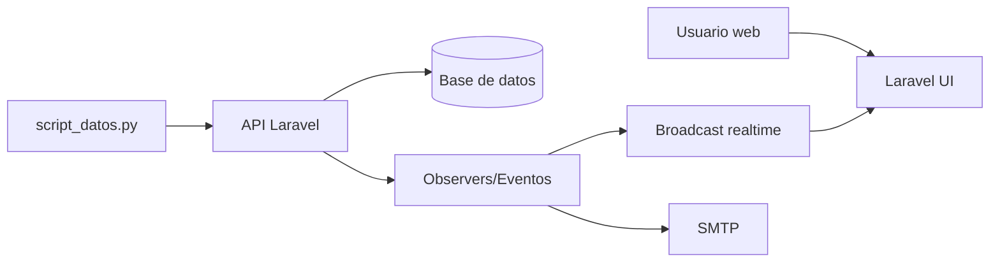

# Documentacion Tecnica Formal - IoT Platform v2

Autor: Equipo de desarrollo IoT Platform v2  
Institucion: Universidad Autonoma de Bucaramanga (UNAB)  
Ciudad: Bucaramanga  
Ano: 2026  
Fecha de verificacion de codigo: 2026-05-08

## Tabla de contenido

1. Introduccion
2. Objetivos
3. Alcance
4. Marco normativo y metodologico
5. Arquitectura del sistema
6. Flujo operativo y API
7. Seguridad y controles
8. Calidad y pruebas
9. Riesgos y limitaciones
10. Conclusiones
11. Bibliografia
12. Anexos

## 1. Introduccion

IoT Platform v2 es una plataforma para gestion de dispositivos y sensores IoT, ingesta de telemetria, evaluacion de reglas de alerta y visualizacion operativa en tiempo real. El proyecto integra backend Laravel, interfaz web y simulador Python para emular trafico de dispositivos.

Esta version del documento fue normalizada para evaluacion academica y posible uso como base de articulo cientifico, con alineacion a lineamientos ICONTEC e ISO.

## 2. Objetivos

### 2.1 Objetivo general

Documentar el estado tecnico real del sistema IoT Platform v2 con trazabilidad de arquitectura, seguridad, calidad y cumplimiento normativo.

### 2.2 Objetivos especificos

1. Describir alcance funcional y limites actuales.
2. Registrar arquitectura y flujo operativo extremo a extremo.
3. Evidenciar controles de seguridad implementados.
4. Relacionar practicas del repositorio con normas ICONTEC e ISO.
5. Consolidar base documental verificable para revision cientifica.

## 3. Alcance

### 3.1 Incluido

- Aplicacion Laravel 12 con UI Blade.
- API protegida por Sanctum y rutas IoT con API key.
- Pipeline de alertas con observers y eventos.
- Simulador `script_datos.py` para carga de lecturas.
- Suite de pruebas en `tests/` y `tests_python/`.

### 3.2 Excluido

- Certificacion formal ISO por organismo acreditado.
- Integracion nativa MQTT/AMQP.
- Analitica predictiva avanzada.
- Modelo multi-tenant.

## 4. Marco normativo y metodologico

### 4.1 Marco ICONTEC

El documento usa estructura formal y criterio de referencias conforme a:

- NTC 1486 (presentacion de trabajos).
- NTC 5613 (referencias bibliograficas).
- NTC 4490 (fuentes electronicas).

### 4.2 Marco ISO de alineacion tecnica

Se declara alineacion con:

- ISO 9001:2015 (gestion de calidad).
- ISO/IEC 27001:2022 (seguridad de la informacion).
- ISO/IEC 25010:2023 (calidad de producto software).
- ISO/IEC/IEEE 29148:2018 (ingenieria de requisitos).
- ISO/IEC/IEEE 12207:2026 (procesos de ciclo de vida).

La trazabilidad detallada se mantiene en `docs/MATRIZ_TRAZABILIDAD_ICONTEC_ISO.md`.

### 4.3 Metodologia de verificacion

1. Lectura de rutas, controladores, servicios, middleware y observadores.
2. Revision de configuracion, scripts y pruebas automatizadas.
3. Contraste entre comportamiento implementado y documentacion.
4. Consolidacion de evidencias con rutas de archivo.

## 5. Arquitectura del sistema

### 5.1 Capas

- Presentacion: Blade + JavaScript.
- Aplicacion: controladores web/API y middleware.
- Dominio: modelos, servicios, observers y eventos.
- Infraestructura: base de datos, cache, broadcast y SMTP.

### 5.2 Componentes principales

- Backend Laravel (`app/`, `routes/`).
- Persistencia relacional (`database/`).
- Simulador IoT (`script_datos.py`).
- Vistas dashboard (`resources/views/dashboard`).

### 5.3 Diagrama de componentes

## 6. Flujo operativo y API

### 6.1 Flujo operativo

1. Inicio de backend con `php artisan serve`.
2. Descubrimiento de sensores por `GET /api/iot/sensors`.
3. Ingesta por `POST /api/sensors/{sensor}/readings`.
4. Persistencia de lecturas y evaluacion de reglas.
5. Emision de alertas, eventos y notificacion de correo.

### 6.2 Control de acceso

- Superficie IoT: API key.
- Superficie privada: `auth:sanctum`.
- Operaciones administrativas: middleware `admin`.
- Rate limits por tipo de operacion (`api-read`, `api-write`, `auth-login`).

### 6.3 Endpoints representativos

- `POST /api/auth/login`
- `GET /api/auth/me`
- `GET /api/iot/sensors`
- `POST /api/sensors/{sensor}/readings`
- `GET /api/alerts/active`

## 7. Seguridad y controles

### 7.1 Controles implementados

- Validacion de payload y tipos.
- Verificacion de estado de dispositivo antes de aceptar telemetria.
- Control de privilegios por rol y middleware.
- Registro estructurado de eventos y excepciones.
- Restriccion de tasa por ventana temporal.

### 7.2 Evidencia de pruebas de seguridad

- `tests/Feature/SecurityAccessControlTest.php`
- `tests/Feature/SecurityRateLimitTest.php`
- `tests/Feature/SecuritySqlInjectionTest.php`
- `tests/Feature/SecurityPrivilegeEscalationTest.php`

### 7.3 Brechas vigentes

- Gestion de secretos pendiente de endurecimiento para produccion.
- Necesidad de politica formal de rotacion de llaves.
- Reforzar sincronizacion continua de especificacion API.

## 8. Calidad y pruebas

### 8.1 Practicas de calidad

- Formateo y consistencia de codigo con herramientas del ecosistema Laravel.
- Pruebas funcionales y de regresion automatizadas.
- Uso de servicios para desacoplar logica de negocio.

### 8.2 Alineacion con ISO/IEC 25010

- Adecuacion funcional: endpoints y casos de uso implementados.
- Confiabilidad: observabilidad y manejo de errores.
- Seguridad: autenticacion, autorizacion y limitacion de peticiones.
- Mantenibilidad: estructura por capas y modularizacion.

## 9. Riesgos y limitaciones

1. Dependencia de configuracion correcta de entorno para seguridad operativa.
2. Posible desfase entre rutas reales y artefactos externos (OpenAPI/Postman).
3. Falta de proceso formal de certificacion externa para normas ISO.

## 10. Conclusiones

1. El sistema es funcional para escenarios academicos y de laboratorio con trazabilidad tecnica suficiente.
2. Existe base de cumplimiento documental ICONTEC e integracion de criterios ISO por alineacion.
3. Para publicacion cientifica robusta, se recomienda anexar metricas experimentales y resultados de desempeno reproducibles.

## 11. Bibliografia

INSTITUTO COLOMBIANO DE NORMAS TECNICAS Y CERTIFICACION (ICONTEC). NTC 1486: documentacion, presentacion de trabajos escritos. Bogota: ICONTEC.

INSTITUTO COLOMBIANO DE NORMAS TECNICAS Y CERTIFICACION (ICONTEC). NTC 5613: referencias bibliograficas, contenido, forma y estructura. Bogota: ICONTEC.

INSTITUTO COLOMBIANO DE NORMAS TECNICAS Y CERTIFICACION (ICONTEC). NTC 4490: referencias documentales para fuentes de informacion electronicas. Bogota: ICONTEC.

INTERNATIONAL ORGANIZATION FOR STANDARDIZATION (ISO). ISO 9001:2015. Quality management systems - Requirements. Geneva: ISO, 2015.

INTERNATIONAL ORGANIZATION FOR STANDARDIZATION (ISO); INTERNATIONAL ELECTROTECHNICAL COMMISSION (IEC). ISO/IEC 27001:2022. Information security, cybersecurity and privacy protection - Information security management systems - Requirements. Geneva: ISO, 2022.

INTERNATIONAL ORGANIZATION FOR STANDARDIZATION (ISO); INTERNATIONAL ELECTROTECHNICAL COMMISSION (IEC). ISO/IEC 25010:2023. Systems and software engineering - Systems and software Quality Requirements and Evaluation (SQuaRE) - Product quality model. Geneva: ISO, 2023.

INTERNATIONAL ORGANIZATION FOR STANDARDIZATION (ISO); INSTITUTE OF ELECTRICAL AND ELECTRONICS ENGINEERS (IEEE). ISO/IEC/IEEE 29148:2018. Systems and software engineering - Life cycle processes - Requirements engineering. Geneva: ISO, 2018.

INTERNATIONAL ORGANIZATION FOR STANDARDIZATION (ISO); INTERNATIONAL ELECTROTECHNICAL COMMISSION (IEC); INSTITUTE OF ELECTRICAL AND ELECTRONICS ENGINEERS (IEEE). ISO/IEC/IEEE 12207:2026. Systems and software engineering - Software life cycle processes. Geneva: ISO, 2026.

## 12. Anexos

- Anexo A. Matriz de trazabilidad normativa: `docs/MATRIZ_TRAZABILIDAD_ICONTEC_ISO.md`.
- Anexo B. Especificacion API: `docs/api/openapi.yaml`.
