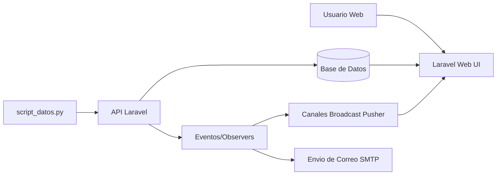
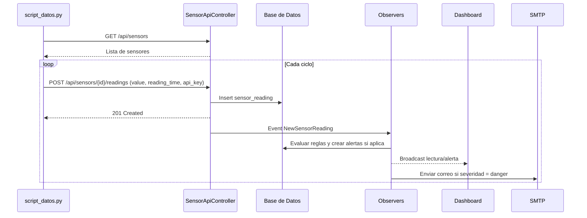

# Documentacion Integral del Proyecto IoT Platform v2

Documento tecnico-funcional del sistema, orientado a:

- Equipo tecnico (desarrollo, soporte, QA, operaciones).
- Usuarios funcionales (operadores del dashboard y administradores).
- Stakeholders del proyecto (alcance, capacidades y limites actuales).

## 1. Para que sirve el programa

IoT Platform v2 es una plataforma web para monitorear infraestructura IoT en laboratorios/areas operativas.

El sistema permite:

- Registrar dispositivos, sensores, tipos y ubicaciones (laboratorios).
- Recibir lecturas de sensores desde API.
- Visualizar datos en dashboard en tiempo real.
- Evaluar reglas de alerta por umbral.
- Crear alertas automaticas y gestionar su ciclo (activa/resuelta).
- Enviar correo cuando la severidad de alerta es `danger`.
- Configurar parametros generales, correo y roles de usuario.

## 2. Alcance

### 2.1 Alcance incluido (estado actual)

- Backend Laravel 12 con vistas Blade.
- Modulo de autenticacion web.
- Control de permisos por rol (`is_admin`).
- CRUD de dispositivos y sensores.
- CRUD de reglas de alerta.
- Configuracion del sistema en BD (`system_settings`).
- Simulacion de datos con `script_datos.py`.
- API para ingestar y consultar lecturas.
- Broadcast de eventos para actualizacion de dashboard.
- Pruebas unitarias y funcionales en Laravel.

### 2.2 Fuera de alcance actual

- Multi-tenant.
- Integracion nativa con brokers IoT (MQTT, AMQP).
- Motor avanzado de analitica predictiva.
- Alertamiento por SMS/WhatsApp/Push (solo email implementado).
- Hardening de seguridad para despliegue empresarial listo para produccion sin ajustes.

## 3. Tipos de usuario y permisos

### 3.1 Usuario estandar

- Puede autenticarse y entrar al dashboard.
- Puede consultar dispositivos, sensores, alertas y configuracion.
- No puede ejecutar acciones administrativas.

### 3.2 Administrador (`is_admin = true`)

- Puede crear/editar/eliminar dispositivos.
- Puede crear/editar/eliminar sensores.
- Puede crear/editar/eliminar tipos de sensores.
- Puede crear/editar/eliminar tipos de dispositivos.
- Puede crear/editar/eliminar laboratorios.
- Puede crear/editar/eliminar reglas de alerta.
- Puede gestionar configuracion general y de email.
- Puede cambiar roles de usuarios.

## 4. Arquitectura general

### 4.1 Capas del sistema

- Presentacion: Blade + Bootstrap + Chart.js + JS del dashboard.
- Aplicacion: Controllers web y API en `app/Http/Controllers`.
- Dominio: Modelos, servicios, observers y eventos.
- Infraestructura: MySQL/SQLite (segun `.env`), migrations, seeders, cache.

### 4.2 Componentes principales

- App web Laravel.
- API REST para sensores/dispositivos.
- Script simulador Python (`script_datos.py`).
- Base de datos relacional.
- Broadcast real-time (Pusher).
- Servicio de email (SMTP configurable en `system_settings`).

### 4.3 Diagrama de arquitectura



## 5. Como funciona el sistema (flujo end-to-end)

### 5.1 Flujo operativo principal

1. Se inicia Laravel (`php artisan serve`).
2. El script `script_datos.py` consulta sensores disponibles por API.
3. El script envia lecturas periodicas por `POST /api/sensors/{sensor}/readings`.
4. Laravel valida `api_key`, estado del dispositivo y formato de datos.
5. Se guarda la lectura en `sensor_readings`.
6. Se dispara evento `NewSensorReading` para tiempo real.
7. `SensorReadingObserver` evalua reglas (`checkForAlert`).
8. Si aplica una regla, se crea registro en `alerts`.
9. `AlertObserver` emite `NewAlertTriggered` y, si la severidad es `danger`, envia correo.
10. Dashboard actualiza graficos/alertas via canal realtime o fallback por polling.

### 5.2 Diagrama de flujo funcional



## 6. Modulos funcionales

### 6.1 Dashboard

- Resume totales clave (dispositivos, activos, alertas activas).
- Grafica principal con seleccion de dispositivo/sensor.
- Monitores adicionales configurables por usuario.
- Actualizacion realtime cuando Pusher esta disponible.
- Persistencia de layout por usuario (`dashboard_preferences`).

### 6.2 Dispositivos

- CRUD de dispositivos.
- Campos: nombre, serial, tipo, laboratorio, IP, MAC, estado.
- Cambio de estado con registro historico (`device_status_logs`).
- Registro de ultima comunicacion por evento `DeviceCommunicationReceived`.

### 6.3 Sensores

- CRUD de sensores asociados a un dispositivo y tipo.
- Consulta de lecturas historicas.
- Filtro por rango de fechas.
- Descarga JSON de lecturas por sensor.

### 6.4 Alertas

- Creacion automatica en base a reglas y lecturas.
- Vista de alertas activas y resueltas.
- Resolucion individual o masiva.
- Contador de no resueltas en sidebar.

### 6.5 Reglas de alerta

- Regla por tipo de sensor con alcance opcional a dispositivo/sensor.
- Umbral minimo y/o maximo.
- Severidad permitida: `info`, `warning`, `danger`.
- Validaciones de consistencia de umbrales.
- `max_value > min_value` cuando ambos existen.
- Debe existir al menos uno de `min_value` o `max_value`.

### 6.6 Configuracion del sistema

- Parametros generales: nombre app, URL, umbrales, intervalo.
- Estado de modulo de email.
- Configuracion persistente en `system_settings` (con cache).

### 6.7 Configuracion de email

- Configuracion SMTP completa via UI administrativa.
- Email de prueba desde la interfaz.
- Destinatario de alertas configurable (`mail_to`).

### 6.8 Gestion de roles

- Administrador puede promover/degradar usuarios.
- Basado en campo booleano `users.is_admin`.

## 7. Guia de usuario (operacion)

### 7.1 Flujo recomendado para operador

1. Iniciar sesion.
2. Ir a Dashboard.
3. Seleccionar dispositivo y sensor para monitoreo.
4. Revisar panel de alertas activas.
5. Ingresar a modulo Alertas para marcar resueltas.

### 7.2 Flujo recomendado para administrador

1. Verificar tipos de dispositivo/sensor y laboratorios.
2. Registrar dispositivos y sensores.
3. Configurar reglas de alerta por sensor/tipo.
4. Configurar correo SMTP y enviar prueba.
5. Ajustar parametros globales del sistema.
6. Asignar roles de usuario segun necesidad.

## 8. Guia tecnica

### 8.1 Requisitos

- PHP 8.2+
- Composer
- Node.js 20+
- npm
- Python 3.10+
- pip

### 8.2 Instalacion

```bash
composer install
npm install
cp .env.example .env
php artisan key:generate
php artisan migrate --seed
```

### 8.3 Ejecucion

Terminal 1:

```bash
php artisan serve
```

Terminal 2:

```bash
pip install requests
python script_datos.py
```

### 8.4 Variables de entorno criticas

- `APP_URL`
- `DB_CONNECTION`, `DB_HOST`, `DB_PORT`, `DB_DATABASE`, `DB_USERNAME`, `DB_PASSWORD`
- `API_KEY` (validacion de ingestion)
- `BROADCAST_DRIVER`, `PUSHER_APP_KEY`, `PUSHER_APP_CLUSTER`
- Variables de `mail` si se usan defaults de Laravel

### 8.5 Endpoints principales

- `GET /api/sensors`
- `POST /api/sensors/{sensor}/readings`
- `GET /api/sensors/{sensor}/latest-readings`
- `GET /api/devices`
- `GET /api/alerts/active`

Ejemplo de ingestion:

```bash
curl -X POST "http://127.0.0.1:8000/api/sensors/1/readings" \
  -H "Content-Type: application/json" \
  -d '{
    "value": 42.3,
    "reading_time": "2026-04-26 14:35:00",
    "api_key": "TU_API_KEY"
  }'
```

## 9. Modelo de datos principal

Entidades clave:

- users
- device_types
- labs
- devices
- sensor_types
- sensors
- sensor_readings
- alert_rules
- alerts
- device_status_logs
- dashboard_preferences
- system_settings

Relaciones principales:

- Un `device_type` tiene muchos `devices`.
- Un `lab` tiene muchos `devices`.
- Un `device` tiene muchos `sensors`.
- Un `sensor_type` tiene muchos `sensors`.
- Un `sensor` tiene muchas `sensor_readings`.
- Una `sensor_reading` puede disparar muchas `alerts`.
- Una `alert_rule` puede originar muchas `alerts`.

## 10. Seguridad y control de acceso

- Autenticacion web con Laravel Auth.
- Middleware `auth` para modulos internos.
- Middleware `admin` para operaciones administrativas.
- Ingestion de sensores protegida por `api_key` en payload.
- Validaciones server-side en controllers.

## 11. Pruebas automatizadas

Cobertura actual incluye:

- Permisos admin/no-admin.
- Creacion de dispositivos.
- Gestion de roles.
- Evaluacion de alertas por umbral.
- Envio de correo para alertas `danger`.

Comando:

```bash
php artisan test
```

## 12. Limitaciones y consideraciones tecnicas actuales

- `script_datos.py` tiene `API_KEY` hardcodeada; conviene externalizarla a variable de entorno para mayor seguridad.
- La mayoria de endpoints API (excepto `/api/user`) no usan `auth:sanctum`; hoy dependen de validaciones internas y/o `api_key` segun endpoint.
- Hay logica de realtime en vistas Blade y parte en recursos JS; se puede unificar para mantenimiento.
- La gestion de secretos SMTP en seeders no es adecuada para repositorios compartidos.

## 13. Estructura de carpetas relevante

- `app/Http/Controllers` - logica web/API.
- `app/Models` - entidades y relaciones.
- `app/Observers` - automatizacion de alertas y correo.
- `app/Events` y `app/Listeners` - eventos y respuestas.
- `app/Services` - servicios de dominio.
- `resources/views` - interfaz Blade.
- `routes/web.php` - rutas web.
- `routes/api.php` - rutas API.
- `database/migrations` - esquema.
- `database/seeders` - datos iniciales.
- `tests` - pruebas.
- `script_datos.py` - simulador IoT.

## 14. Resumen ejecutivo

En su estado actual, IoT Platform v2 ya cumple su objetivo central: monitorear sensores, generar alertas y notificar eventos criticos. El sistema es funcional para demostracion operativa y uso interno controlado. Para escalar a produccion, se recomienda fortalecer seguridad de secretos, estrategia de autenticacion API y estandarizacion de configuracion operativa.
