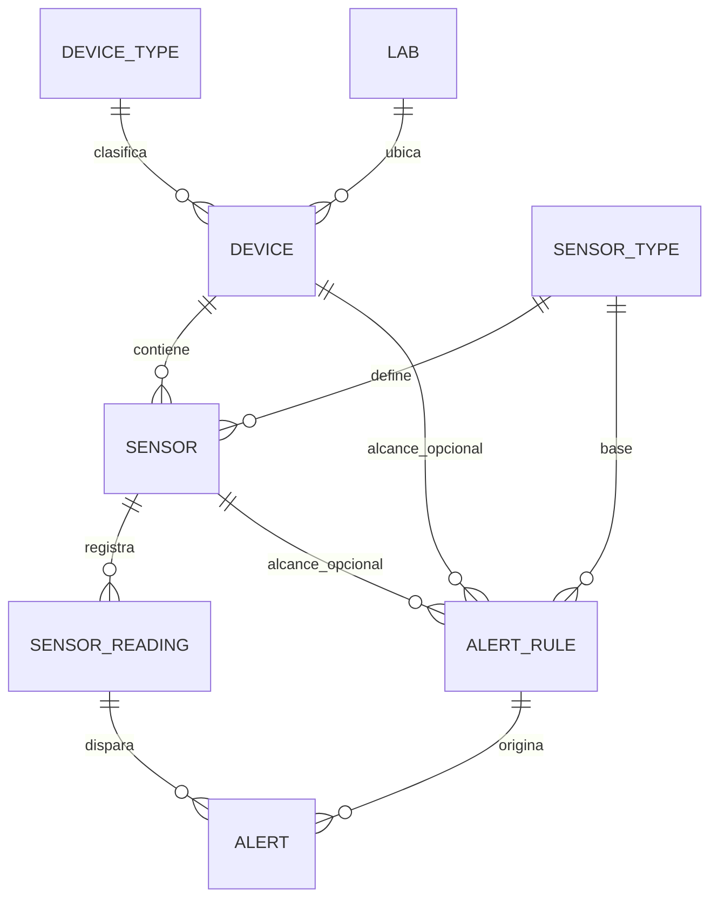

# IoT Platform v2

Plataforma de monitoreo IoT construida con Laravel 12 para gestionar dispositivos, sensores, lecturas y alertas en tiempo real.

## Estado actual del codigo

Actualmente el proyecto ya tiene implementado:

- Backend web y API con Laravel 12.
- Dashboard con monitoreo en tiempo real.
- Ingestion de lecturas por API (`/api/sensors/{sensor}/readings`).
- Generacion automatica de alertas desde lecturas (`SensorReadingObserver`).
- Notificaciones por correo para alertas `danger` (`AlertObserver`).
- Script Python `script_datos.py` para simular envio continuo de datos.

## Flujo principal de ejecucion

1. Levantas Laravel con `php artisan serve`.
2. Ejecutas `script_datos.py` para simular datos de sensores.
3. El script consulta sensores (`GET /api/sensors`) y envia lecturas (`POST /api/sensors/{id}/readings`).
4. Laravel guarda la lectura, emite evento en tiempo real y evalua reglas de alerta.
5. Si una regla aplica, se crea alerta; si es `danger`, intenta enviar correo.
6. El dashboard consume alertas/lecturas por API y canales broadcast.

## Como correr el proyecto

### Requisitos

- PHP 8.2+
- Composer
- Node.js 20+
- npm
- Python 3.10+
- pip

### Instalacion inicial

```bash
composer install
npm install
cp .env.example .env
php artisan key:generate
php artisan migrate --seed
```

### Variables de entorno importantes

En `.env` valida al menos:

- `API_KEY` (debe coincidir con la API key usada por `script_datos.py`).
- `DB_CONNECTION` y datos de base de datos.
- `BROADCAST_DRIVER` y variables de Pusher si quieres tiempo real por websocket.

Nota: el script usa por defecto `http://127.0.0.1:8000` como `IOT_BASE_URL`.
Nota: actualmente la API key del simulador esta en la variable `API_KEY` dentro de `script_datos.py`.

### Ejecucion diaria (orden recomendado)

Terminal 1:

```bash
php artisan serve
```

Terminal 2:

```bash
pip install requests
python script_datos.py
```

Con eso se empezaran a enviar lecturas cada pocos segundos y podras ver cambios en el dashboard.

## Endpoints clave hoy

- `GET /api/sensors` - listado de sensores para simulacion y dashboard.
- `POST /api/sensors/{sensor}/readings` - crea una lectura (requiere `api_key` en payload).
- `GET /api/sensors/{sensor}/latest-readings` - lecturas recientes por sensor.
- `GET /api/alerts/active` - alertas activas para dashboard.
- `GET /api/devices` - listado paginado de dispositivos.

## Diagrama Mermaid: relacion entre componentes

```mermaid
flowchart LR
    A[script_datos.py] -->|GET /api/sensors| B[SensorApiController@index]
    A -->|POST /api/sensors/{id}/readings| C[SensorApiController@storeReading]
    C --> D[(sensor_readings)]
    C --> E[Event NewSensorReading]
    D --> F[SensorReadingObserver]
    F --> G[SensorReading::checkForAlert]
    G --> H[(alerts)]
    H --> I[AlertObserver]
    I --> J[Event NewAlertTriggered]
    I --> K[Envio de correo si severity = danger]
    E --> L[Canal sensor.{id}]
    J --> M[Canal alerts]
    L --> N[Dashboard]
    M --> N
```

## Diagrama Mermaid: modelo de datos principal



## Archivos clave para este flujo

- `script_datos.py`
- `routes/api.php`
- `app/Http/Controllers/Api/SensorApiController.php`
- `app/Models/SensorReading.php`
- `app/Observers/SensorReadingObserver.php`
- `app/Observers/AlertObserver.php`
- `app/Events/NewSensorReading.php`
- `app/Events/NewAlertTriggered.php`

## Pruebas

```bash
php artisan test
```
