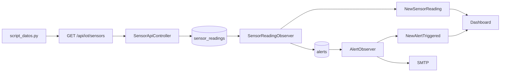
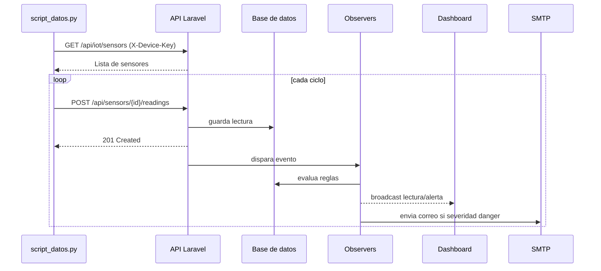
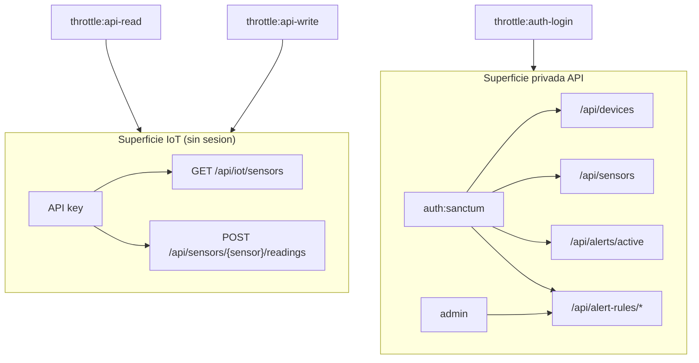
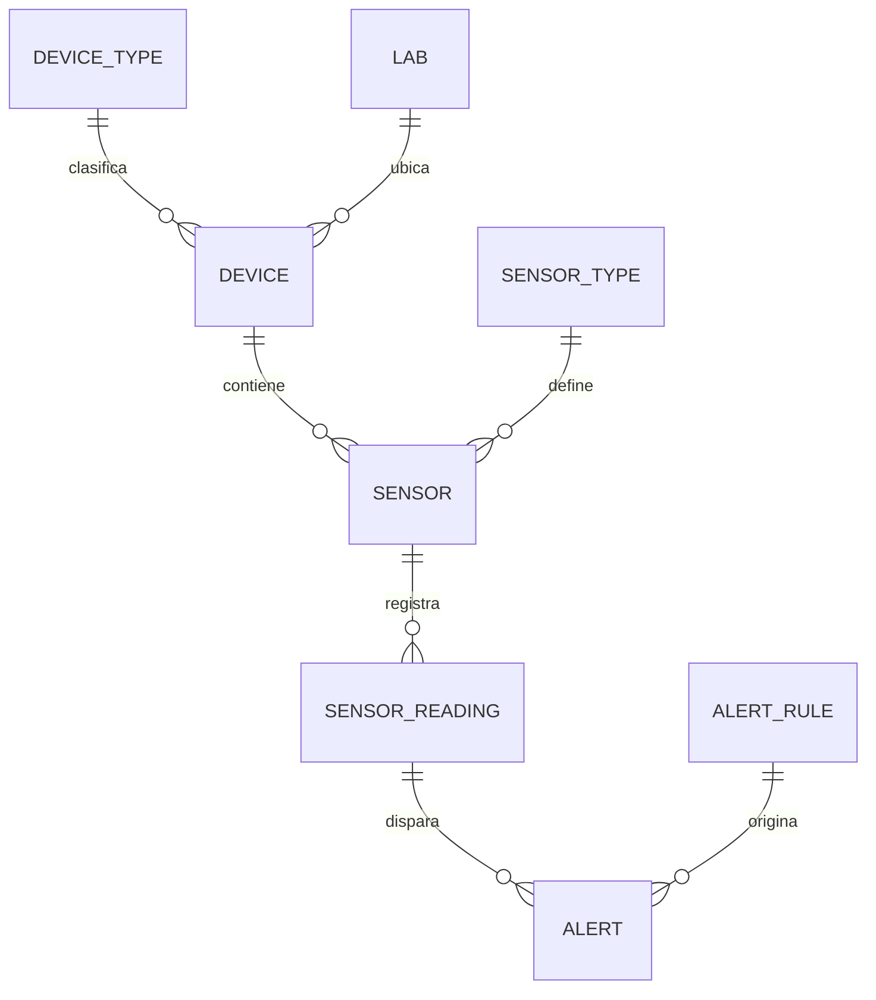

# IoT Platform v2

Plataforma IoT construida con Laravel 12 para operar dispositivos y sensores en tiempo real: ingesta de telemetria, evaluacion de reglas, generacion de alertas, visualizacion en dashboard y notificacion por correo.

## Estado real del codigo (verificado: 2026-04-26)

Implementado hoy en el repo:

- API Auth con Sanctum: `POST /api/auth/login`, `GET /api/auth/me`, `POST /api/auth/logout`.
- Flujo IoT sin sesion web con API key: `GET /api/iot/sensors` y `POST /api/sensors/{sensor}/readings`.
- API operativa protegida con `auth:sanctum` para dispositivos, sensores, alertas y consultas de dashboard.
- Endpoints criticos protegidos con middleware `admin`.
- Rate limiting diferenciado: `api-read`, `api-write`, `auth-login`.
- Logging estructurado en controladores API, excepciones globales y simulador Python.
- Observers/eventos para automatizar alertas y correo (`SensorReadingObserver`, `AlertObserver`).

## Como correr el proyecto

### Requisitos

- PHP 8.2+
- Composer
- Node.js 20+
- npm
- Python 3.10+
- pip

### Instalacion

```bash
composer install
npm install
cp .env.example .env
php artisan key:generate
php artisan migrate --seed
```

### Variables de entorno clave

- `API_KEY` (clave global para validacion IoT).
- `DB_CONNECTION`, `DB_HOST`, `DB_PORT`, `DB_DATABASE`, `DB_USERNAME`, `DB_PASSWORD`.
- `BROADCAST_DRIVER`, `PUSHER_APP_KEY`, `PUSHER_APP_CLUSTER`.
- `IOT_BASE_URL` (opcional, default `http://127.0.0.1:8000`).
- `IOT_API_KEY` (opcional; si existe, el simulador la prioriza sobre `API_KEY`).
- `IOT_LOG_LEVEL` (opcional, default `INFO`).

### Ejecucion diaria (orden recomendado)

Terminal 1:

```bash
php artisan serve
```

Terminal 2:

```bash
pip install requests
python script_datos.py
```

Opcional para assets en desarrollo:

```bash
npm run dev
```

## Arquitectura y funcionamiento

### Diagrama 1: flujo principal



### Diagrama 2: secuencia de ingesta



### Diagrama 3: fronteras de seguridad



### Diagrama 4: modelo de dominio



## API actual

### Endpoints IoT (API key)

- `GET /api/iot/sensors`
- `POST /api/sensors/{sensor}/readings`

### Endpoints protegidos por Sanctum

- `POST /api/auth/login`
- `GET /api/auth/me`
- `POST /api/auth/logout`
- `GET /api/devices`
- `GET /api/devices/{device}`
- `POST /api/devices/{device}/status` (`admin`)
- `GET /api/sensors`
- `GET /api/sensors/{sensor}/readings`
- `GET /api/sensors/{sensor}/latest-readings`
- `GET /api/alerts/active`
- `GET/POST/DELETE /api/alert-rules/*` (`admin`)

## Seguridad (estado real)

Controles implementados en codigo:

- Autenticacion API con Sanctum y tokens con abilities (`*` admin, `read` no admin).
- Autorizacion por rol con middleware `admin` en operaciones de administracion.
- Validacion estricta de payloads IoT (`value`, `reading_time`, `api_key`) y rechazo de campos inesperados con logs.
- Verificacion de estado de dispositivo antes de ingerir (`status` + `is_active`).
- Consistencia de estado al actualizar dispositivo: `DeviceApiController` sincroniza `status` e `is_active`.
- Rate limiting activo:
- limite `api-read`: 120 req/min por usuario o IP.
- limite `api-write`: 60 req/min por usuario o IP, sensor y huella de API key.
- limite `auth-login`: 5 req/min por email + IP.
- Manejo global de excepciones API (`ValidationException`, `BadRequestHttpException`, `QueryException`, `PDOException`) con severidad de log.
- Endurecimiento de privilegios en `User`: no permite elevar `is_admin` por mass assignment o updates no autorizados.

Riesgos pendientes detectados:

- `database/seeders/SystemSettingsSeeder.php` contiene credenciales SMTP reales. Deben rotarse y moverse a secretos de entorno.
- `script_datos.py` conserva `DEFAULT_API_KEY` vacia como fallback; en despliegue productivo conviene exigir variable obligatoria sin fallback.
- `docs/api/openapi.yaml` y Postman pueden quedar desfasados frente a rutas nuevas; conviene regenerarlos tras cada cambio de API.

## Observabilidad y logs

### Backend Laravel

- `SensorApiController`: logs `info`, `warning`, `error` para ingesta, payload inesperado, API key invalida y fallos de BD.
- `DeviceApiController`: logs de consulta, cambios de estado y errores.
- `bootstrap/app.php`: centraliza logs de excepciones API (warning/error/critical segun tipo).

### Simulador Python

- `script_datos.py`: logs de ciclo de simulacion, validacion de formato de sensores, errores de red, 401/403/422/429/5xx.

Ubicaciones:

- Laravel: `storage/logs/laravel.log`
- Simulador: salida consola

## Calidad tecnica y arquitectura

Se refleja una base de ingenieria limpia para evolucion:

- Capas claras: controllers, services, models, observers, events.
- Side effects desacoplados via observers/eventos (sin logica de alertas en vistas).
- Cobertura de pruebas funcionales en seguridad y regresiones de rutas/API.
- Correccion explicitamente cubierta por tests de regresion para evitar `/api/api/...`.

## Pruebas

```bash
php artisan test
```

## Archivos clave

- `routes/api.php`
- `app/Http/Controllers/Api/AuthApiController.php`
- `app/Http/Controllers/Api/SensorApiController.php`
- `app/Http/Controllers/Api/DeviceApiController.php`
- `app/Providers/AppServiceProvider.php`
- `bootstrap/app.php`
- `app/Models/User.php`
- `script_datos.py`
- `DOCUMENTACION_PROYECTO.md`
