# IoT Platform v2

Monorepo IoT con:

- `/back`: backend Laravel 12 como API REST + broadcasting.
- `/front`: SPA Vue 3 + Vite + Bootstrap 5.
- `/memory`: memoria tecnica persistente del refactor.
- `/docs`: documentacion funcional y normativa.

El sistema opera dispositivos y sensores en tiempo real: ingesta de telemetria, evaluacion de reglas, generacion de alertas, visualizacion en dashboard y notificacion por correo.

## Estado actual (verificado: 2026-05-13)

Implementado hoy en el repo:

- Backend separado fisicamente en `/back`.
- Frontend SPA separado fisicamente en `/front`.
- Blade legacy conservado temporalmente en `/back/resources/views`.
- Docker local implementado para desarrollo con `docker compose`.
- API Auth con Sanctum: `POST /api/auth/login`, `GET /api/auth/me`, `POST /api/auth/logout`.
- Flujo IoT sin sesion web con API key: `GET /api/iot/sensors` y `POST /api/sensors/{sensor}/readings`.
- API operativa protegida con `auth:sanctum` para dispositivos, sensores, alertas y consultas de dashboard.
- Endpoints criticos protegidos con middleware `admin`.
- Rate limiting diferenciado: `api-read`, `api-write`, `auth-login`.
- Logging estructurado en controladores API, excepciones globales y simulador Python.
- Observers/eventos para automatizar alertas y correo (`SensorReadingObserver`, `AlertObserver`).
- Frontend Vue con auth, dashboard, sensores, dispositivos, alertas, reglas, configuracion y realtime progresivo con fallback polling.

## Estructura

```text
/
  back/     Laravel API + Broadcasting + Blade legacy temporal
  front/    Vue 3 + Vite + Bootstrap 5 SPA
  memory/   Memoria tecnica del refactor
  docs/     Documentacion complementaria
```

## Cumplimiento Normativo para Revision Cientifica (actualizado: 2026-05-08)

El repositorio fue normalizado para evaluacion academica con enfoque de articulo cientifico, bajo:

- ICONTEC: NTC 1486, NTC 5613 y NTC 4490.
- ISO: ISO 9001:2015, ISO/IEC 27001:2022, ISO/IEC 25010:2023, ISO/IEC/IEEE 29148:2018, ISO/IEC/IEEE 12207:2026.

Documentos oficiales del marco:

- Politica de cumplimiento ICONTEC + ISO: `docs/ICONTEC_COMPLIANCE.md`
- Matriz de trazabilidad normativa: `docs/MATRIZ_TRAZABILIDAD_ICONTEC_ISO.md`
- Evidencia tecnica de codigo y estructura: `docs/EVIDENCIA_CUMPLIMIENTO_CODIGO_ESTRUCTURA.md`
- Procedimiento de auditoria interna: `docs/PROCEDIMIENTO_AUDITORIA_NORMATIVA.md`
- Plantilla base para entregables: `docs/PLANTILLA_TRABAJO_ICONTEC.md`
- Guia de referencias: `docs/REFERENCIAS_ICONTEC.md`
- Documentacion tecnica formal: `DOCUMENTACION_PROYECTO.md`
- Analisis tecnico formal: `ANALISIS_PROYECTO.md`

Declaracion de alcance:

- Se declara alineacion tecnica y documental con las normas listadas.
- No se declara certificacion ISO emitida por organismo acreditado.
- La evidencia de cumplimiento sobre codigo y estructura se mantiene con trazas por archivo/linea.

## Como correr el proyecto

### Requisitos

- PHP 8.2+
- Composer
- Node.js 20+
- npm
- Python 3.10+
- pip
- Docker + Docker Compose plugin (opcional para entorno containerizado)

### Backend

```bash
cd back
composer install
cp .env.example .env
php artisan key:generate
php artisan migrate
php artisan serve --host=127.0.0.1 --port=8000
```

### Frontend

```bash
cd front
npm install
cp .env.example .env
npm run dev
```

### Docker local

Stack por defecto:

```bash
docker compose build
docker compose up -d
docker compose ps
docker compose logs -f back
docker compose logs -f front
docker compose logs -f db
docker compose logs -f redis
```

Servicios:

- `back`: Laravel API + broadcasting en `http://localhost:8000`
- `front`: SPA Vue/Vite en `http://localhost:5173`
- `db`: MySQL 8 en `localhost:3306`
- `redis`: Redis 7 en `localhost:6379`
- `queue`: worker opcional bajo profile `queue`

Healthcheck backend:

```bash
curl http://localhost:8000/api/health
```

Migraciones dentro del contenedor backend:

```bash
docker compose exec back php artisan migrate --force
```

Tests backend dentro de Docker usando entorno de testing explicito:

```bash
docker compose exec back env \
  APP_ENV=testing \
  DB_CONNECTION=sqlite \
  DB_DATABASE=:memory: \
  CACHE_STORE=array \
  SESSION_DRIVER=array \
  QUEUE_CONNECTION=sync \
  APP_URL=http://localhost:8000 \
  FRONT_URL=http://localhost:5173 \
  php artisan test
```

Nota:

- `docker compose exec back php artisan test` usa el runtime normal de Compose y puede dar falsos negativos al heredar MySQL/Redis reales.
- Para una suite aislada y reproducible dentro del contenedor, usar el comando anterior con `APP_ENV=testing` y SQLite en memoria.

Build frontend dentro de Docker:

```bash
docker compose exec front npm run build
docker compose exec front npm run test:phase7
```

Worker de colas opcional:

```bash
docker compose --profile queue up -d queue
```

Estado actual de `queue`:

- El servicio esta definido y puede quedar `Up` con el profile `queue`.
- La validacion final se hizo repitiendo el mismo set de overrides de puertos del stack base.
- Sigue pendiente validar una carga de trabajo real de colas dentro del contenedor.

Si el stack se levanta con puertos alternos, el profile `queue` debe arrancarse repitiendo exactamente el mismo set de overrides:

```bash
COMPOSE_PROJECT_NAME=iotplatformv2 \
BACK_PORT=18000 \
FRONT_PORT=15173 \
MYSQL_PORT=13306 \
REDIS_PORT=16379 \
docker compose --profile queue up -d
```

Si los puertos `8000`, `5173`, `3306` o `6379` ya estan ocupados en el host, se pueden sobreescribir al arrancar:

```bash
COMPOSE_PROJECT_NAME=iotplatformv2 \
BACK_PORT=18000 \
FRONT_PORT=15173 \
MYSQL_PORT=13306 \
REDIS_PORT=16379 \
docker compose up -d
```

### Validaciones

Backend:

```bash
cd back
php artisan route:list --path=api
php artisan test
```

Frontend:

```bash
cd front
npm run build
npm run test:structure
npm run test:phase4
npm run test:phase5
npm run test:phase7
```

### Variables de entorno clave

- `back/.env`: secretos y configuracion del backend.
- `front/.env`: solo variables publicas `VITE_*`.
- `.env.example` en raiz: guia de orquestacion para Docker Compose.
- No poner secretos backend en el frontend.
- `IOT_API_KEY` o `API_KEY` para validacion IoT.
- `DB_CONNECTION`, `DB_HOST`, `DB_PORT`, `DB_DATABASE`, `DB_USERNAME`, `DB_PASSWORD`.
- `BROADCAST_DRIVER`, `PUSHER_APP_KEY`, `PUSHER_APP_CLUSTER`.
- `IOT_BASE_URL` (opcional, default `http://127.0.0.1:8000`).
- `IOT_API_KEY` (opcional; si existe, el simulador la prioriza sobre `API_KEY`).
- `IOT_LOG_LEVEL` (opcional, default `INFO`).
- No poner secretos en variables `VITE_*`.

### Ejecucion diaria (orden recomendado)

Terminal 1:

```bash
cd back
php artisan serve --host=127.0.0.1 --port=8000
```

Terminal 2:

```bash
cd front
npm run dev
```

Terminal 3:

```bash
pip install requests
python script_datos.py
```

### Ejecucion diaria con Docker (opcional)

```bash
docker compose up -d
docker compose ps
```

Para detener y limpiar contenedores/volumenes del stack local:

```bash
docker compose down -v
```

## Arquitectura y funcionamiento

### Diagrama 1: flujo principal

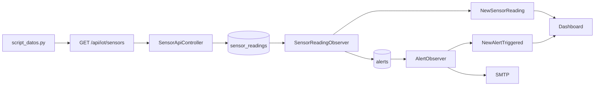

### Diagrama 2: secuencia de ingesta

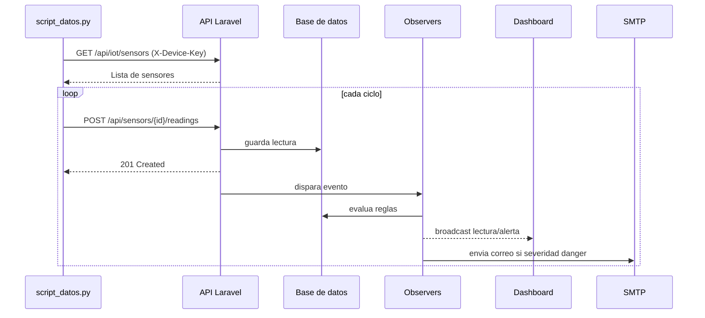

### Diagrama 3: fronteras de seguridad

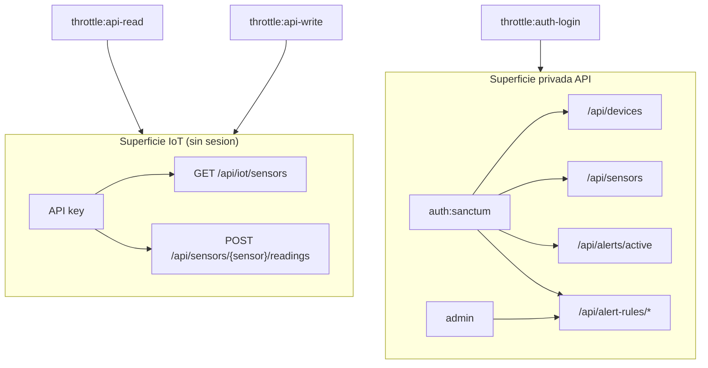

### Diagrama 4: modelo de dominio

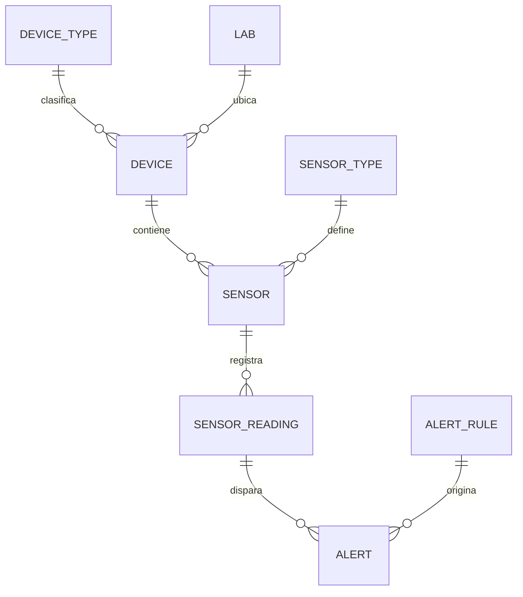

### Diagrama 5: arquitectura por capas

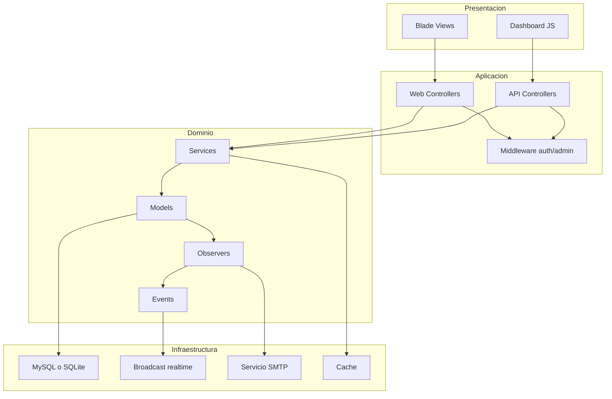

### Diagrama 6: flujo de permisos


### Diagrama 7: ciclo de vida de alerta

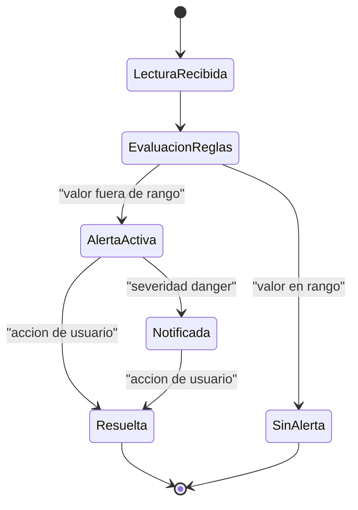

### Diagrama 8: flujo de ejecucion local


### Diagrama 9: mapa de rutas principales

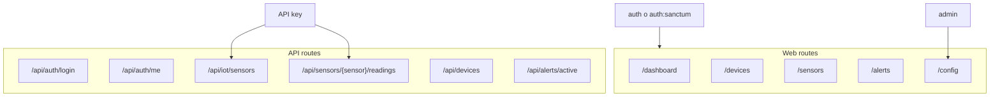

### Diagrama 10: flujo de autenticacion API (Sanctum)

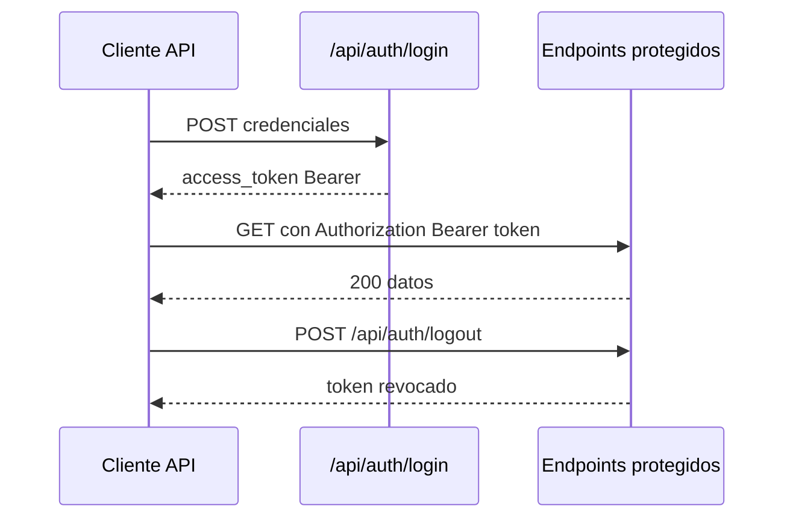

### Diagrama 11: C4 Context (sistema y actores)

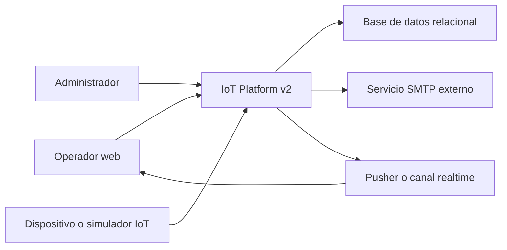

### Diagrama 12: C4 Container (contenedores internos)

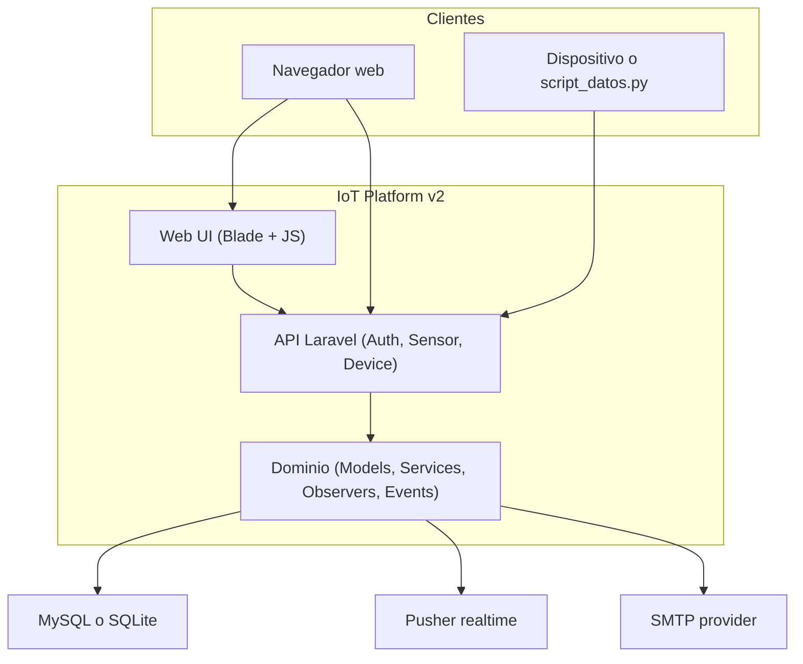

### Diagrama 13: decision flow de alertas

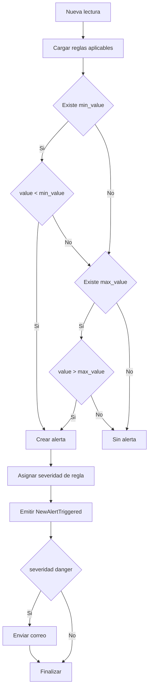

### Diagrama 14: manejo de fallos y respuestas esperadas

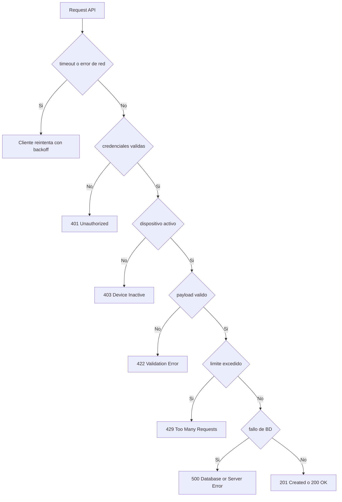

## API actual

### Endpoints IoT (API key)

- `GET /api/iot/sensors`
- `POST /api/sensors/{sensor}/readings`

### Endpoints protegidos por Sanctum

- `POST /api/auth/login`
- `GET /api/auth/me`
- `POST /api/auth/logout`
- `GET /api/devices`
- `GET /api/devices/{device}`
- `POST /api/devices/{device}/status` (`admin`)
- `GET /api/sensors`
- `GET /api/sensors/{sensor}/readings`
- `GET /api/sensors/{sensor}/latest-readings`
- `GET /api/alerts/active`
- `GET/POST/DELETE /api/alert-rules/*` (`admin`)

## Seguridad (estado real)

Controles implementados en codigo:

- Autenticacion API con Sanctum y tokens con abilities (`*` admin, `read` no admin).
- Autorizacion por rol con middleware `admin` en operaciones de administracion.
- Validacion estricta de payloads IoT (`value`, `reading_time`, `api_key`) y rechazo de campos inesperados con logs.
- Verificacion de estado de dispositivo antes de ingerir (`status` + `is_active`).
- Consistencia de estado al actualizar dispositivo: `DeviceApiController` sincroniza `status` e `is_active`.
- Rate limiting activo con limite `api-read`: 120 req/min por usuario o IP.
- Rate limiting activo con limite `api-write`: 60 req/min por usuario o IP, sensor y huella de API key.
- Rate limiting activo con limite `auth-login`: 5 req/min por email + IP.
- Manejo global de excepciones API (`ValidationException`, `BadRequestHttpException`, `QueryException`, `PDOException`) con severidad de log.
- Endurecimiento de privilegios en `User`: no permite elevar `is_admin` por mass assignment o updates no autorizados.

Riesgos pendientes detectados:

- `database/seeders/SystemSettingsSeeder.php` contiene credenciales SMTP reales. Deben rotarse y moverse a secretos de entorno.
- `script_datos.py` conserva `DEFAULT_API_KEY` vacia como fallback; en despliegue productivo conviene exigir variable obligatoria sin fallback.
- `docs/api/openapi.yaml` y Postman pueden quedar desfasados frente a rutas nuevas; conviene regenerarlos tras cada cambio de API.

## Observabilidad y logs

### Backend Laravel

- `SensorApiController`: logs `info`, `warning`, `error` para ingesta, payload inesperado, API key invalida y fallos de BD.
- `DeviceApiController`: logs de consulta, cambios de estado y errores.
- `bootstrap/app.php`: centraliza logs de excepciones API (warning/error/critical segun tipo).

### Simulador Python

- `script_datos.py`: logs de ciclo de simulacion, validacion de formato de sensores, errores de red, 401/403/422/429/5xx.

Ubicaciones:

- Laravel: `back/storage/logs/laravel.log`
- Simulador: salida consola

## Runbook de operacion

### Verificacion de salud

1. Verificar app viva:

```bash
curl -i http://127.0.0.1:8000/up
```

2. Verificar descubrimiento IoT:

```bash
curl -i -H "X-Device-Key: TU_API_KEY" http://127.0.0.1:8000/api/iot/sensors
```

3. Verificar login API:

```bash
curl -i -X POST http://127.0.0.1:8000/api/auth/login \
  -H "Content-Type: application/json" \
  -d '{"email":"admin@example.com","password":"secret"}'
```

### Verificacion de logs

```bash
tail -f back/storage/logs/laravel.log
```

En otra terminal, ejecutar el simulador para correlacionar eventos:

```bash
python script_datos.py
```

### Reinicios operativos

- Backend Laravel (`cd back && php artisan serve --host=127.0.0.1 --port=8000`): detener con `Ctrl+C` y volver a ejecutar.
- Frontend (`cd front && npm run dev`): detener con `Ctrl+C` y volver a ejecutar.
- Simulador (`script_datos.py`): detener con `Ctrl+C` y volver a ejecutar.
- Si hay problemas de cache/configuracion:

```bash
cd back
php artisan optimize:clear
php artisan config:clear
php artisan cache:clear
```

## Troubleshooting rapido

| Codigo | Causa probable | Como resolver |
|---|---|---|
| `401` | API key invalida o token Sanctum ausente/invalido | Validar `X-Device-Key` o `api_key`; renovar login en `/api/auth/login`; revisar expiracion o revocacion de token. |
| `403` | Dispositivo inactivo o usuario sin permisos `admin` | Confirmar `devices.status = true` y `is_active = true`; validar rol de usuario para endpoints administrativos. |
| `422` | Payload invalido o formato inesperado | Revisar campos requeridos (`value`, `api_key`) y formato de `reading_time` (`Y-m-d H:i:s`). |
| `429` | Rate limit excedido | Reducir frecuencia de envio, aplicar backoff exponencial, distribuir carga por lotes/sensores. |
| `500` | Error interno o de base de datos | Revisar `storage/logs/laravel.log`, conectividad BD, credenciales y estado del motor de BD. |

## Testing strategy

### Unit tests (logica aislada)

Cubren reglas de negocio sin depender del flujo HTTP completo:

- Evaluacion de alertas por umbrales.
- Reglas disparadas por lecturas.
- Comportamiento de servicios y modelos.

Ejemplos:

- `tests/Unit/SensorReadingAlertTest.php`
- `tests/Unit/SensorReadingTriggeredRulesTest.php`
- `tests/Unit/DeviceServiceTest.php`

### Feature tests (flujo end-to-end HTTP y seguridad)

Cubren rutas, middleware, validaciones, auth y regresiones:

- Acceso con API key en IoT.
- Login/token Sanctum y endpoints protegidos.
- Rate limiting, SQLi hardening, control de privilegios.
- Regresiones de rutas (`/api/api/...`) y consistencia de estado de dispositivo.

Ejemplos:

- `tests/Feature/IotApiKeyAccessTest.php`
- `tests/Feature/ApiAuthTokenTest.php`
- `tests/Feature/SecurityRateLimitTest.php`
- `tests/Feature/SecurityAccessControlTest.php`
- `tests/Feature/SecurityPrivilegeEscalationTest.php`

### Comandos recomendados

```bash
cd back
php artisan test
php artisan test --testsuite=Unit
php artisan test --testsuite=Feature
```

## Calidad tecnica y arquitectura

Se refleja una base de ingenieria limpia para evolucion:

- Capas claras: controllers, services, models, observers, events.
- Side effects desacoplados via observers/eventos (sin logica de alertas en vistas).
- Cobertura de pruebas funcionales en seguridad y regresiones de rutas/API.
- Correccion explicitamente cubierta por tests de regresion para evitar `/api/api/...`.

## Pruebas

```bash
cd back
php artisan test
```

## Archivos clave

- `back/routes/api.php`
- `back/app/Http/Controllers/Api/AuthApiController.php`
- `back/app/Http/Controllers/Api/SensorApiController.php`
- `back/app/Http/Controllers/Api/DeviceApiController.php`
- `back/app/Providers/AppServiceProvider.php`
- `back/bootstrap/app.php`
- `back/app/Models/User.php`
- `front/src/router/index.js`
- `front/src/stores/auth.js`
- `script_datos.py`
- `DOCUMENTACION_PROYECTO.md`
