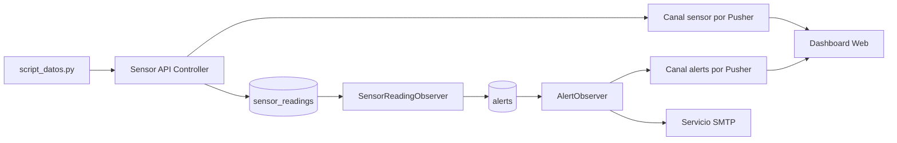
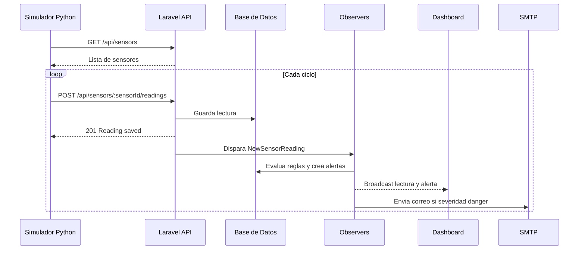
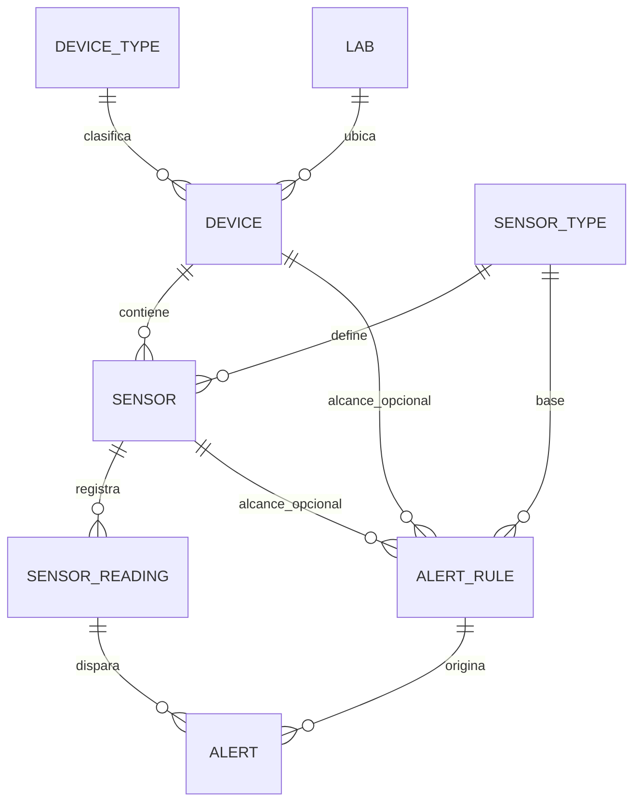
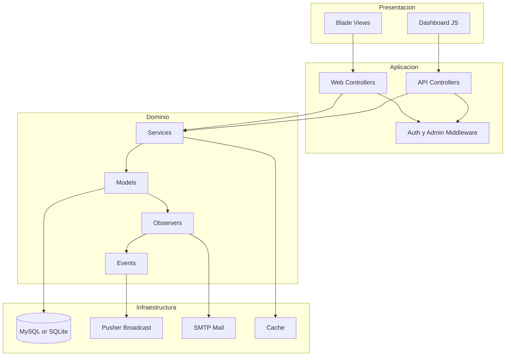
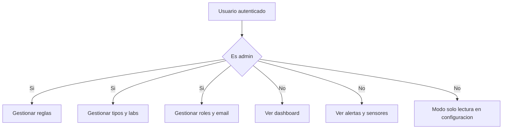
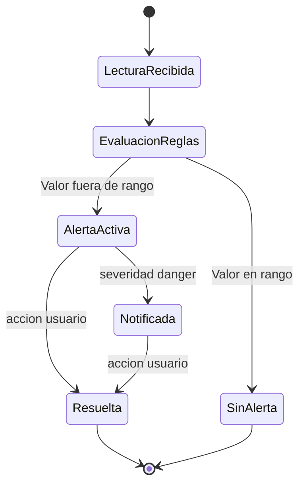
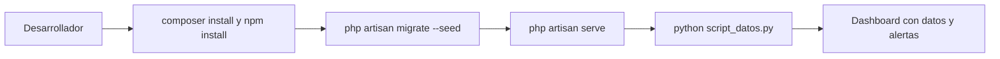
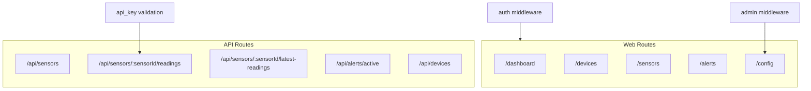

# IoT Platform v2

Plataforma de monitoreo IoT desarrollada con Laravel 12 para gestionar dispositivos, sensores, lecturas y alertas en tiempo real.

## Que resuelve este proyecto

Este repositorio implementa un sistema end-to-end para operacion IoT:

- Ingesta de telemetria desde sensores por API.
- Monitoreo visual en dashboard en tiempo real.
- Motor de alertas por reglas configurables.
- Notificacion por correo para eventos criticos.
- Gestion administrativa de catalogos, configuracion y roles.

En terminos de producto, permite pasar de "solo leer datos" a "operar con datos": detectar desbordes, reaccionar mas rapido y mantener trazabilidad de incidentes.

## Propuesta de valor tecnico

Este codigo refleja buenas practicas de ingenieria aplicadas a un caso real:

- Arquitectura por capas: controllers, servicios, modelos, observers, eventos.
- Separacion de responsabilidades: la logica de alertas vive en dominio/observers, no en vistas.
- Diseno orientado a eventos: lectura nueva -> evaluacion -> alerta -> broadcast -> email.
- Seguridad funcional: middleware `auth` y `admin`, validaciones de request, control de API key para ingesta.
- Mantenibilidad: configuracion centralizada en `system_settings`, pruebas automatizadas y estructura clara.

## Estado actual del sistema

Actualmente ya esta implementado:

- Backend web + API con Laravel 12.
- Dashboard con graficas y monitoreo en vivo.
- Ingesta de lecturas por `POST /api/sensors/:sensorId/readings`.
- Evaluacion automatica de reglas con `SensorReadingObserver`.
- Creacion de alertas y broadcast en canal `alerts`.
- Envio de correo para severidad `danger` via `AlertObserver`.
- Simulador Python (`script_datos.py`) para generar trafico de datos.

## Arquitectura y funcionamiento

### Diagrama 1: relacion de componentes



### Diagrama 2: flujo de datos y alertas



### Diagrama 3: modelo de dominio



### Diagrama 4: arquitectura por capas



### Diagrama 5: flujo de permisos



### Diagrama 6: ciclo de vida de una alerta



### Diagrama 7: flujo de ejecucion local



### Diagrama 8: mapa de rutas principales



## Como correr el proyecto

### Requisitos

- PHP 8.2+
- Composer
- Node.js 20+
- npm
- Python 3.10+
- pip

### Instalacion inicial

```bash
composer install
npm install
cp .env.example .env
php artisan key:generate
php artisan migrate --seed
```

### Variables de entorno clave

En `.env` valida al menos:

- `API_KEY` (debe coincidir con la usada por el simulador).
- `DB_CONNECTION` y credenciales de base de datos.
- `BROADCAST_DRIVER`, `PUSHER_APP_KEY`, `PUSHER_APP_CLUSTER` para tiempo real.

Notas:

- `script_datos.py` usa por defecto `IOT_BASE_URL=http://127.0.0.1:8000`.
- Actualmente el simulador define su `API_KEY` en el mismo archivo.

### Ejecucion diaria (orden recomendado)

Terminal 1:

```bash
php artisan serve
```

Terminal 2:

```bash
pip install requests
python script_datos.py
```

Opcional para assets en desarrollo:

```bash
npm run dev
```

## Endpoints principales

- `GET /api/sensors` - lista sensores para simulacion y dashboard.
- `POST /api/sensors/:sensorId/readings` - crea lectura (requiere `api_key` en payload).
- `GET /api/sensors/:sensorId/latest-readings` - ultimas lecturas por sensor.
- `GET /api/alerts/active` - alertas activas para dashboard.
- `GET /api/devices` - dispositivos paginados con metadatos.

## Calidad de codigo y arquitectura limpia

Estos puntos son utiles para explicar la calidad tecnica del repositorio en una entrevista o revision:

- Dominio encapsulado: `SensorReading::checkForAlert()` concentra reglas de disparo.
- Automatizacion desacoplada: `SensorReadingObserver` y `AlertObserver` manejan side effects.
- Eventos en tiempo real: `NewSensorReading` y `NewAlertTriggered` para UI reactiva.
- Servicios de aplicacion: `DashboardMetricsService` y `DeviceService` evitan controllers gordos.
- Roles y autorizacion: middleware `admin` con enforcement en rutas criticas.
- Configuracion dinamica: `SystemSetting` permite operar sin redeploy para ajustes funcionales.
- Pruebas orientadas a comportamiento: permisos, alertas y envio de correo.

## Estructura del repositorio

```text
app/
  Events/
  Http/Controllers/
  Http/Middleware/
  Listeners/
  Models/
  Observers/
  Services/
resources/views/
routes/
database/migrations/
database/seeders/
tests/
script_datos.py
```

## Archivos clave para entender el sistema

- `script_datos.py`
- `routes/api.php`
- `routes/web.php`
- `app/Http/Controllers/Api/SensorApiController.php`
- `app/Models/SensorReading.php`
- `app/Observers/SensorReadingObserver.php`
- `app/Observers/AlertObserver.php`
- `app/Services/DashboardMetricsService.php`
- `app/Services/DeviceService.php`

## Pruebas

```bash
php artisan test
```

## Resumen para quien llega al repo

Si eres reclutador, lider tecnico o miembro nuevo del equipo:

- Este proyecto no es solo CRUD: implementa flujo IoT real con eventos, alertas y operacion.
- Tiene base arquitectonica limpia para evolucionar (mas canales de notificacion, reglas avanzadas, integraciones externas).
- Muestra criterio de ingenieria en separacion de capas, automatizacion de procesos y enfoque en mantenibilidad.
