# IoT Platform v2

Monorepo para recibir telemetría IoT, persistirla, procesarla de forma asíncrona y presentar datos y alertas en una SPA. Este documento describe el árbol de trabajo y el código presentes el **11 de septiembre de 2026**; no sustituye una verificación de despliegue.

## Estado verificable

| Área | Hecho comprobable en el repositorio | Límite de la afirmación |
| --- | --- | --- |
| Interfaz | front/ contiene una SPA Vue 3 con rutas públicas de acceso y dashboard, y rutas autenticadas para sensores, dispositivos, alertas, administración y métricas. | La disponibilidad depende de que estén configurados API y transporte Pusher compatibles. |
| Superficie pública | Sólo GET /api/public/graph/bootstrap y GET /api/public/graph/sensors/{sensor}/series son operaciones anónimas de producto. El servidor filtra por sensors.public_monitoring_enabled. | GET /api/health es liveness de infraestructura, no una API de producto. |
| Datos privados | La serie de un sensor restringido se consulta autenticadamente en GET /api/sensors/{sensor}/series; alertas y estado de dispositivos se difunden por canales privados. | No existe ACL por sensor ni por alerta: el límite actual es estar autenticado. |
| Ingesta durable | La ruta de ingesta cruda escribe raw_sensor_events y raw_event_outboxes en una sola transacción. Debezium captura el binlog y los consumidores Redis Streams publican, normalizan y entregan eventos de dominio. | Requiere MySQL con binlog, Redis, Debezium y los workers del perfil Compose workers. |
| Validación ejecutada en esta sesión | npm.cmd run test:unit: 36 archivos, 184 pruebas correctas; npm.cmd run build: correcto; npm.cmd run audit:no-polling:source: correcto. | No se ejecutó la suite PHP en esta máquina: no hay binario php ni Docker disponible. |

La evidencia histórica de Docker, backend y navegador está en [docs/implementation/gate-10-evidence.md](docs/implementation/gate-10-evidence.md). El inventario fuente-a-evidencia y sus límites está en [docs/implementation/repository-state-2026-09-11.md](docs/implementation/repository-state-2026-09-11.md).

## Estructura

~~~
back/               Laravel 12: API, modelos, migraciones, consumidores y broadcasting
front/              Vue 3 + Vite + Pinia + Chart.js
ingestion_service/  Adaptador Python MQTT/simulación hacia la ingesta cruda
cdc/                Configuración de Debezium Server
infra/              Inicialización de MySQL para CDC
docs/               Evidencia, decisiones y documentación operativa
graphify-out/       Grafo de código generado; no editar manualmente
~~~

## Funcionamiento real

### Ingesta y entrega al navegador

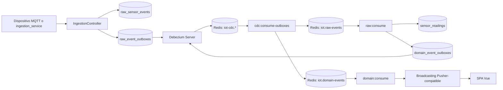
```mermaid
flowchart LR
    Producer["Dispositivo MQTT o ingestion_service"] --> Ingest["IngestionController"]
    Ingest --> Raw[("raw_sensor_events")]
    Ingest --> RawOutbox[("raw_event_outboxes")]
    RawOutbox --> Debezium["Debezium Server"]
    Debezium --> CdcStream[("Redis: iot-cdc.*")]
    CdcStream --> CdcConsumer["cdc:consume-outboxes"]
    CdcConsumer --> RawStream[("Redis: iot.raw-events")]
    RawStream --> RawConsumer["raw:consume"]
    RawConsumer --> Readings[("sensor_readings")]
    RawConsumer --> DomainOutbox[("domain_event_outboxes")]
    DomainOutbox --> Debezium
    CdcConsumer --> DomainStream[("Redis: iot.domain-events")]
    DomainStream --> DomainConsumer["domain:consume"]
    DomainConsumer --> Broadcast["Broadcasting Pusher-compatible"]
    Broadcast --> SPA["SPA Vue"]
```

El contrato de confirmación de POST /api/ingestion/events sólo afirma que el recibo crudo quedó persistido (status: received); no afirma que haya sido publicado o procesado. El consumidor crudo normaliza lecturas y usa raw_sensor_events.status como ledger del grupo. Los consumidores emplean grupos de Redis, XREADGROUP, XAUTOCLAIM, ACK y DLQ para recuperar entregas pendientes. Véase [docs/INGESTION_PIPELINE.md](docs/INGESTION_PIPELINE.md).

La vía compatible POST /api/sensors/{sensor}/readings sigue existiendo para dispositivos con API key. No sustituye el flujo raw-first descrito arriba.

### Lectura de gráficas y tiempo real

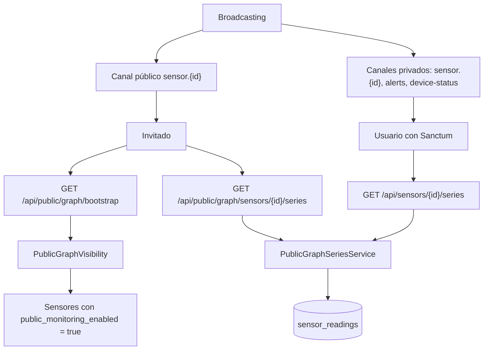
```mermaid
flowchart TB
    Guest["Invitado"] --> Bootstrap["GET /api/public/graph/bootstrap"]
    Bootstrap --> Visibility["PublicGraphVisibility"]
    Visibility --> PublicSensors["Sensores con public_monitoring_enabled = true"]
    Guest --> PublicSeries["GET /api/public/graph/sensors/{id}/series"]
    PublicSeries --> SeriesService["PublicGraphSeriesService"]
    SeriesService --> Readings[("sensor_readings")]

    User["Usuario con Sanctum"] --> PrivateSeries["GET /api/sensors/{id}/series"]
    PrivateSeries --> SeriesService
    Broadcast["Broadcasting"] --> PublicChannel["Canal público sensor.{id}"]
    Broadcast --> PrivateChannels["Canales privados: sensor.{id}, alerts, device-status"]
    PublicChannel --> Guest
    PrivateChannels --> User
```

Las ventanas de serie se solicitan con límites temporales y el frontend identifica/cancela solicitudes históricas por consumidor. La recuperación de tiempo real es una carga acotada desencadenada por suscripción, reconexión, visibilidad o autenticación; el código de producto no utiliza polling periódico de estado. El detector fuente front/scripts/verify-no-polling.mjs forma parte de la verificación.

### Fronteras de acceso

| Superficie | Protección en código | Ejemplos |
| --- | --- | --- |
| Pública de producto | Visibilidad de sensor + throttle:api-read | /api/public/graph/bootstrap, /api/public/graph/sensors/{sensor}/series |
| Ingesta IoT compatible | API key validada por el controlador + rate limit | /api/iot/sensors, /api/sensors/{sensor}/readings |
| Ingesta raw | Middleware ingestion.token + rate limit | /api/ingestion/events |
| Operación autenticada | auth:sanctum | sensores, dispositivos, alertas, dashboard y series privadas |
| Administración | auth:sanctum + admin | catálogos, roles, reglas y configuración |

La SPA es la entrada canónica de dashboard: el backend redirige / y /dashboard a FRONT_URL/dashboard. Aún existen rutas Blade de administración/compatibilidad en back/routes/web.php; no se documentan como una retirada completa de Blade.

## Ejecutar localmente

### Con Docker Compose

El perfil base inicia db, redis, back y front. El perfil workers añade Debezium, outbox-cdc-consumer, raw-consumer y domain-event-consumer.

~~~powershell
$env:DEBEZIUM_DB_PASSWORD = "una-clave-local"
docker compose up -d
docker compose --profile workers up -d
docker compose ps
~~~

El archivo Compose requiere DEBEZIUM_DB_PASSWORD porque MySQL crea el usuario de CDC. Los puertos del host se pueden cambiar con BACK_PORT, FRONT_PORT, MYSQL_PORT y REDIS_PORT. El worker Laravel de colas convencional es opcional y se inicia aparte:

~~~powershell
docker compose --profile queue up -d queue
~~~

La configuración Compose declara dependencias y healthchecks; levantarla no demuestra por sí solo una entrega end-to-end. Para el procedimiento y la evidencia capturada, consulte [docs/implementation/gate-10-evidence.md](docs/implementation/gate-10-evidence.md).

### Sin contenedores

~~~powershell
cd back
composer install
Copy-Item .env.example .env
php artisan key:generate
php artisan migrate
php artisan serve --host=127.0.0.1 --port=8000
~~~

~~~powershell
cd front
npm.cmd install
Copy-Item .env.example .env
npm.cmd run dev
~~~

El servicio Python es independiente y requiere sus propias dependencias:

~~~powershell
cd ingestion_service
python -m venv .venv
.\.venv\Scripts\Activate.ps1
pip install -r requirements.txt
python -m app.main --simulate
~~~

Para procesar el flujo raw-first fuera de Docker también deben estar disponibles MySQL con binlog, Redis, Debezium y los tres comandos Laravel de consumidores; no basta con iniciar el servidor HTTP.

## Verificación

~~~powershell
# frontend
cd front
npm.cmd run test:unit
npm.cmd run build
npm.cmd run audit:no-polling:source

# backend (requiere PHP y dependencias instaladas)
cd ..\back
php artisan route:list --path=api
php artisan test
~~~

Las advertencias JSDOM de canvas y de contexto de router aparecieron durante las pruebas frontend de esta sesión, sin fallos de prueba. No se presentan como evidencia de rendering de navegador ni de backend.

+
## Cumplimiento, alcance y trazabilidad

El repositorio mantiene documentación de alineación académica con ICONTEC e ISO en docs/ICONTEC_COMPLIANCE.md, docs/MATRIZ_TRAZABILIDAD_ICONTEC_ISO.md, docs/EVIDENCIA_CUMPLIMIENTO_CODIGO_ESTRUCTURA.md, docs/PROCEDIMIENTO_AUDITORIA_NORMATIVA.md y docs/REFERENCIAS_ICONTEC.md.

La alineación documental o técnica no equivale a una certificación emitida por un organismo acreditado. Los documentos formales y auditorías fechadas se conservan como evidencia de sus sesiones; para describir el código vigente se debe contrastar con el registro de estado y las rutas/servicios propietarios.

## Arquitectura detallada

### Modelo de dominio persistido

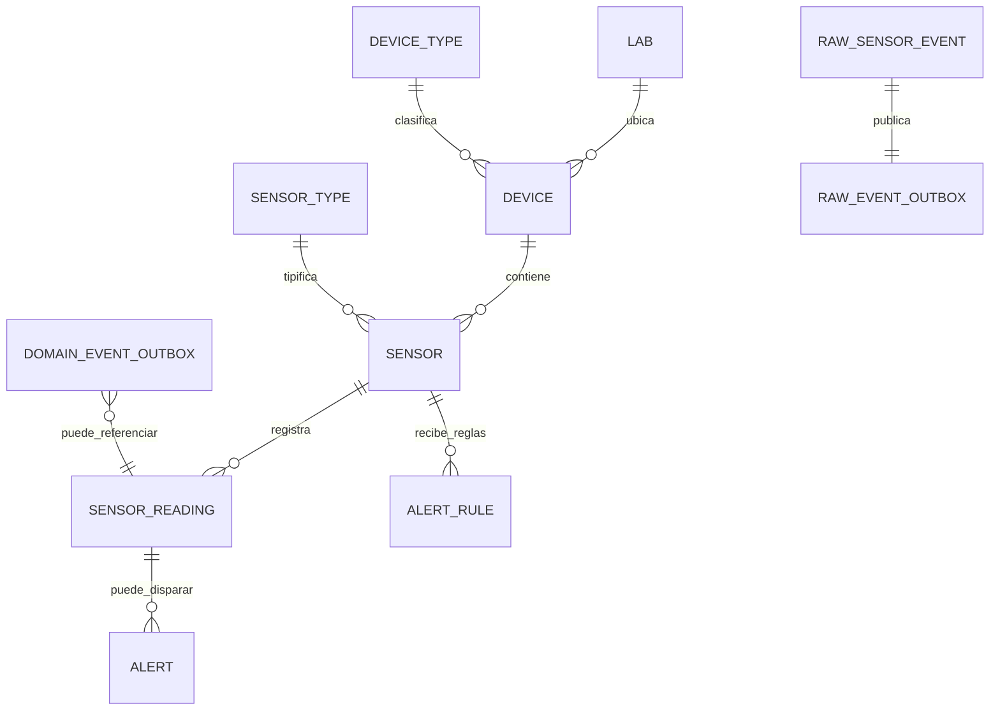
```mermaid
erDiagram
    LAB ||--o{ DEVICE : ubica
    DEVICE_TYPE ||--o{ DEVICE : clasifica
    DEVICE ||--o{ SENSOR : contiene
    SENSOR_TYPE ||--o{ SENSOR : tipifica
    SENSOR ||--o{ SENSOR_READING : registra
    SENSOR ||--o{ ALERT_RULE : recibe_reglas
    SENSOR_READING ||--o{ ALERT : puede_disparar
    RAW_SENSOR_EVENT ||--|| RAW_EVENT_OUTBOX : publica
    DOMAIN_EVENT_OUTBOX }o--|| SENSOR_READING : puede_referenciar
```

Las tablas de outbox y las lecturas se crean mediante migraciones de back/database/migrations. El diagrama expresa relaciones usadas por el modelo; no pretende enumerar cada columna ni declarar claves de negocio que no estén representadas por el código.

### Capas y propietarios

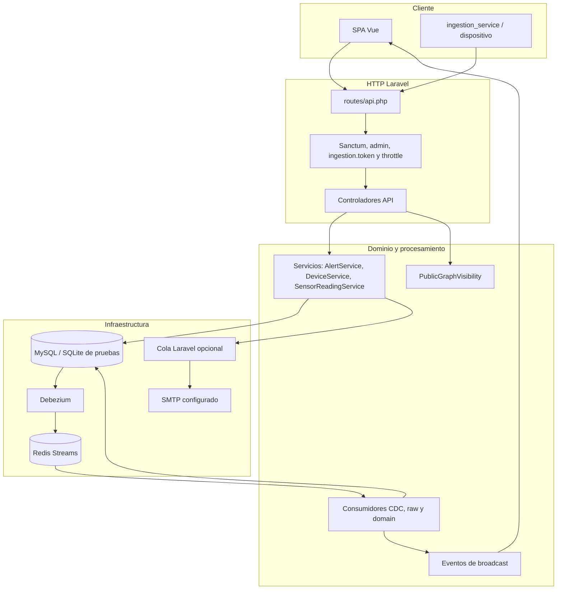
```mermaid
flowchart TB
    subgraph Client["Cliente"]
        SPA["SPA Vue"]
        IngestClient["ingestion_service / dispositivo"]
    end
    subgraph Http["HTTP Laravel"]
        Routes["routes/api.php"]
        Controllers["Controladores API"]
        Middleware["Sanctum, admin, ingestion.token y throttle"]
    end
    subgraph Domain["Dominio y procesamiento"]
        Services["Servicios: AlertService, DeviceService, SensorReadingService"]
        Visibility["PublicGraphVisibility"]
        Consumers["Consumidores CDC, raw y domain"]
        Events["Eventos de broadcast"]
    end
    subgraph Infra["Infraestructura"]
        DB[(MySQL / SQLite de pruebas)]
        Redis[(Redis Streams)]
        Debezium["Debezium"]
        Queue["Cola Laravel opcional"]
        Mail["SMTP configurado"]
    end

    SPA --> Routes
    IngestClient --> Routes
    Routes --> Middleware
    Middleware --> Controllers
    Controllers --> Services
    Controllers --> Visibility
    Services --> DB
    Consumers --> DB
    DB --> Debezium
    Debezium --> Redis
    Redis --> Consumers
    Consumers --> Events
    Events --> SPA
    Services --> Queue
    Queue --> Mail
```

El flujo de entrega durable y el broadcasting son propietarios distintos: cdc:consume-outboxes transforma cambios CDC de outbox en streams de aplicación; raw:consume procesa recibos; domain:consume convierte hechos de dominio en eventos de navegador.

### Ciclo de alerta

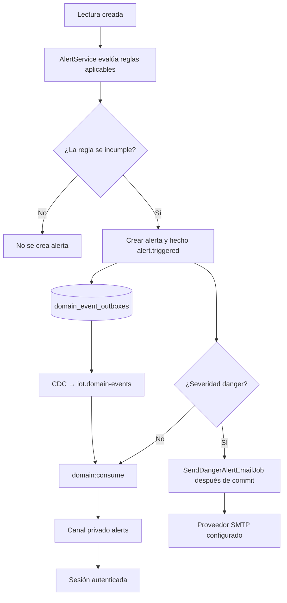
```mermaid
flowchart TD
    Reading["Lectura creada"] --> Rules["AlertService evalúa reglas aplicables"]
    Rules --> InRange{"¿La regla se incumple?"}
    InRange -- "No" --> End["No se crea alerta"]
    InRange -- "Sí" --> Alert["Crear alerta y hecho alert.triggered"]
    Alert --> Outbox[(domain_event_outboxes)]
    Alert --> Email{"¿Severidad danger?"}
    Email -- "Sí" --> Job["SendDangerAlertEmailJob después de commit"]
    Email -- "No" --> Stream
    Outbox --> CDC["CDC → iot.domain-events"]
    CDC --> Stream["domain:consume"]
    Stream --> Private["Canal privado alerts"]
    Private --> User["Sesión autenticada"]
    Job --> Mail["Proveedor SMTP configurado"]
```

La creación de una alerta y la escritura del hecho de dominio son responsabilidad de AlertService. AlertObserver no hace broadcast síncrono; para correo de peligro despacha un job después del commit. La entrega del job depende de un worker de cola disponible.

### Autenticación, roles y broadcasting

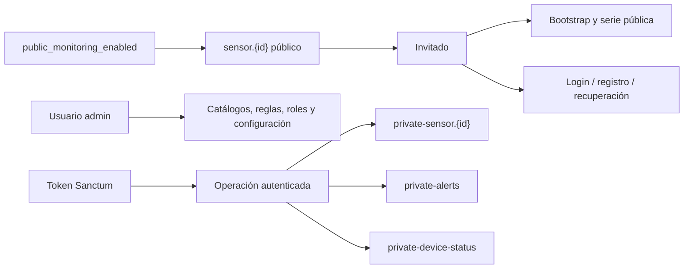
```mermaid
flowchart LR
    Guest["Invitado"] --> PublicGraph["Bootstrap y serie pública"]
    Guest --> Login["Login / registro / recuperación"]
    Auth["Token Sanctum"] --> User["Operación autenticada"]
    User --> PrivateSensor["private-sensor.{id}"]
    User --> Alerts["private-alerts"]
    User --> DeviceStatus["private-device-status"]
    Admin["Usuario admin"] --> AdminApi["Catálogos, reglas, roles y configuración"]
    PublicFlag["public_monitoring_enabled"] --> PublicSensor["sensor.{id} público"]
    PublicSensor --> Guest
```

Los nombres Pusher resultantes incluyen el prefijo private- para canales privados. El frontend administra las suscripciones mediante front/src/realtime/channelRegistry.js; una suscripción no convierte a la aplicación en un sistema con ACL por recurso.

## API actual

La fuente canónica de estas rutas es back/routes/api.php. Para inspeccionar middleware, URI y controlador del entorno instalado:

~~~powershell
cd back
php artisan route:list --path=api
~~~

### Sin sesión

| Ruta | Uso |
| --- | --- |
| GET /api/health | Liveness de infraestructura. |
| GET /api/public/graph/bootstrap | Catálogo mínimo de sensores públicos habilitados para monitoreo. |
| GET /api/public/graph/sensors/{sensor}/series | Serie temporal pública y acotada de un sensor visible. |
| POST /api/auth/login | Emite token Sanctum. |
| POST /api/auth/register | Registro. |
| POST /api/auth/forgot-password | Solicitud de recuperación. |
| POST /api/auth/reset-password | Restablecimiento. |
| GET /api/auth/verify-email/{id}/{hash} | Verificación firmada de correo. |

No están expuestas las antiguas rutas /api/config/public, /api/dashboard/public, /api/alerts/active ni /api/devices/{device}/sensors como superficie anónima.

### Ingesta

| Ruta | Autorización / significado |
| --- | --- |
| GET /api/iot/sensors | Soporte de descubrimiento para dispositivo; SensorApiController valida la API key. |
| POST /api/sensors/{sensor}/readings | Ingesta compatible de una lectura por sensor mediante API key. |
| POST /api/ingestion/events | Ingesta raw con X-Ingestion-Token; persiste recibo y outbox. |

### Operación con Sanctum

- GET /api/auth/me, POST /api/auth/logout y POST /api/auth/resend-verification.
- GET /api/user y GET /api/profile.
- GET /api/config/runtime.
- GET /api/dashboard/metrics; GET y PUT /api/dashboard/preferences.
- GET /api/devices, GET /api/devices/{device}, GET /api/devices/status-snapshot y GET /api/devices/{device}/sensor-list.
- GET /api/sensors, GET /api/sensors/{sensor}, GET /api/sensors/all/readings, GET /api/sensors/{sensor}/readings, GET /api/sensors/{sensor}/readings/export, GET /api/sensors/{sensor}/latest-readings, GET /api/sensors/{sensor}/series y GET /api/sensors/{sensor}/graph-zones.
- GET /api/alerts, GET /api/alerts/active, GET /api/alerts/unresolved, GET /api/alerts/{alert}, PATCH /api/alerts/{alert}/resolve y POST /api/alerts/resolve-all.

GET /api/sensors/{sensor}/series no aplica PublicGraphVisibility: es la vía autenticada para el historial de un sensor restringido.

### Administración con Sanctum y admin

- POST, PUT y DELETE /api/devices; POST /api/devices/{device}/status.
- POST, PUT y DELETE /api/sensors.
- CRUD API de /api/labs, /api/sensor-types y /api/device-types.
- GET, POST, PUT y DELETE /api/alert-rules, además de GET /api/alert-rules/create y POST /api/alert-rules/store por compatibilidad.
- GET /api/metrics; GET /api/users; PATCH /api/users/{user}/role.
- GET y PUT /api/config/alerts, /api/config/general y /api/config/email; POST /api/config/email/test; GET /api/config/system-info.
- GET /api/internal/metrics/api-performance y GET /api/internal/metrics/event-pipeline.

Las rutas administrativas de configuración no deben interpretarse como una fuente pública de configuración.

## Configuración y operación

### Requisitos

- PHP 8.2 o superior y Composer para back/.
- Node.js y npm para front/.
- Python 3.10 o superior para ingestion_service/.
- MySQL, Redis y Debezium para ejecutar el pipeline durable completo fuera de Compose.
- Docker Engine y el plugin Docker Compose para el stack definido en docker-compose.yml.

### Variables relevantes

| Grupo | Variables |
| --- | --- |
| Backend y base de datos | APP_URL, FRONT_URL, DB_CONNECTION, DB_HOST, DB_PORT, DB_DATABASE, DB_USERNAME, DB_PASSWORD. |
| Redis y streams | REDIS_HOST, REDIS_PORT, INGESTION_RAW_EVENTS_STREAM, INGESTION_RAW_CONSUMER_GROUP, DOMAIN_EVENTS_STREAM, DOMAIN_EVENTS_CONSUMER_GROUP, CDC_RAW_OUTBOX_STREAM y CDC_DOMAIN_OUTBOX_STREAM. |
| CDC | DEBEZIUM_DB_PASSWORD y, en Debezium, DB_HOST, DB_DATABASE, DEBEZIUM_DB_USER y DEBEZIUM_DB_PASSWORD. |
| Ingesta | INGESTION_SERVICE_TOKEN; el cliente Python usa BACKEND_BASE_URL y BACKEND_INGESTION_TOKEN. |
| Frontend | VITE_API_BASE_URL y variables VITE_PUSHER_*; no deben contener secretos. |
| Dispositivo compatible | X-Device-Key o api_key, según la ruta y el controlador. |

Las muestras de entorno no son credenciales de producción. No se deben subir archivos .env, copias de .env ni claves a la SPA.

### Runbook mínimo

1. Iniciar la dependencia elegida (Compose completo o servicios locales).
2. Ejecutar migraciones de Laravel.
3. Si se usa raw-first, arrancar Debezium y los consumidores CDC, raw y domain.
4. Abrir la SPA en el puerto configurado.
5. Para un diagnóstico de salud, consultar GET /api/health; para la aplicación, comprobar también autenticación, bootstrap de gráficas o una operación autorizada.
6. Revisar back/storage/logs/laravel.log y las salidas de los contenedores o procesos consumidores.

~~~powershell
# Limpiar cachés Laravel cuando se cambie configuración
cd back
php artisan optimize:clear

# Seguir el log local de Laravel
Get-Content .\storage\logs\laravel.log -Wait
~~~

## Seguridad y observabilidad

### Controles presentes en fuente

- Tokens Sanctum y middleware admin para operaciones administrativas.
- Rate limiters nombrados api-read, api-write y auth-login.
- Middleware ingestion.token para la ingesta raw.
- Validación de payload y API key en las rutas de dispositivo.
- PublicGraphVisibility con decisión fail-closed basada exclusivamente en public_monitoring_enabled.
- Canales privados para alertas y estado de dispositivos; autenticación de broadcasting bajo /api/broadcasting/auth con auth:sanctum.
- Registro de ValidationException, BadRequestHttpException, QueryException y PDOException en back/bootstrap/app.php.
- User protege la elevación de privilegios frente a asignación masiva; las pruebas de seguridad correspondientes se encuentran en back/tests.

Estos controles no sustituyen una revisión de secretos, configuración TLS, rotación de claves, permisos de red ni observabilidad externa del despliegue.

### Métricas y trazas disponibles

EventPipelineMetricsService alimenta GET /api/internal/metrics/event-pipeline para administradores. Los controladores y consumidores registran contexto de errores y operaciones lentas. Las rutas bajo api.metrics registran métricas de rendimiento de API.

La existencia del endpoint no equivale a que haya un sistema de métricas externo, alertas de operación o retención de logs configurados.

## Diagnóstico rápido

| Síntoma | Verificación respaldada por código |
| --- | --- |
| 401 en una ruta autenticada | Renovar o enviar el Bearer token Sanctum; para descubrimiento/lectura IoT, comprobar API key. |
| 404 en serie pública | Confirmar que el sensor existe y tiene public_monitoring_enabled verdadero; un sensor restringido usa la ruta autenticada /api/sensors/{sensor}/series. |
| 422 en ingesta raw | Revisar el contrato validado por StoreRawIngestionEventRequest. |
| 429 | Esperar/reducir solicitudes conforme al limiter de la ruta. |
| El recibo raw queda received | Revisar Debezium, los streams iot-cdc.*, cdc:consume-outboxes y raw:consume; 201 no garantiza procesamiento. |
| No llegan eventos en tiempo real | Comprobar variables VITE_PUSHER_*, backend de broadcasting, token para canales privados y consumidores de dominio. |
| Correo de peligro no llega | Comprobar configuración SMTP y que un worker de colas procese SendDangerAlertEmailJob. |

## Pruebas y calidad

### Frontend ejecutado en esta actualización

~~~powershell
cd front
npm.cmd run test:unit
npm.cmd run build
npm.cmd run audit:no-polling:source
~~~

Resultado capturado: 36 archivos de prueba y 184 pruebas correctas; build de producción correcto; detector de polling de estado correcto. Las pruebas de JSDOM mostraron avisos de canvas y de contexto de router sin convertirlos en fallos.

### Backend y pipeline

El repositorio contiene pruebas de rutas, seguridad, consumidores, publicación CDC, visibilidad pública y contratos de serie en back/tests. La ejecución reproducible requiere PHP, dependencias y, para los escenarios que usan Redis, una instancia compatible:

~~~powershell
cd back
php artisan test
php artisan test --filter=DomainEventBroadcastConsumerTest
php artisan test --filter=Gate10PublicGraphBoundaryTest
~~~

No se ejecutaron esos comandos en esta máquina durante la actualización documental. La evidencia histórica de una suite PHP y Docker está fechada en implementation/gate-10-evidence.md y se debe citar con su entorno, no como resultado fresco.

### Calidad y límites actuales

- SensorApiController concentra todavía CRUD, historial, exportación y zonas de gráfica; docs/PENDING_OPTIMIZATIONS.md conserva su posible separación como trabajo medible.
- SensorMonitorBoard.vue conserva varias responsabilidades de interfaz; su división debe preservar contratos de consulta, tiempo real y cancelación.
- Las rutas Blade no están retiradas por completo.
- Las inyecciones de fallos CDC A–E y la captura formal de red en vivo siguen documentadas como pendientes en la evidencia Gate 10.
- Una gráfica no inventa cadencia, calidad, precisión, freshness o umbrales que el contrato no entregue.

## Archivos clave

| Área | Archivos |
| --- | --- |
| Rutas | back/routes/api.php, back/routes/web.php y back/routes/channels.php |
| Ingesta | back/app/Http/Controllers/Api/IngestionController.php, back/app/Services/Ingestion/RawStreamConsumer.php y ingestion_service/app/ |
| CDC | cdc/application.properties, docker-compose.yml y back/app/Console/Commands/ConsumeCdcOutboxes.php |
| Dominio y alertas | back/app/Services/Alerts/AlertService.php, AlertLifecycleService.php y back/app/Observers/AlertObserver.php |
| Gráficas | back/app/Http/Controllers/Api/PublicGraphController.php, back/app/Services/Monitoring/ y front/src/api/graph.js |
| Tiempo real | front/src/realtime/ y front/src/stores/ |
| Evidencia | docs/implementation/ y docs/INGESTION_PIPELINE.md |

## Mapa ampliado de arquitectura y operación

Esta sección conserva el nivel de detalle del README anterior, pero sus diagramas representan las dependencias y fronteras que están implementadas ahora. Son mapas del código y de la composición declarada; no son prueba de que los procesos estén levantados.

### Contexto del sistema

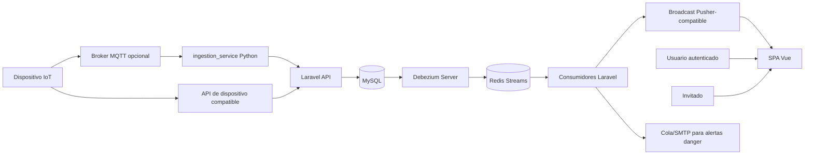
```mermaid
flowchart LR
    Device[Dispositivo IoT] --> MQTT[Broker MQTT opcional]
    MQTT --> Adapter[ingestion_service Python]
    Device --> Compatible[API de dispositivo compatible]
    Adapter --> API[Laravel API]
    Compatible --> API
    API --> MySQL[(MySQL)]
    MySQL --> Debezium[Debezium Server]
    Debezium --> Redis[(Redis Streams)]
    Redis --> Workers[Consumidores Laravel]
    Workers --> Realtime[Broadcast Pusher-compatible]
    Realtime --> Browser[SPA Vue]
    Admin[Usuario autenticado] --> Browser
    Guest[Invitado] --> Browser
    Workers --> Mail[Cola/SMTP para alertas danger]
```

El broker MQTT no forma parte del perfil Compose. ingestion_service puede simular o recibir MQTT y actúa como adaptador HTTP; no sustituye a los consumidores Laravel ni a Debezium.

### Contenedores y procesos declarados

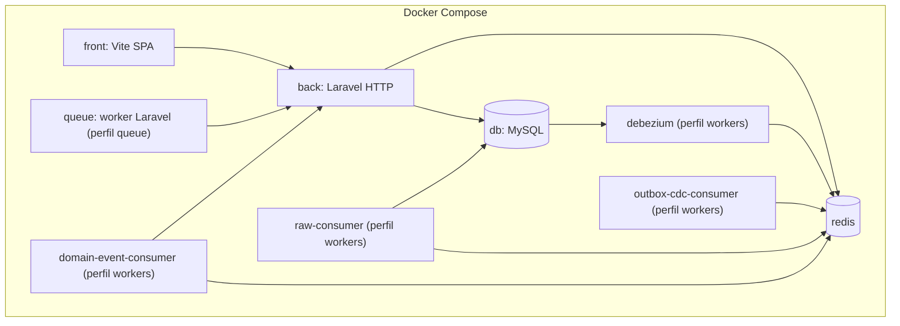
```mermaid
flowchart TB
    subgraph Compose[Docker Compose]
        Front["front: Vite SPA"]
        Back["back: Laravel HTTP"]
        DB[("db: MySQL")]
        Redis[("redis")]
        Queue["queue: worker Laravel (perfil queue)"]
        Debezium["debezium (perfil workers)"]
        Cdc["outbox-cdc-consumer (perfil workers)"]
        Raw["raw-consumer (perfil workers)"]
        Domain["domain-event-consumer (perfil workers)"]
    end
    Front --> Back
    Back --> DB
    Back --> Redis
    Queue --> Back
    DB --> Debezium
    Debezium --> Redis
    Cdc --> Redis
    Raw --> DB
    Raw --> Redis
    Domain --> Redis
    Domain --> Back
```

El perfil base no arranca Queue ni los cuatro componentes de workers. Por eso una instalación para ingestión durable debe habilitar workers, y una instalación que quiera entregar correo en cola debe habilitar queue.

### Ejecución local por responsabilidades

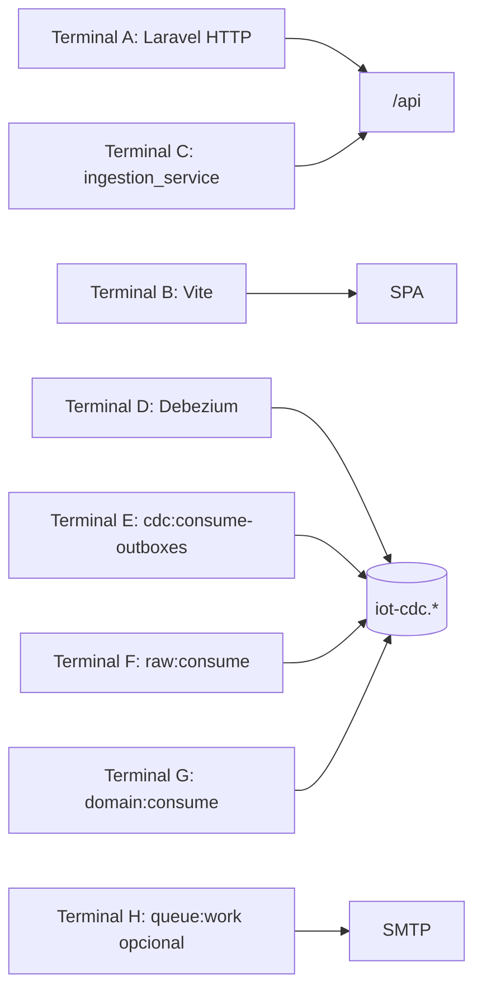
```mermaid
flowchart LR
    TerminalA["Terminal A: Laravel HTTP"] --> API["/api"]
    TerminalB["Terminal B: Vite"] --> SPA["SPA"]
    TerminalC["Terminal C: ingestion_service"] --> API
    TerminalD["Terminal D: Debezium"] --> Stream[("iot-cdc.*")]
    TerminalE["Terminal E: cdc:consume-outboxes"] --> Stream
    TerminalF["Terminal F: raw:consume"] --> Stream
    TerminalG["Terminal G: domain:consume"] --> Stream
    TerminalH["Terminal H: queue:work opcional"] --> SMTP["SMTP"]
```

El comando Composer dev ofrece una conveniencia distinta: inicia HTTP, queue:listen, pail y Vite en paralelo. No inicia MySQL, Redis, Debezium ni los consumidores raw/domain/CDC.

### Mapa de rutas por audiencia

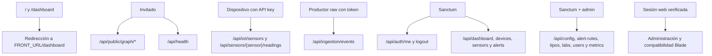
```mermaid
flowchart TB
    Root["/ y /dashboard"] --> Redirect["Redirección a FRONT_URL/dashboard"]
    Public["Invitado"] --> PublicGraph["/api/public/graph/*"]
    Public --> Health["/api/health"]
    Device["Dispositivo con API key"] --> Iot["/api/iot/sensors y /api/sensors/{sensor}/readings"]
    Producer["Productor raw con token"] --> RawIn["/api/ingestion/events"]
    User["Sanctum"] --> AuthApi["/api/auth/me y logout"]
    User --> Operations["/api/dashboard, devices, sensors y alerts"]
    Admin["Sanctum + admin"] --> AdminApi["/api/config, alert-rules, tipos, labs, users y metrics"]
    Legacy["Sesión web verificada"] --> Blade["Administración y compatibilidad Blade"]
```

### Autenticación y autorización de API

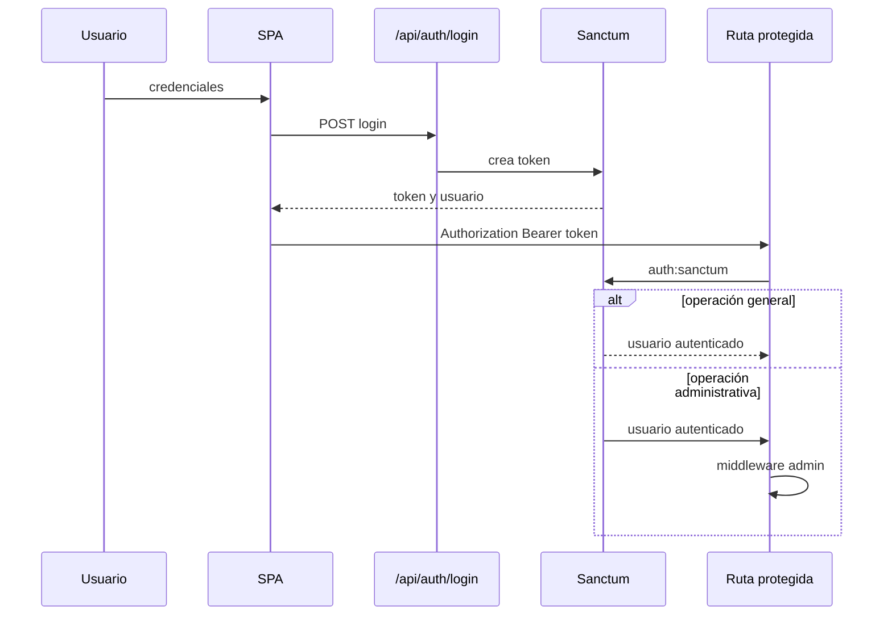
```mermaid
sequenceDiagram
    participant U as Usuario
    participant SPA as SPA
    participant A as /api/auth/login
    participant S as Sanctum
    participant API as Ruta protegida
    U->>SPA: credenciales
    SPA->>A: POST login
    A->>S: crea token
    S-->>SPA: token y usuario
    SPA->>API: Authorization Bearer token
    API->>S: auth:sanctum
    alt operación general
        S-->>API: usuario autenticado
    else operación administrativa
        S->>API: usuario autenticado
        API->>API: middleware admin
    end
```

El registro, recuperación y restablecimiento de contraseña están bajo el limiter auth-login. La verificación de correo usa URL firmada. La autorización de canales privados se procesa en /api/broadcasting/auth con auth:sanctum.

### Permisos de broadcasting

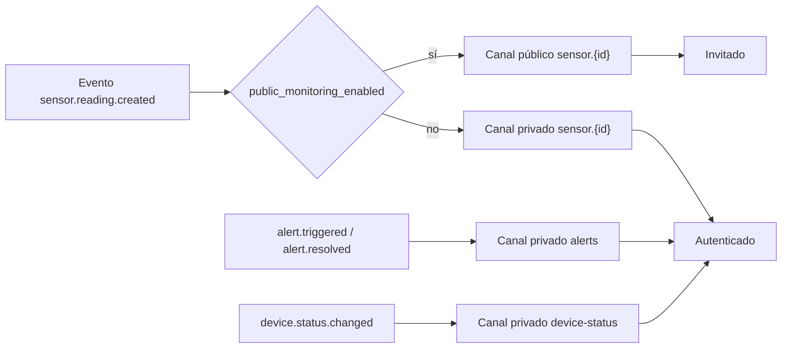
```mermaid
flowchart LR
    Reading[Evento sensor.reading.created] --> Visibility{public_monitoring_enabled}
    Visibility -->|sí| PublicChannel["Canal público sensor.{id}"]
    Visibility -->|no| PrivateSensor["Canal privado sensor.{id}"]
    Alert["alert.triggered / alert.resolved"] --> PrivateAlerts["Canal privado alerts"]
    Status["device.status.changed"] --> PrivateStatus["Canal privado device-status"]
    PublicChannel --> Guest["Invitado"]
    PrivateSensor --> Auth["Autenticado"]
    PrivateAlerts --> Auth
    PrivateStatus --> Auth
```

Los canales privados verifican que el usuario esté autenticado. No hay modelo de propiedad o ACL fina por sensor, alerta o dispositivo: una persona autenticada puede suscribirse a la entidad existente según las reglas definidas en routes/channels.php.

### Decisión de alerta y publicación

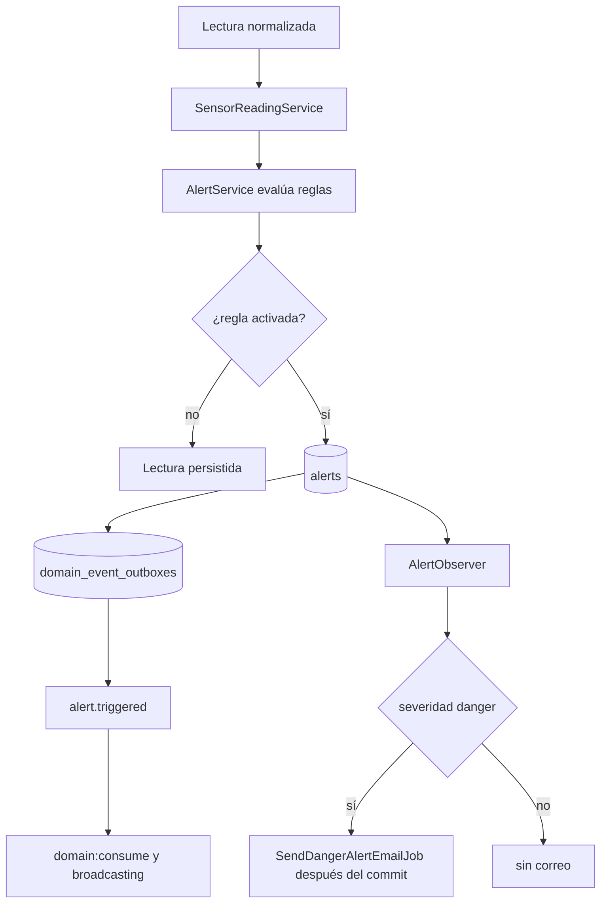
```mermaid
flowchart TD
    Reading[Lectura normalizada] --> Service[SensorReadingService]
    Service --> Rules[AlertService evalúa reglas]
    Rules --> Trigger{¿regla activada?}
    Trigger -->|no| Stored[Lectura persistida]
    Trigger -->|sí| Alert[(alerts)]
    Alert --> DomainOutbox[(domain_event_outboxes)]
    Alert --> Observer[AlertObserver]
    Observer --> Danger{severidad danger}
    Danger -->|sí| Job["SendDangerAlertEmailJob después del commit"]
    Danger -->|no| NoMail["sin correo"]
    DomainOutbox --> DomainEvent[alert.triggered]
    DomainEvent --> Browser["domain:consume y broadcasting"]
```

No se deduce de este flujo que un correo fue enviado: el job requiere una configuración SMTP válida y un worker de colas que lo procese.

### Fallos, reintentos y fronteras de confirmación

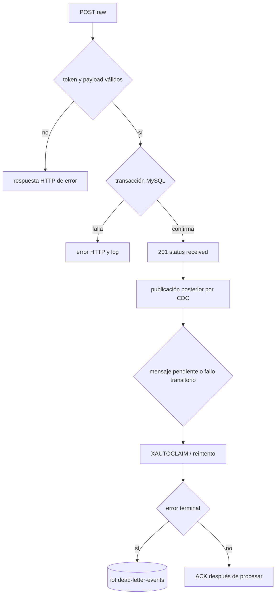
```mermaid
flowchart TD
    Request[POST raw] --> Valid{token y payload válidos}
    Valid -->|no| Reject[respuesta HTTP de error]
    Valid -->|sí| Tx{transacción MySQL}
    Tx -->|falla| Error[error HTTP y log]
    Tx -->|confirma| Accepted[201 status received]
    Accepted --> Later[publicación posterior por CDC]
    Later --> Pending{mensaje pendiente o fallo transitorio}
    Pending --> Claim[XAUTOCLAIM / reintento]
    Claim --> Terminal{error terminal}
    Terminal -->|sí| DLQ[(iot.dead-letter-events)]
    Terminal -->|no| Consume["ACK después de procesar"]
```

La respuesta 201 solamente está al lado de la transacción de aceptación. Un incidente posterior se diagnostica en outboxes, binlog/Debezium, streams, consumidores, DLQ y logs, no se interpreta como una reversión de la respuesta original.

### Recorrido de una serie histórica

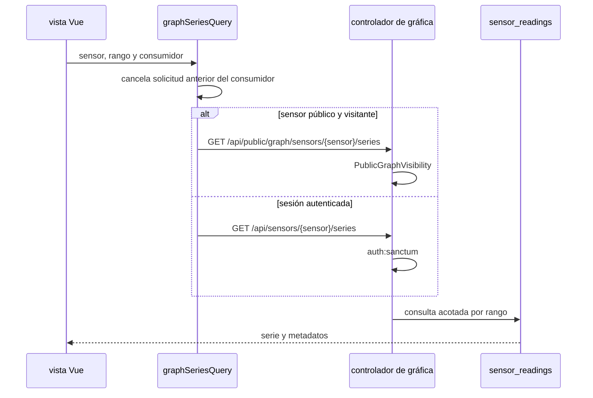
```mermaid
sequenceDiagram
    participant View as vista Vue
    participant Query as graphSeriesQuery
    participant API as controlador de gráfica
    participant DB as sensor_readings
    View->>Query: sensor, rango y consumidor
    Query->>Query: cancela solicitud anterior del consumidor
    alt sensor público y visitante
        Query->>API: GET /api/public/graph/sensors/{sensor}/series
        API->>API: PublicGraphVisibility
    else sesión autenticada
        Query->>API: GET /api/sensors/{sensor}/series
        API->>API: auth:sanctum
    end
    API->>DB: consulta acotada por rango
    DB-->>View: serie y metadatos
```

La capa de consulta no usa polling para estado de producto. Una carga de recuperación puede producirse como respuesta a eventos de ciclo de vida de tiempo real; es una acción delimitada, no un temporizador periódico.

## Mapas operativos adicionales

Los siguientes mapas complementan los anteriores. Cada uno usa sólo rutas, procesos o estados que están declarados en el código fuente y Compose.

### Guardia de navegación de la SPA

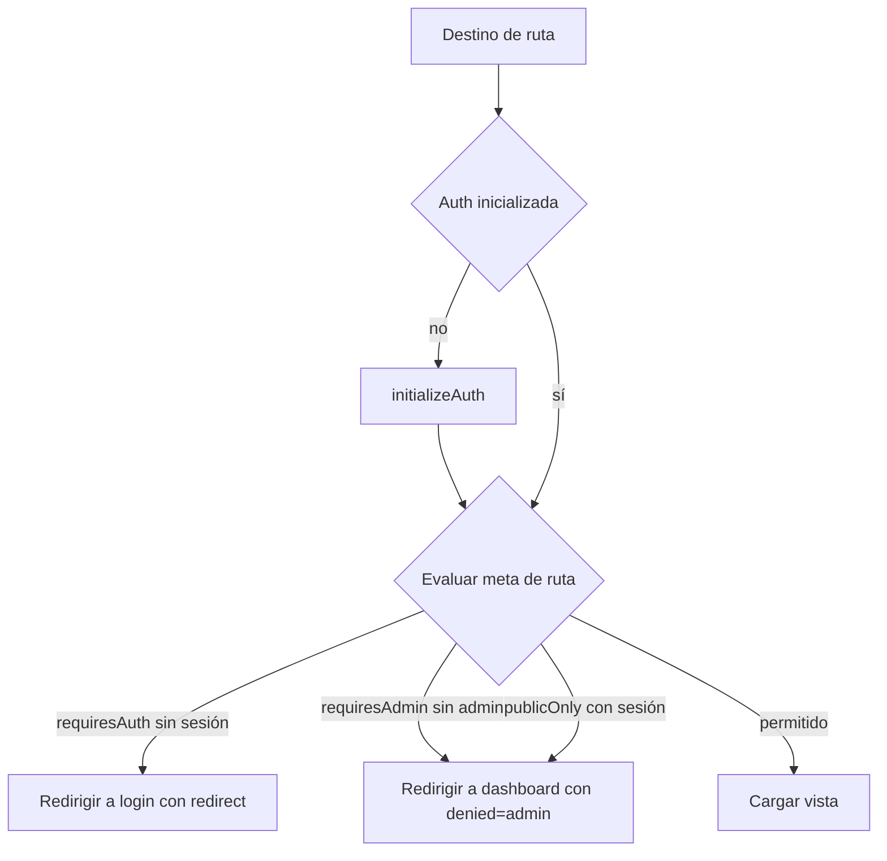
```mermaid
flowchart TD
    Destination["Destino de ruta"] --> Initialized{"Auth inicializada"}
    Initialized -->|no| Initialize["initializeAuth"]
    Initialize --> Evaluate{"Evaluar meta de ruta"}
    Initialized -->|sí| Evaluate
    Evaluate -->|requiresAuth sin sesión| Login["Redirigir a login con redirect"]
    Evaluate -->|requiresAdmin sin admin| Dashboard["Redirigir a dashboard con denied=admin"]
    Evaluate -->|publicOnly con sesión| Dashboard
    Evaluate -->|permitido| View["Cargar vista"]
```

Fuente: front/src/router/index.js. La guardia de cliente mejora la navegación, pero el middleware del backend conserva la autoridad de acceso.

### Dependencias de salud de Docker Compose

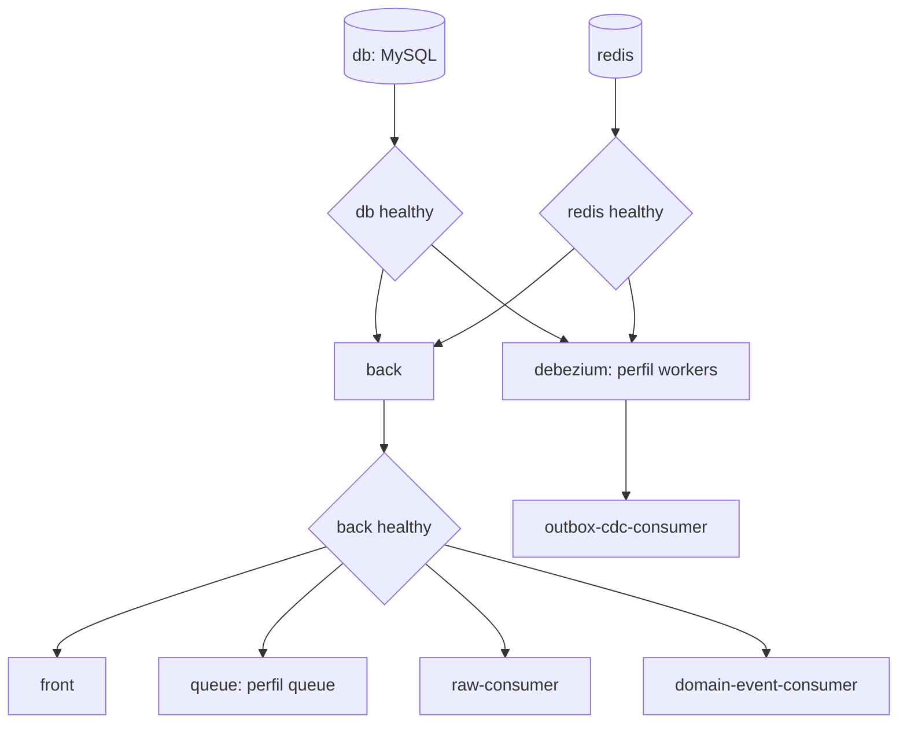
```mermaid
flowchart TD
    DB[("db: MySQL")] --> DBReady{"db healthy"}
    Redis[("redis")] --> RedisReady{"redis healthy"}
    DBReady --> Back["back"]
    RedisReady --> Back
    Back --> BackReady{"back healthy"}
    BackReady --> Front["front"]
    BackReady --> Queue["queue: perfil queue"]
    DBReady --> Debezium["debezium: perfil workers"]
    RedisReady --> Debezium
    Debezium --> Cdc["outbox-cdc-consumer"]
    BackReady --> Raw["raw-consumer"]
    BackReady --> Domain["domain-event-consumer"]
```

Fuente: docker-compose.yml. Las flechas representan dependencias de inicio declaradas, no la dirección del tráfico ni una garantía de que los perfiles opcionales estén activos.

### Modos del adaptador Python de ingesta

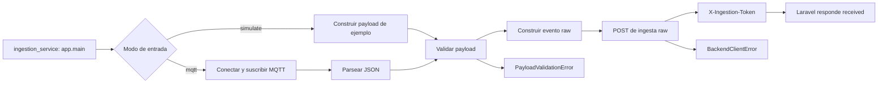
```mermaid
flowchart LR
    Start["ingestion_service: app.main"] --> Mode{"Modo de entrada"}
    Mode -->|simulate| Sample["Construir payload de ejemplo"]
    Mode -->|mqtt| Subscribe["Conectar y suscribir MQTT"]
    Subscribe --> Parse["Parsear JSON"]
    Sample --> Validate["Validar payload"]
    Parse --> Validate
    Validate --> Event["Construir evento raw"]
    Event --> Request["POST de ingesta raw"]
    Request --> Token["X-Ingestion-Token"]
    Token --> Backend["Laravel responde received"]
    Validate --> Invalid["PayloadValidationError"]
    Request --> ClientError["BackendClientError"]
```

Fuente: ingestion_service/app/main.py, mqtt_client.py y backend_client.py. El adaptador entrega eventos al endpoint raw; no procesa directamente Redis Streams ni crea lecturas normalizadas.

### Recuperación de consumidores CDC y raw

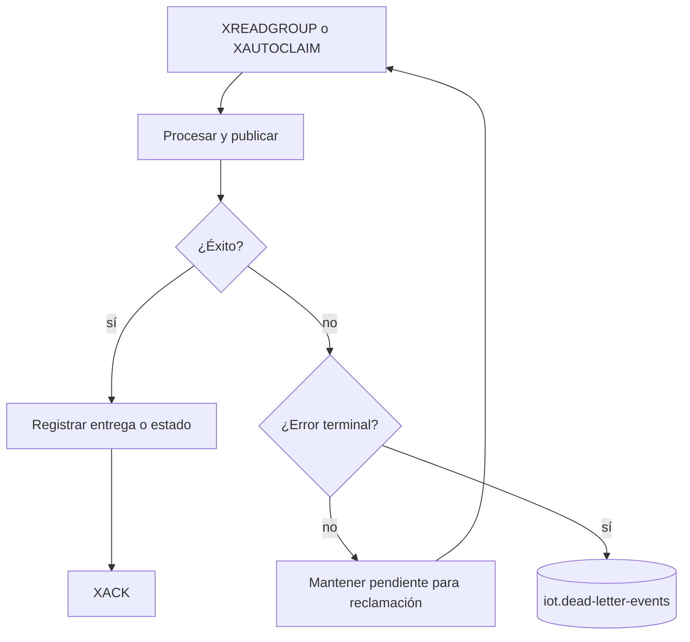
```mermaid
flowchart TD
    Read["XREADGROUP o XAUTOCLAIM"] --> Process["Procesar y publicar"]
    Process --> Result{"¿Éxito?"}
    Result -->|sí| Mark["Registrar entrega o estado"]
    Mark --> Ack["XACK"]
    Result -->|no| Attempts{"¿Error terminal?"}
    Attempts -->|no| Pending["Mantener pendiente para reclamación"]
    Pending --> Read
    Attempts -->|sí| DeadLetter[("iot.dead-letter-events")]
```

Fuente: CdcOutboxStreamConsumer.php y RawStreamConsumer.php. La semántica es al menos una vez: hay reintento y reclamación, no una promesa de exactly-once.

### Selección de frontera para una solicitud API

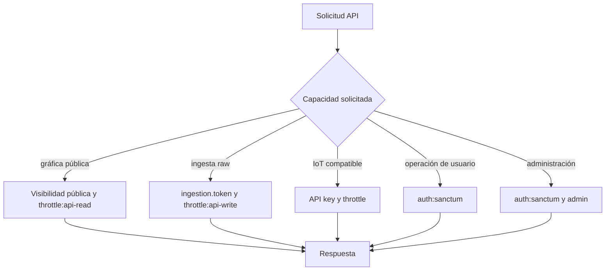
```mermaid
flowchart TD
    Request["Solicitud API"] --> Kind{"Capacidad solicitada"}
    Kind -->|gráfica pública| Public["Visibilidad pública y throttle:api-read"]
    Kind -->|ingesta raw| Raw["ingestion.token y throttle:api-write"]
    Kind -->|IoT compatible| Iot["API key y throttle"]
    Kind -->|operación de usuario| Sanctum["auth:sanctum"]
    Kind -->|administración| Admin["auth:sanctum y admin"]
    Public --> Response["Respuesta"]
    Raw --> Response
    Iot --> Response
    Sanctum --> Response
    Admin --> Response
```

Fuente: back/routes/api.php. La etiqueta de cada rama resume middlewares declarados; las validaciones internas del controlador siguen aplicando cuando existen.

## Inventario de API con contratos de acceso

Las rutas siguientes se obtienen de back/routes/api.php. Los grupos de recursos contienen los verbos estándar index, show, store, update y destroy que Laravel registra; no se asume una ruta no declarada.

### Público y autenticación inicial

| Método y ruta | Control de acceso | Propósito |
| --- | --- | --- |
| GET /api/health | throttle:api-read | Liveness de infraestructura. |
| GET /api/public/graph/bootstrap | throttle:api-read + métricas | Bootstrap mínimo de gráfica pública. |
| GET /api/public/graph/sensors/{sensor}/series | throttle:api-read + métricas + visibilidad | Serie pública acotada. |
| POST /api/auth/login | throttle:auth-login | Obtiene sesión/token mediante controlador de auth. |
| POST /api/auth/register | throttle:auth-login | Registro. |
| POST /api/auth/forgot-password | throttle:auth-login | Inicio de recuperación. |
| POST /api/auth/reset-password | throttle:auth-login | Restablecimiento. |
| GET /api/auth/verify-email/{id}/{hash} | signed + throttle:api-read | Confirmación de correo firmada. |

### Dispositivo e ingesta sin sesión web

| Método y ruta | Protección | Finalidad |
| --- | --- | --- |
| GET /api/iot/sensors | API key validada por SensorApiController + throttle | Descubrimiento compatible de sensores. |
| POST /api/sensors/{sensor}/readings | API key validada por SensorApiController + throttle | Escritura compatible de una lectura. |
| POST /api/ingestion/events | ingestion.token + throttle | Recibo raw-first y outbox transaccional. |

### Usuario autenticado

| Grupo | Rutas declaradas | Operación |
| --- | --- | --- |
| Identidad | GET /api/user, GET /api/profile, GET /api/auth/me; POST /api/auth/logout y /api/auth/resend-verification | Identidad, perfil y ciclo de token/verificación. |
| Configuración de runtime | GET /api/config/runtime | Lectura autenticada de configuración de runtime. |
| Dashboard | GET /api/dashboard/metrics, GET y PUT /api/dashboard/preferences | Métricas y preferencias del dashboard. |
| Dispositivos | GET /api/devices, /api/devices/status-snapshot, /api/devices/{device} y /api/devices/{device}/sensor-list | Lectura autenticada; los cambios de dispositivo exigen admin. |
| Sensores | GET /api/sensors, /api/sensors/{sensor}, /readings, /readings/export, /series, /latest-readings y /graph-zones | Lectura, historial, exportación, serie privada, último dato y zonas. |
| Alertas | GET /api/alerts, /active, /unresolved y /{alert}; POST /resolve-all; PATCH /{alert}/resolve | Consulta y resolución autenticadas. |

Las rutas de dispositivos POST /api/devices, PUT o DELETE /api/devices/{device} y POST /api/devices/{device}/status son administrativas. Las rutas de sensores POST /api/sensors, PUT o DELETE /api/sensors/{sensor} también lo son.

### Administración

| Grupo | Protección adicional | Rutas/acciones |
| --- | --- | --- |
| Métricas | admin | GET /api/metrics, /api/internal/metrics/api-performance y /api/internal/metrics/event-pipeline. |
| Usuarios | admin | GET /api/users y PATCH /api/users/{user}/role. |
| Catálogos | admin | apiResource para /api/labs, /api/sensor-types y /api/device-types, excepto formularios HTML create/edit. |
| Configuración | admin | GET/PUT /api/config/alerts, /general y /email; GET /system-info; POST /email/test. |
| Reglas | admin | GET /api/alert-rules, /create y /{alertRule}; POST / y /store; PUT y DELETE /{alertRule}. |

## Cumplimiento documental y calidad de ingeniería

El material académico y normativo se conserva, no se elimina por ser anterior. Su función es distinta de la documentación operativa: registra marcos y trazabilidad, mientras que este README describe contratos ejecutables y límites actuales.

| Documento preservado | Uso actual |
| --- | --- |
| docs/ICONTEC_COMPLIANCE.md | Política de alineación ICONTEC/ISO. |
| docs/MATRIZ_TRAZABILIDAD_ICONTEC_ISO.md | Matriz de trazabilidad normativa. |
| docs/EVIDENCIA_CUMPLIMIENTO_CODIGO_ESTRUCTURA.md | Evidencia por archivo/estructura para la revisión. |
| docs/PROCEDIMIENTO_AUDITORIA_NORMATIVA.md | Procedimiento de auditoría interna. |
| docs/PLANTILLA_TRABAJO_ICONTEC.md y docs/REFERENCIAS_ICONTEC.md | Plantilla y guía de referencias. |
| DOCUMENTACION_PROYECTO.md | Documento técnico formal histórico, ahora rotulado con su vigencia. |

La presencia de esos documentos no declara una certificación ISO emitida por un organismo acreditado. El alcance sostenible es alineación documental/técnica y trazabilidad, que debe contrastarse contra el código y evidencia fechada.

### Estrategia de pruebas conservada y actualizada

| Nivel | Contenido tangible | Cómo ejecutarlo |
| --- | --- | --- |
| Unit/feature PHP | Reglas, rutas, autorización, validación, consumidores, visibilidad pública y contratos. | cd back; php artisan test |
| Frontend unitario | Componentes, vistas, stores, APIs y tiempo real con Vitest. | cd front; npm.cmd run test:unit |
| Build frontend | Bundle de producción de Vite. | cd front; npm.cmd run build |
| Puertas estáticas | Estructura de fases y detector de polling. | npm.cmd run test:structure, test:phase4, test:phase5, test:phase7 y audit:no-polling:source |
| Auditoría E2E | Scripts Playwright/eventos/red, diferenciados de la suite unitaria. | npm.cmd run audit:baseline, audit:events, audit:network o audit:network:live |

La ejecución de cada comando es evidencia sólo para el entorno y fecha que la emite. En esta actualización se ejecutaron test:unit, build y audit:no-polling:source del frontend; los demás comandos se listan para reproducibilidad, no como resultados nuevos.

### Señales de logs y métricas

| Componente | Señal en fuente | Uso de operación |
| --- | --- | --- |
| Laravel HTTP | back/storage/logs/laravel.log y manejadores de excepciones en bootstrap/app.php | Revisar validación, solicitudes incorrectas, SQL/PDO y errores de aplicación. |
| Consumidores | Comandos cdc:consume-outboxes, raw:consume y domain:consume | Observar outboxes, mensajes pendientes, reintentos, ACK y DLQ. |
| API | Middleware api.metrics e InternalMetricsController | Consultar las métricas administrativas de rendimiento/pipeline. |
| Frontend | Logs de navegador y estado de conexión de realtime | Diagnosticar configuración de Pusher, token, suscripción o reconexión. |
| Compose | docker compose logs para back, debezium y consumidores | Correlacionar el estado de procesos declarados. |

No hay una afirmación de Prometheus, APM, SIEM, retención centralizada ni alertado externo porque no están implementados como parte de este repositorio.

### Respuestas y acciones de diagnóstico

| Respuesta o síntoma | Interpretación prudente | Acción reproducible |
| --- | --- | --- |
| 401 | Falta token Sanctum o API key aceptada por la ruta. | Comprobar cabecera, token y la frontera de la ruta. |
| 403 | Usuario autenticado sin admin, o regla de recurso que lo deniega. | Verificar rol y middleware de la ruta. |
| 404 en gráfica pública | Sensor inexistente o no habilitado para monitor público. | Consultar bootstrap público o usar serie privada con sesión. |
| 422 | El request no supera las reglas del FormRequest/controlador. | Contrastar payload con StoreRawIngestionEventRequest o ruta compatible. |
| 429 | Se alcanzó api-read, api-write o auth-login. | Reducir frecuencia y aplicar backoff en el cliente. |
| 5xx | Fallo de aplicación o dependencia. | Revisar laravel.log, configuración y conectividad de servicio. |
| Recibo raw inmóvil | La aceptación ocurrió, pero la cadena posterior no avanzó. | Revisar binlog, Debezium, iot-cdc.*, outboxes y raw:consume. |
| UI sin cambios en vivo | Suscripción, broadcasting o consumidor de dominio no entrega. | Revisar VITE_PUSHER_*, auth privada y domain:consume. |

## Superficie SPA y persistencia

### Rutas de la SPA

El router de front/src/router/index.js usa createWebHistory y carga las vistas de forma diferida. AppLayout contiene las rutas de producto y el guard inicializa el store de autenticación antes de decidir el acceso.

| Audiencia | Rutas SPA | Comportamiento de guardia |
| --- | --- | --- |
| Visitante | /, /dashboard, /login, /register, /forgot-password, /reset-password y /verify-email/:id/:hash | Un visitante puede abrir dashboard; quien ya inició sesión no vuelve a login/registro. |
| Autenticado | /sensors, /sensors/:id, /devices, /devices/:id, /alerts, /alerts/:id y /profile | Sin sesión se redirige a login con redirect=to.fullPath. |
| Administrador | /alert-rules, /config, /config/general, /config/alerts, /config/email, /config/diagnostics, /labs, /sensor-types, /device-types, /users y /metrics | Sin is_admin se redirige a dashboard con denied=admin. |
| No encontrada | /404 y el comodín | El comodín redirige al nombre de ruta not-found. |

El acceso de la interfaz es una conveniencia de navegación, no el control de seguridad definitivo: las mutaciones y datos administrativos siguen protegidos por los middlewares del backend.

### Entidades persistidas relevantes

| Grupo | Tablas o modelo de datos | Papel en el flujo |
| --- | --- | --- |
| Identidad y catálogo | users, labs, device_types y sensor_types | Usuarios, laboratorios y tipos de inventario. |
| Inventario | devices, sensors y device_status_logs | Dispositivos, sensores y transiciones de estado. |
| Medición y alertas | sensor_readings, alerts y alert_rules | Lecturas normalizadas, incidentes y sus umbrales/reglas. |
| Aceptación durable | raw_sensor_events y raw_event_outboxes | Payload original, estado del recibo y publicación pendiente. |
| Entrega de dominio | domain_event_outboxes | Hechos que el consumidor de dominio convierte en broadcasting. |

Las tablas son el contrato persistido de la aplicación, pero no se deben inferir columnas, cardinalidades ni políticas de retención que no estén declaradas por las migraciones y modelos correspondientes.

### Principios de integración que sí aparecen en código

1. La SPA se comunica con la API; / y /dashboard del backend redirigen hacia FRONT_URL/dashboard.
2. La aceptación raw separa persistencia de procesamiento: el productor obtiene received antes de CDC.
3. Los eventos de dominio se publican desde outbox y consumidores, no directamente desde la respuesta de ingesta raw.
4. La difusión pública depende de public_monitoring_enabled; alertas y estado de dispositivo no son datos invitados.
5. El historial de gráfico público y privado usa rutas distintas; la ruta privada es autenticada, no una excepción a la visibilidad pública.
6. Las rutas Blade restantes se mantienen por compatibilidad/administración y no acreditan que la SPA sea el único renderer del repositorio.

### Límites explícitos para evolución segura

| Tema | Estado actual verificable | Cambio que requeriría trabajo adicional |
| --- | --- | --- |
| ACL de recursos | Autenticación general para series privadas, alertas y estado de dispositivos. | Propiedad, membresías o permisos por sensor/alerta/dispositivo. |
| Eventos | Redis Streams con grupos, reclamación y DLQ. | Garantía exactly-once u orden global. |
| Correo | Job tras commit para alertas danger. | Confirmación de entrega sin worker, SMTP y observación de proveedor. |
| Observabilidad | Logs y endpoints administrativos de métricas. | Telemetría externa, alertado y retención operacional. |
| Blade | Rutas y vistas aún presentes para partes de compatibilidad. | Retiro completo con paridad funcional y validación de ruta por ruta. |
| SQL en Graphify | Un archivo SQL no se indexa sin tree_sitter_sql. | Instalar el parser y regenerar el artefacto. |

## Documentación relacionada

- [Estado del repositorio y matriz de evidencia](docs/implementation/repository-state-2026-09-11.md)
- [Pipeline de ingesta raw-first y CDC](docs/INGESTION_PIPELINE.md)
- [Evidencia Gate 10](docs/implementation/gate-10-evidence.md)
- [Decisiones ADR G1](docs/implementation/adr-g1.md)
- [Estado y plan de migración](PLAN.md)
- [Grafo de código interactivo](graphify-out/graph.html) y [reporte del grafo](graphify-out/GRAPH_REPORT.md)

Los documentos fechados son evidencia de su sesión indicada, no una fuente automática del estado actual. El README y el registro de estado anterior son los puntos de entrada para contrastar afirmaciones con código.
