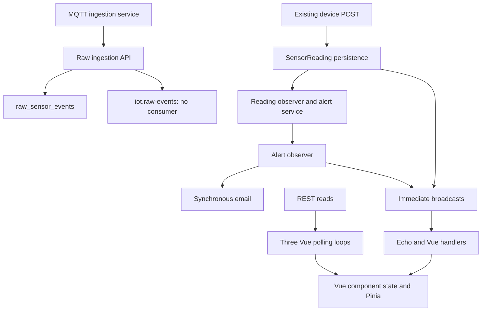
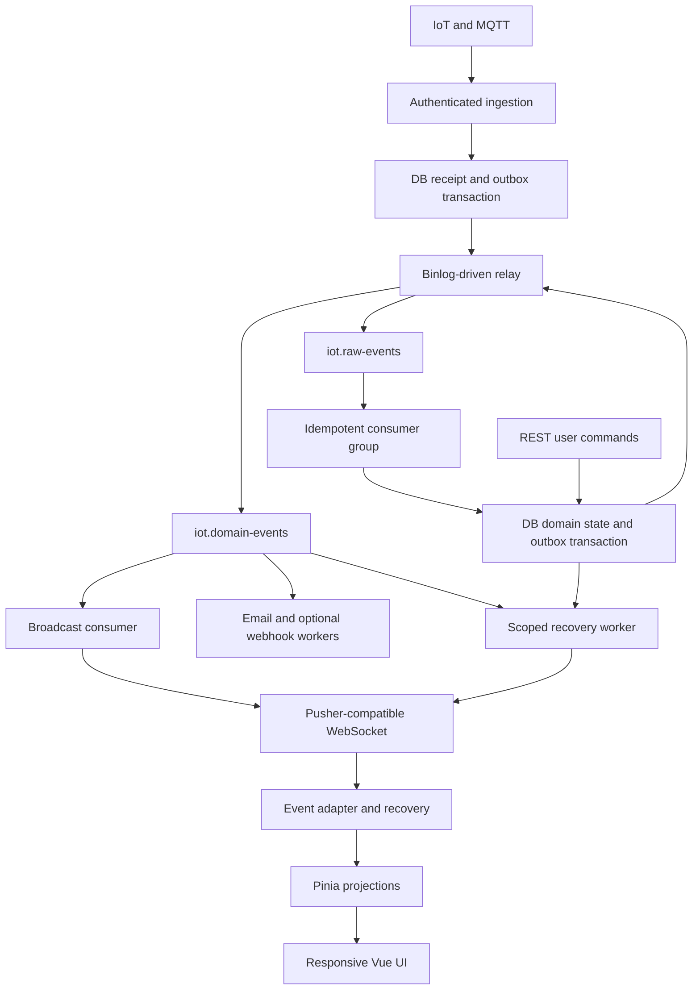

# IoT Platform v2 — architecture audit and implementation plan

**Branch:** `refraccion` · **Audited SHA:** `880cffbcfc7aecb081fb378642d8693c1df64170` · **Date:** 7 September 2026

**Status: source audit and handler simulation completed; Gate 0 mobile visual verification now PARTIALLY CLOSED (see §2a/§4a, updated 7 September 2026 evening). No migration implemented.**

## 1. Executive verdict

The current Vue application has useful responsive foundations. **Update (7 September 2026, evening): Gate 0 is now partially closed.** A real Chromium browser (via a machine-wide Playwright install, not the sandbox's own) was pointed at a real `vite dev` server for this exact checkout, with all `/api/*` calls mocked per §16–18 of the audit brief. 38 role×route×viewport combinations were rendered and screenshotted — see §2a and §4a. 37 of 38 showed no document-level overflow, no console errors, no page errors and no failed requests. One genuine new mobile bug was found (M09, §5) that the earlier source-only pass could not have caught. However, this pass only navigates and screenshots — it does not click, open modals, resize while open, or inject alert/toast events — so M02, M04, M05 and M06 remain source-level findings only, and M03/M07 could not be evaluated at all because of a mock-fixture field-name mismatch (documented in §2a). Mobile readiness is now **partially** certified: page-load-level structural soundness is real evidence; interaction-level and chart/monitor behavior is still not verified.

The architecture is **not fully event-driven**. Three active Vue timers discover state through REST: global alerts every 10 seconds, dashboard alerts every 5 seconds, and sensor monitors every configured interval, normally 2 seconds. The latter does not subscribe to sensor events. Sensor detail does subscribe. Alert creation updates Pinia, but alert resolution and device status have incomplete propagation. Reconnect changes connection status without replay.

The raw ingestion path stores a database receipt and attempts `XADD`; no raw consumer exists in this snapshot. Redis publication failure still returns HTTP 201. Synchronous alert broadcasting and email also remain on the reading creation path.

Keep Vue, Pinia, Bootstrap, Chart.js, Laravel and the Echo singleton. Add reliable ingestion and versioned domain events, repair subscription ownership, and implement recovery **before** deleting timers. A transactional outbox with a binlog-driven relay is recommended to satisfy both durable delivery and the strict prohibition on periodic state discovery. This operational dependency requires a deployment feasibility gate.

The highest migration risk is deleting polling before lifecycle coverage, durable publication and reconnect recovery are complete. The mobile gate remains open.

## 2. Audit environment and evidence

| Item | Result |
| --- | --- |
| Branch verification | `git ls-remote` returned the expected SHA; shallow checkout of `refraccion` |
| Production changes | None; final `git status --short` empty |
| Frontend dependencies | `npm ci --ignore-scripts --no-audit --no-fund` succeeded |
| Locked versions | Vue 3.5.34; Pinia 2.3.1; Bootstrap 5.3.8; Chart.js 4.5.1; Echo 1.19.0; Pusher JS 8.5.0; Vite 5.4.21; Laravel 12.10.2 |
| Build | Passed: 212 modules; JS 592.52 kB / 193.37 kB gzip; CSS 235.82 kB / 32.27 kB gzip |
| Existing checks | `test:structure`, `test:phase4`, `test:phase5`, `test:phase7`: passed; these are structural source checks, not browser tests |
| Dev server | Started successfully on sandbox loopback; this does not prove browser execution |
| Integrated browser | `ENVIRONMENT_CONSTRAINT`: `net::ERR_BLOCKED_BY_CLIENT` at the local audit URL |
| Standalone Playwright (this session) | Resolved: reused a pre-existing machine-wide Playwright/Chromium install (`playwright@1.63.0-alpha`) instead of downloading one; front-end npm deps also required a manual out-of-band `npm install` because this sandbox's own outbound access to `registry.npmjs.org` timed out with zero packages cached — a deeper `ENVIRONMENT_CONSTRAINT` than the original Chromium-only blocker |
| Rendered routes / screenshots | **38 / 38** — see §2a and `front/.audit-e2e/results/*.png` (local, not committed) |
| Handler simulation | 11 scenarios executed against bundled production modules with a fake Echo transport; assertion success includes successful reproduction of defects |
| Real infrastructure | PHP, Redis server and Docker unavailable locally; Laravel integration, real Redis and real browser WebSocket transport not tested |
| Synthetic configuration | `/api`; `synthetic-audit-key`; synthetic cluster; loopback host; no real credentials |
| Synthetic API | Sandbox-only server prepared for auth/profile, dashboard/preferences, config, devices, sensors/readings, alerts, catalogs, rules, users and metrics; browser consumption was not verified |
| Data modes | Normal, long content, empty and dense fixture generators prepared; no claim these rendered |
| Constraints respected | No production access, real email/webhooks, network/proxy/TLS changes, commits or PRs |

Evidence labels used: `SOURCE_CONFIRMED`, `EVENT_HANDLER_SIMULATED`, `ENVIRONMENT_CONSTRAINT`, `NOT_VERIFIABLE`, and — as of §2a — `PLAYWRIGHT_CONFIRMED` (38 real-browser runs). There are still **no** `WEBSOCKET_TRANSPORT_VERIFIED` findings; real Laravel/Redis/WebSocket transport remains untested. Architecture recommendations are proposals, not evidence of implemented behavior.

The archive contains the exact handler observations and verification manifest. Its mobile scripts are **unexecuted scaffolding**, not a passing test suite. No event-driven-architecture skill was listed in this environment; the supplied principles were applied directly.

## 2a. Gate 0 real-browser run (`PLAYWRIGHT_CONFIRMED`, 7 September 2026 evening)

**Setup:** `front/` deps installed out-of-band (this sandbox has no path to `registry.npmjs.org`); `npm run dev` served the real Vue SPA at `http://127.0.0.1:5173`; a real Chromium instance (machine-wide Playwright install, not downloaded fresh) drove it. `front/.audit-e2e/fixtures.mjs` mocks every `/api/*` request the frontend issues (matched by `url.pathname.startsWith('/api/')`, not a glob — an earlier glob version accidentally intercepted Vite's own `/src/api/*.js` source files and broke module loading; fixed before real runs) and injects `iot-platform-v2.auth_token` into `localStorage` for guest/user/admin. `front/.audit-e2e/run.mjs` navigates, waits for network idle, then captures URL, `<h1>/<h2>` heading, console/page errors, failed requests, `innerWidth`/`clientWidth`/`scrollWidth`, and a full-page screenshot. **This harness only navigates and screenshots — it never clicks, opens a modal, resizes mid-session, or injects a realtime event.**

**Coverage:** 38 runs — `/dashboard` (guest/user/admin), `/login` (guest), `/devices`, `/devices/1`, `/sensors`, `/sensors/1`, `/alerts`, `/alerts/1`, `/profile` (user/admin each), `/config`, `/alert-rules`, `/labs`, `/users`, `/metrics` (admin) all at 390×844; plus `/dashboard`(guest), `/devices`(admin) and `/config`(admin) swept across 320×700, 360×800, 430×932, 768×1024, 1440×900. All in `mode=normal` fixture data only — long/empty/dense modes exist in `fixtures.mjs` but were not exercised this run.

**Results:** 37 of 38 runs: `navError: null`, `overflow.hasOverflow: false`, 0 console errors, 0 page errors, 0 failed requests, on first attempt, no retries. One failure:

- **`devices-admin-320x700`: real document-level overflow** — `scrollWidth: 353` vs `clientWidth: 320` (33px). Visually confirmed: `DeviceList.vue`'s 7-column table (`.table-responsive` per `KEEP AS-IS` §6) leaks past its scroll container at 320px specifically — only 3 of 7 columns are visible in the capture, the rest pushed off-canvas rather than staying inside the intended horizontal scroller. Disappears at 360px and above. Filed as **M09** below — this is a genuinely new finding this source-only audit did not catch, since it only manifests at the narrowest breakpoint.

**Two evidence gaps surfaced, disclosed rather than hidden:**
1. `fixtures.mjs`'s `/dashboard/public` mock returns `{devices, sensors, alerts}` counts, but `MetricsCards.vue`/`DashboardView.vue` read `total_devices`/`active_devices`/`total_sensors`/`active_alerts`/`unresolved_alerts`. Field-name mismatch → `SensorMonitorBoard` never receives real device data → renders its empty state in every single run. **M03 and M07 (monitor-card header, chart resize) could not be evaluated in this pass** — not resolved, not refuted, blocked by this fixture gap. Fix before the next Gate 0 pass: correct the mock field names (or synthesize the exact shape) and rerun with real device/sensor data.
2. `/sensors/1` at 390×844 renders its "Tendencia" chart card as an empty white box with zero console errors — could be a genuine Chart.js/canvas-sizing bug or a headless-render timing quirk (ResizeObserver not firing before the 500ms screenshot delay). Not classified either way — open question, needs a targeted follow-up with a longer settle delay or an explicit `chart.resize()` wait.

**M01 re-confirmed, now with a render across all 3 roles at 390px, not just source reading:** `NavBar.vue:48` still hides `/profile` behind `d-none d-md-inline` even inside the expanded mobile hamburger menu — an authenticated user genuinely cannot reach Profile via nav below 768px. Source-confirmed before, now also confirmed against a live render (menu state itself wasn't opened in the capture, so this is "the DOM the browser actually produced has this class," not "we watched someone fail to tap it").

**M02, M04, M05, M06 status downgraded from "no runtime proof" to "no runtime proof, and the proof this harness *can* gather doesn't reach them":** M02 needs long-text injection (this run used short fixture strings and saw clean header wrapping at both 320 and 390 — inconclusive, not a pass); M04 needs a triggered toast (none fired — no alert event was injected); M05 needs an opened modal (none opened — zero clicks in this harness); M06 needs measured `getBoundingClientRect()` on real buttons, not a screenshot glance. All four require an **interaction-capable** follow-up harness (click, inject event, measure), not just navigate-and-screenshot.

Two secondary UX observations from the visual pass, not filed as new bugs (consistent with the existing `.table-responsive` `KEEP AS-IS` policy in §6): `/users` and `/alerts` at 390px truncate their rightmost table column (Acciones / Fecha) with no visible scroll affordance in the static capture — worth a human look at whether users notice the table scrolls, but not document overflow and not a regression.

## 3. Current architecture

The repository also contains active legacy web routes and Blade files **in this same SHA**, alongside the Vue SPA. They were independently observed in `back/routes/web.php`; they were not borrowed from `main`. The target client is Vue. Existing backend mutation paths must be accounted for when centralizing events, even if the old interface is later retired. Raw ingestion currently does not lead to normalized readings automatically.

## 4a. Mobile Playwright matrix — post-Gate-0 (`PLAYWRIGHT_CONFIRMED` cells; see §2a for method and limits)

`OK` = rendered clean (no overflow, no console/page errors, no failed requests). `OVERFLOW` = document-level horizontal overflow confirmed. `NV` = not run this pass (fixture-gap-blocked or out of matrix scope this round — see §2a, not "neither browser path completed" anymore).

| Screen | 320 | 360 | 390 | 430 | 768 | 1440 | Role(s) tested |
| --- | --- | --- | --- | --- | --- | --- | --- |
| Dashboard | OK | NV | OK | NV | NV | NV | guest, user, admin |
| Login / auth | NV | NV | OK | NV | NV | NV | guest |
| Devices / detail | **OVERFLOW** | OK | OK | OK | OK | OK | user, admin |
| Sensors / detail | NV | NV | OK (chart empty, see §2a) | NV | NV | NV | user, admin |
| Alerts / detail | NV | NV | OK | NV | NV | NV | user, admin |
| Profile | NV | NV | OK | NV | NV | NV | user, admin |
| Config | OK | OK | OK | OK | OK | OK | admin |
| Alert rules / labs / users / metrics | NV | NV | OK | NV | NV | NV | admin |

None of the cells above exercise a modal, a toast, or a long/dense/empty fixture mode — see §2a for exactly what "OK" does and doesn't prove. Device/detail modal (M05) was never opened in this pass.

## 4. Mobile Playwright matrix — original pre-Gate-0 baseline (superseded by §4a above, kept for history)

`NV` = `NOT_VERIFIABLE` because neither browser path completed. These are required test cases, not failures observed in the UI.

| Screen | 320 | 360 | 390 | 430 | 768 | 1440 | Intended role |
| --- | --- | --- | --- | --- | --- | --- | --- |
| Dashboard / monitors | NV | NV | NV | NV | NV | NV | guest, user, admin |
| Login / auth | NV | NV | NV | NV | NV | NV | guest |
| Devices / detail / modal | NV | NV | NV | NV | NV | NV | user, admin |
| Sensors / detail / history | NV | NV | NV | NV | NV | NV | user, admin |
| Alerts / detail / toast | NV | NV | NV | NV | NV | NV | guest dashboard, user |
| Profile | NV | NV | NV | NV | NV | NV | user |
| Config / rules / catalogs | NV | NV | NV | NV | NV | NV | admin |
| Users / metrics | NV | NV | NV | NV | NV | NV | admin |

Start with 390×844; expand only high-risk/shared components to 320×700, 360×800, 430×932, 768×1024 and 1440×900. Use actual top-level viewports for acceptance; a fixed-width screenshot crop is not a mobile test.

## 5. Mobile findings and investigation targets

Nine findings; M01–M08 are source-derived (see §2a for what the Gate 0 render pass could and couldn't add to each), M09 is `PLAYWRIGHT_CONFIRMED`.

| ID | Source observation | Confidence / priority | Required runtime proof and conditional change | Gate 0 status |
| --- | --- | --- | --- | --- |
| M01 | `NavBar.vue` hides the only profile link with `d-none d-md-inline`; profile is absent from `navItems` | High / P1 | At 390px an authenticated user must be able to reach Profile through navigation. Add a mobile-visible profile entry while retaining collapse | Re-confirmed against a live 390px render (§2a); menu open-state not clicked |
| M02 | Device/sensor/rule/admin page headers use horizontal flex groups; several lack wrap/stack rules | Medium / P2 | Measure heading and action bounds at 320/390 with long text. Stack or wrap only failed shared headers | Inconclusive: short fixture text rendered clean at 320/390; long-text mode not run |
| M03 | `.monitor-card__header` places long sensor titles beside a button group without a narrow-width rule | Medium / P2 | Add 3 charts, use long sensor names, test move/remove at 320. Consider `min-width:0`, wrapping and a stacked action group | Blocked: mock fixture field-name mismatch means the board never receives device data (§2a) |
| M04 | **Strengthened 7 September 2026 (source-verified, no Playwright needed for this part):** Bootstrap's `--bs-toast-max-width: 350px` is applied as `width`, not `max-width` (`front/node_modules/bootstrap/dist/css/bootstrap.css:5391,5402`). `AlertToast.vue`'s scoped styles (lines 95–112) never override it. This guarantees the toast is 30px wider than a 320px viewport **before any content is added** — not just a risk under long content as originally framed. Positive counterpoint: `AlertToast.vue:7–9` already has `role="status" aria-live="polite" aria-atomic="true"` — it is not accessibility-blank like the modals (M05) | High / P1 (upgraded from Medium/P2) | Override `--bs-toast-max-width` or set an explicit responsive width in `AlertToast.vue`'s own styles; then inject a long critical alert at 320/390 to confirm the fix and check close-button reachability | Not exercised via Playwright: no alert event injected, no toast fired; the fixed-width defect above is source-confirmed independent of that |
| M05 | Device and shared rule modals use plain containers, with no dialog role, modal ARIA, focus trap or Escape handler in their code | High / P1 | Keep existing width/height CSS; test focus entry, containment, Escape and return focus. Add accessible dialog behavior | Not exercised: harness never clicks to open a modal |
| M06 | `btn-sm` and close controls are widespread | Medium / P2 | Measure actual hit regions and spacing. Aim for 44×44 on important actions; do not label every smaller control an AA failure | Not exercised: needs `getBoundingClientRect()` measurement, not a screenshot glance |
| M07 | Charts specify responsive sizing but rely on parent geometry | Medium / P2 | Measure canvas and parent through 390→320→768→390; test dense data and multiple charts | Blocked: same mock gap as M03; separately, `/sensors/1` chart rendered empty in all runs (unclassified — could be a real bug or a headless timing quirk) |
| M08 | Large initial JS chunk and eager router imports are build/source-confirmed | High / P2 | Measure mobile startup before budgeting; lazy-load admin/auth/detail routes where useful. Build size alone is not measured user latency | Not applicable to this pass (needs perf timing, not screenshots) |
| M09 | `PLAYWRIGHT_CONFIRMED`: `DeviceList.vue`'s 7-column table overflows the document at 320×700 specifically (`scrollWidth 353` vs `clientWidth 320`); passes clean at 360px+. **Root cause corrected 7 September 2026:** a source-level pass traced the actual ancestor chain (`AppLayout .app-shell` → `main.app-main` → `.container-fluid` → `DevicesView <section>` → `.content-panel` → `.table-responsive`) and found **no flex/grid container wraps `.table-responsive`** — the original "flex/grid ancestor missing `min-width:0`" mechanism is unsupported by source and should not be repeated. Two more plausible, source-verified contributors instead: (1) `DevicesView.vue:3–14`'s page header is the same un-wrapped `d-flex justify-content-between` pattern as M02, admin-only (two extra buttons), which lines up with only the *admin* devices run overflowing; (2) `DeviceList.vue:44–62`'s 3-button `.btn-group.btn-group-sm` in the Acciones column has no truncation, though `.table-responsive` should normally contain that on its own | High / P1 (new) | Fix the M02-pattern header first (same fix, same file family); re-run at exactly 320×700 to see if that alone resolves `hasOverflow`. The exact leak mechanism inside the table itself is **NOT_VERIFIABLE from source alone** — needs live DOM/computed-style inspection, not just a CSS read | **Confirmed via real render + screenshot**, `front/.audit-e2e/results/devices-admin-320x700.png`; root-cause mechanism corrected via source verification, not yet re-confirmed via a second Playwright run |

The 44×44 target is a product usability preference. WCAG 2.2 AA criterion 2.5.8 generally uses 24×24 CSS pixels with defined exceptions; contrast, focus and other criteria need separate checks. [W3C target-size guidance](https://www.w3.org/WAI/WCAG22/Understanding/target-size-minimum.html).

## 6. KEEP AS-IS

- Vue 3, Pinia, Router, Vite, Bootstrap and Sass: no evidence justifies a framework migration or native app.
- Existing hero/toolbar stacking below 991.98px; retain unless measured behavior fails.
- Intentional `.table-responsive` wrappers; horizontal scrolling inside a data table is not automatically document overflow.
- Device modal width `min(960px, 100%)` and bounded vertical overflow: preserve as a **keep candidate**, subject to runtime confirmation.
- Chart.js; bounded monitor history of 60 points and sensor-detail history of 50 points.
- Axios API boundary, REST history/CRUD endpoints, existing public dashboard intent.
- Echo singleton and current event names during compatibility rollout; improve lifecycle ownership around them.
- Laravel alert-rule service, raw receipt persistence, Redis service and `iot.raw-events` name.
- Existing tests as smoke checks; add behavioral coverage instead of treating file/string checks as proof of realtime reliability.

## 7. Complete active Vue polling inventory

| File / function | Interval | Request | Replacement | Target action |
| --- | --- | --- | --- | --- |
| `components/layout/AppLayout.vue:35–53`, `refreshActiveAlerts` | 10,000 ms | `GET /api/alerts/active` | Alert creation + resolution + recovery snapshot | REMOVE timer |
| `components/dashboard/ActiveAlertsCard.vue:59–66`, `load` | 5,000 ms | Same active-alert endpoint | Shared alerts projection | REMOVE timer |
| `components/dashboard/SensorMonitorBoard.vue:525–544` (`startPolling`/`stopPolling`), `:536` (`setInterval`), `:355–367` (`refreshMonitor` — corrected: not colocated with the other two, verified 7 September 2026) | `max(1000, pollInterval)`; default 2,000 ms | `GET /api/sensors/{id}/latest-readings?limit=1` per monitor | Sensor reading events + bounded projection | REMOVE timer and polling-only prop |
| `realtime/useAlertsRealtime.js`, alerts store, navbar/card copy | No independent timer | Declares polling fallback/mode | connecting/live/recovering/disconnected/stale | REMOVE fallback semantics and copy |
| `views/DashboardView.vue:67–86`, configuration forms | Timer configuration only | Supplies sensor interval | Remove/deprecate browser polling setting | REMOVE active frontend use |
| `SensorMonitorBoard.vue:495` | 350 ms timeout | Saves changed layout | User-action debounce | NOT POLLING: retain |
| `AlertToast.vue:88` | 9,000 ms timeout | None | Dismisses visual notification | NOT POLLING: retain |
| Navbar mount/auth change, page refresh, filter/history/CRUD handlers | Event/user-driven | Initial or explicit requests | Keep REST as appropriate | NOT POLLING |

No recursive realtime timeout was found in `front/src`. Docker health checks and `CHOKIDAR_USEPOLLING` concern infrastructure/development, not domain-state propagation. Do not remove them based on a keyword match. The legacy Blade client still exists and is outside the Vue timer count; gate its retirement/access explicitly before calling the entire deployed platform polling-free.

**Source-derived traffic, not production measurement:** active dashboard alert timers produce 6+12 = 18 requests/minute/client. At the default sensor interval, total periodic REST traffic is `18 + 30 × monitor_count`.

| Selected monitors | Sensor reads/min | Alert reads/min | Total/min |
| --- | --- | --- | --- |
| 1 | 30 | 18 | 48 |
| 3 | 90 | 18 | 108 |
| 5 | 150 | 18 | 168 |

This excludes startup, manual actions, retries and WebSocket traffic. Outside the dashboard, the shell adds 6/min where mounted. More than one monitor on the same sensor still causes repeated requests. Five default monitors can exceed the configured 120/min production read limit for one client, before other traffic; local mode disables that limit. Under events, periodic state-discovery requests target zero. No battery percentage or latency improvement was measured.

## 8. Event catalog

Proposed canonical envelopes add `event_id`, `event_type`, `event_version:1`, `occurred_at`, `producer`, `aggregate_type`, `aggregate_id`, `aggregate_version`, `correlation_id`, optional `causation_id`, and a bounded payload. Transport cursor and event identity are distinct. Versions are immutable; additive fields remain compatible.

| Event | Current producer / state | Durable target | Consumer / browser channel |
| --- | --- | --- | --- |
| `raw.sensor.received` v1 | Raw ingestion API publishes DB ID and metadata; currently no type/version | `iot.raw-events` via reliable relay | `raw-process-v1`; no browser channel |
| `sensor.reading.created` v1 | `SensorApiController::store` emits `NewSensorReading` synchronously | `iot.domain-events` | projections, browser fan-out; `sensor.{id}` or authorized scoped equivalent |
| `alert.triggered` v1 | `AlertObserver → NotificationService → NewAlertTriggered` | `iot.domain-events` | alerts projection, email, optional webhook; `alerts` public projection or scoped private channel |
| `alert.resolved` v1 | Missing | `iot.domain-events` | alerts projection + other sessions; same authorized alert scope |
| `device.status.changed` v1 | `DeviceStatusUpdated` class exists; no dispatcher found in application search; API status mutation does not emit it | `iot.domain-events` | device/dashboard projections; replace public `device-status` only if scope requires |
| `device.communication.received` v1 | Emitted by legacy DeviceController; listener updates last communication | Only if communication changes a required projection | Explicit device service; no per-heartbeat browser event unless necessary |
| Connection snapshot / replay frames | Missing | Read from DB + domain transport | Connection-scoped recovery channel; protocol messages, not invented business facts |

For bulk resolution, emit a bounded set of per-alert `alert.resolved` events within transaction chunks. A batch wrapper is optional; do not publish an unbounded list. Add device/sensor catalog change events only for fields required to remain live in active dashboards; otherwise refresh through explicit navigation/actions. The live-surface inventory must make this distinction explicit.

## 9. Observer / listener matrix

| Trigger | Actual class | Current responsibility | Current execution | Target |
| --- | --- | --- | --- | --- |
| Reading created | `SensorReadingObserver::created` | Calls `checkForAlert`, delegates to AlertService | Sync | One explicit ingestion transaction owns reading/rule processing; observer must not duplicate it |
| Alert created | `AlertObserver::created` | Cache invalidation, broadcast, email | Sync | Domain event stored atomically; independent async effects |
| Alert updated | `AlertObserver::updated` | Cache invalidation on resolution fields | Sync | Explicit resolution service also records durable event |
| Device communication | `UpdateDeviceLastCommunication` | Updates timestamp | Sync; imported `ShouldQueue` is not implemented | Keep small local mutation if needed, emit status transition through service |
| User registration | Framework verification listener | Sends verification notification | Outside domain audit | Preserve; separately review delivery configuration |
| Reading event class `handle()` | `NewSensorReading::handle` | Calls alert evaluation | No invocation registration found | Do not assume event methods execute automatically; remove only after usage verification |

`resolveAll()` uses a bulk query update. Adding an observer alone would not cover this path: Eloquent mass updates do not dispatch individual model events. [Laravel mass-update behavior](https://laravel.com/framework/docs/12.x/eloquent#mass-updates).

## 10. Redis Streams audit

| Concern | Current evidence | Assessment |
| --- | --- | --- |
| Producer | `RawSensorEventPublisher.php:16–46` | `XADD iot.raw-events *` with raw DB identifier; no complete payload, type or version |
| Consumer | No XREAD/XREADGROUP/XACK/XGROUP/XPENDING/XAUTOCLAIM implementation found in backend or ingestion service | Missing; ingestion README explicitly calls consumer future work |
| Publish failure | Publisher returns false; controller logs then returns 201 | Receipt survives; automatic progress is not guaranteed |
| Transactionality | Raw DB insert then Redis write | Material dual-write gap |
| Idempotency | Raw receipt has database-generated ID; no producer-supplied unique event key | MQTT/HTTP redelivery can create duplicate receipts |
| Retention | XADD has no trimming options | Stream growth unbounded in application code |
| Persistence | Redis 7 container and volume; no explicit AOF/replication policy in Compose | Volume alone is not a stated durability/RPO guarantee |
| Retry / pending / DLQ | No consumer lifecycle | Missing |
| Deployment | Queue service optional under `queue` profile; no raw consumer/CDC service | Worker existence cannot be assumed |

Redis persistence must be deliberately configured and failure-tested. AOF policy, replication and backup choices determine loss windows; do not equate an acknowledged `XADD` with zero data loss. [Redis persistence](https://redis.io/docs/latest/operate/oss_and_stack/management/persistence/).

## 11. Redis Pub/Sub role

Not required for the initial target with one broadcaster and the current hosted Pusher-compatible transport. Use it only if a selected self-hosted WebSocket deployment needs cross-process fan-out. It is an ephemeral distribution hop backed by durable events and recovery. It must not carry the only copy of ingestion, outbox notifications or retry work. Browsers never connect to Redis.

## 12. WebSocket / Echo architecture and recovery

Retain one Echo connection **per application/tab**, with a registry keyed by scope/channel and callback ownership. Unsubscribe individual listeners; leave the underlying channel only when its last consumer releases it. **Verified 7 September 2026: this is broader than one composable.** Both realtime composables call the full-channel-teardown `leaveChannel`, not a listener-scoped removal — `useAlertsRealtime.js:141` (`activeEcho.leaveChannel(ALERTS_CHANNEL)`) and `useSensorRealtime.js:82` (`activeEcho.leaveChannel(channelName)`); neither uses Echo's per-listener `channel.stopListening(event)`. Echo's installed source confirms channel-level unsubscribe behavior; the isolated harness reproduces the conflict.

Application lifecycle owns connect/disconnect and authentication changes. An alert-specific reconnect must not silently invalidate sensor subscriptions. Recreate authorization headers when credentials change. Derive connected state from transport/subscription acknowledgements; `useSensorRealtime` currently declares connected immediately after registering a handler.

Set `enabledTransports: ['ws','wss']` for **all** configurations. Currently it is only set for a custom host; the installed Pusher JS includes HTTP fallback transports. No actual fallback activation was tested. Surface an unavailable/stale state when WebSockets cannot connect.

**Recovery protocol:**

1. Confirm authorized subscriptions and buffer live events before establishing the initial snapshot/replay boundary. The attachment's history-then-subscribe example leaves a race.
2. On initial load, reconnect or resume, send one bounded resume command containing a scoped cursor. With hosted Pusher, a one-shot authenticated HTTP POST can enqueue recovery and return 202; recovery data arrives through a connection-specific private channel. It is a command, not a periodic state query or synchronous RPC over a domain bus.
3. If the cursor is retained, replay authorized events after it, ending with an explicit recovery-complete watermark. Merge with buffered live events, deduplicating IDs and enforcing aggregate versions.
4. If the cursor expired, establish a subscription and pre-snapshot stream cursor, read a consistent DB projection containing entity versions, then push the snapshot and catch-up events from that earlier cursor. Discard mutations already covered by snapshot versions. Do not assume a DB auto-increment ID is a commit-order watermark.
5. Bound buffers, history, replay pages and snapshot size. If limits are exceeded, restart recovery with an explicit stale-state message. Persist only scope-safe cursors; invalidate them on principal/scope changes.
6. Handle mobile suspend/resume and visibility restoration as lifecycle events. Transport backoff and known retry deadlines are legitimate timers; periodic GET recovery is forbidden.

This requires server endpoints, authorization, replay retention and a recovery worker: current Pusher/Echo does not supply this application protocol. Public dashboard data can remain public if intentional; separate public-safe projections from private events instead of making guest access fail. Raw operational identifiers, device keys and private user fields must not leak into browser events.

### 12a. NEW FINDING (verified 7 September 2026): zero broadcasting-auth scaffolding exists today

Backend source verification found something the sections above discuss only as a *target* gap, not a *current-state* fact: `back/config/broadcasting.php` **does not exist** (absent from the full `back/config/` listing), `back/routes/channels.php` **does not exist**, there is no `Broadcast::channel(...)` or `Broadcast::routes()` call anywhere in `back/`, and `back/bootstrap/app.php` (76 lines, fully read) calls `withRouting`/`withCommands`/`withMiddleware`/`withExceptions` but never `withBroadcasting(...)`. All three domain broadcast events confirmed using plain public channels — `NewSensorReading.php:27` → `new Channel('sensor.'.$id)`; `NewAlertTriggered.php:26` → `new Channel('alerts')`; `DeviceStatusUpdated.php:28` → `new Channel('device-status')` (this last one is still never dispatched anywhere, confirming the existing §8/§9 claim). Because everything today is a public channel, this absence doesn't break current behavior — but it means **TASK-003 (event contracts and security scope) starts from nothing, not from a partially-wired private-channel system.** Scope TASK-003's effort accordingly: it must create the broadcasting config and auth-route files, not just extend existing ones.

## 13. Webhook and email architecture

No application-domain webhook implementation was found; a Slack logging setting is not one. Keep webhooks disabled until an actual consumer is identified, but define the extension boundary now.

Consume durable alert events into an idempotent delivery record keyed by `(event_id, destination)`. Workers use explicit timeout, bounded exponential retry, HMAC over the exact body with timestamp/key ID, and immutable event version. Record response status, attempt and next deadline. Validate configured destinations against SSRF and redirect-to-private-address risks. Slow delivery must not block ingestion or browser broadcasting.

Email currently calls `Mail::send` through the alert observer path. Move it behind its own worker. Existing rate limiting is not an idempotency ledger; acquiring a rate-limit key before a failed send can suppress a retry. A crash after SMTP accepts and before recording success may still duplicate email: exact-once external delivery requires provider-side support. Webhook recipients must deduplicate the event ID.

## 14. Root causes

| ID | Root cause | Consequences |
| --- | --- | --- |
| RC1 | State propagation ownership split between REST timers, component refs and Pinia | Duplicate requests, competing alert counts, stale summary cards and readings |
| RC2 | Incomplete domain-event coverage | No resolution propagation; unconnected device event; monitor ignores sensor stream |
| RC3 | Non-atomic database persistence and event publication; side effects inside observers | Stranded raw receipts, request failure after persisted data, retry duplication and SMTP coupling |
| RC4 | Missing durable consumer operations | No processing, ack, reclaim, bounded retry, retention or replay |
| RC5 | Transport lifecycle and recovery are not projection lifecycle | False connection state, missed updates, shared-channel teardown and stale dedup state |
| RC6 | Responsive/accessibility acceptance is not behaviorally tested | Mobile quality unknown despite structural checks; profile navigation and dialog semantics gaps |

## 15. Consequential architectural decisions

| Decision | Alternatives | Recommendation / reason |
| --- | --- | --- |
| Domain event transport | Raw stream only vs raw + domain stream | Add domain stream: raw data cannot reconstruct manual resolution/device mutations, and recovery/effects require independently consumable facts |
| Reliable publication | Best effort vs outbox | Outbox justified by observed DB→Redis gap; `afterCommit` alone does not survive process death after commit |
| Outbox relay | SQL polling vs binlog-driven CDC | Select CDC for the strict no-state-discovery-polling rule; require feasibility proof before rollout |
| WebSocket provider | Existing Pusher vs Reverb/self-hosted | Keep current transport first; choose Reverb only for demonstrated deployment/cost/control needs. No browser-to-Redis bridge |
| Broadcasting | Immediate `ShouldBroadcastNow` vs durable async consumer | Independent durable broadcast consumer; browser recovery handles delivery gaps |
| Transition ownership | Broad observers vs explicit service | Service owns reading/alert/device transaction; observers limited to well-defined lifecycle behavior, never sole coverage for bulk writes |
| Recovery | Polling, stream replay, pushed snapshot | Scoped replay with server-pushed snapshot when cursor expired; polling excluded |
| Event sourcing | Full reconstruction from stream vs DB authority | Keep database authoritative; no event sourcing migration |

A MySQL binlog connector can stream row changes after its initial snapshot; exact connector packaging, Redis sink and offset persistence must be verified for the chosen deployment. Do not assume adding “outbox” or Debezium to a diagram creates a working relay. [Debezium MySQL connector](https://debezium.io/documentation/reference/stable/connectors/mysql.html).

### 15a. Complexity review (ponytail pass) — what's justified vs speculative

Applied the "does this need to exist yet" ladder against every proposal in §15/§18/§20 that adds new infrastructure, checked against actual evidence in this repo (no measured throughput, no inspected production deployment, open questions #5/#6/#9 already admit this). Three real simplifications, one confirmed-necessary item, one already-correct call:

- **Binlog CDC relay (TASK-004) is the single biggest over-engineering risk in this plan — defer it.** Nothing in this repo establishes a need for Debezium-class infrastructure: no measured event-loss incident, no multi-consumer fan-out requirement, and the audit's own open question #6 admits "exact connector/sink compatibility is unverified." A CDC connector needs binlog access, an extra service, and offset-persistence ops maturity this `docker-compose.yml` doesn't have today. **Cheaper fix that already exists in this stack:** same-transaction outbox row (already correctly proposed) + a Laravel queued job dispatched via `DB::afterCommit()` that publishes it to Redis and retries with the queue's own backoff on failure. Laravel's queue (`QUEUE_CONNECTION`, already configured; `queue` Compose profile, already defined) is an *already-installed dependency* that solves "retry until the Redis leg succeeds" without inventing a binlog pipeline. Escalate to CDC only if a real deployment later needs guaranteed capture of writes that bypass the outbox path entirely (e.g. a second write path is added) — not preemptively.
- **Dedicated dead-letter stream (`iot.dead-letter-events`, §18/§67) — reuse what's already there instead.** Laravel's own `failed_jobs` table already records payload, exception, and timestamp for a job that exhausts its retries — exactly what §67 asks a DLQ to store. Standing up a second Redis stream plus operator tooling for it before there's any real failure-rate data is premature. Use `failed_jobs` + `php artisan queue:retry` for v1; graduate to a dedicated stream only if failure volume or cross-consumer DLQ sharing actually materializes.
- **Full reconnect/replay protocol (§12, TASK-007) — the 6-step cursor+snapshot+watermark design is more than a v1 needs.** The hard requirement is real ("no polling fallback" is non-negotiable), but the *smallest* thing that satisfies it is: on reconnect, one HTTP request for a fresh authorized-state snapshot (a one-shot action, not a periodic timer — still satisfies the no-polling gate), then resubscribe. Cursor/replay-log/dedup machinery is real engineering that should be added once reconnect *frequency and payload size* are actually measured against this snapshot-refetch approach, not designed against zero data now.
- **Domain event stream (`iot.domain-events`) separate from `iot.raw-events` — confirmed necessary, not over-engineering.** Unlike the above, this has a concrete evidence-based justification already in §47: raw ingestion data cannot reconstruct alert resolution or device-status mutations, which don't originate from raw sensor events at all. Keep as proposed.
- **Webhooks (TASK-010) — audit.md already made the correct lazy call.** "Keep webhooks disabled until an actual consumer is identified" (§13, open question #7) is YAGNI applied correctly; don't build the HMAC/signer/retry-ledger code until a real destination exists. No change needed, flagged here only so a later pass doesn't gold-plate this speculatively.

Full observability (TASK-012: stream length, consumer lag, pending age, retry rate, DLQ count, WS/webhook metrics, §68) should similarly wait for the consumer it measures to exist — start with ad-hoc `XLEN`/`XPENDING` checks or a single artisan command, not a dashboard, until real operation shows what's worth watching continuously.

## 16. CURRENT → TARGET

| Area | Current | Target |
| --- | --- | --- |
| Navigation/shell | Bootstrap collapse, profile hidden on phones | Keep shell; reachable profile; measured navigation/focus |
| Dashboard | Initial summary + polled monitors + separately polled alerts | Shared domain projections; all declared live widgets update consistently |
| Charts | Bounded data, responsive options; monitor REST timer | Initial history + event append/dedup/order; measured resize |
| Tables/forms | Bootstrap tables/forms; runtime unknown | Deliberate table scrollers; no page overflow; reachable actions |
| Modals | Good sizing candidate, incomplete dialog behavior | Preserve sizing, add accessible focus and dismissal |
| Alerts | Creation event + two polling layers | Full lifecycle, consistent counts, bounded notifications |
| Breakpoints/touch | Existing Bootstrap/Sass | Evidence-led local changes; important controls comfortably tappable |
| Ingestion | Stored raw records + best-effort XADD | Durable receipt/outbox + streaming relay + idempotent processor |
| Realtime | No replay; fallback polling | WebSocket-only delivery and event recovery |
| External effects | Sync email, no domain webhooks | Independent queued delivery with known retry deadlines |
| Coverage | Structural checks | Contract, failure, Playwright and no-periodic-network gates |

## 17. Proposed event-driven target

The relay routes typed outbox rows to raw or domain streams; it does not feed domain events back into raw processing. If self-hosted fan-out is later needed, place optional Redis Pub/Sub between WebSocket server processes. It is absent from this initial target.

## 18. Stream and consumer group design

Names below are proposed except `iot.raw-events`.

| Stream | Producer | Group | Purpose | Retention / recovery |
| --- | --- | --- | --- | --- |
| `iot.raw-events` | CDC relay from raw outbox | `raw-process-v1` | Normalize raw receipts into readings | Retain until required groups process plus replay safety margin; retained DB payload must outlive references |
| `iot.domain-events` | CDC relay from domain outbox | `browser-delivery-v1` | Broadcast committed facts | Cover agreed browser disconnect window; replay/DB snapshot beyond it |
| `iot.domain-events` | Same | `email-delivery-v1` | Alert email delivery | Independent checkpoint and delivery ledger |
| `iot.domain-events` | Same | `webhook-delivery-v1`, only when enabled | External delivery | Independent destination attempt history |
| `iot.dead-letter-events` | Processing/delivery failure handler | Operator recovery tooling | Quarantine terminal failures | Retain to operational resolution; avoid embedding secrets |

**Consumer contract:** use Redis-7-compatible `XGROUP`, `XREADGROUP ... BLOCK`, `XACK`, `XPENDING` and `XAUTOCLAIM`. No Redis 8-only options. Within one group workers share work; separate groups receive independent copies. Ack only after a committed idempotent business result and its outbox record, or a durably recorded terminal failure. A crash after commit before ack redelivers safely. [Redis XREADGROUP](https://redis.io/docs/latest/commands/xreadgroup/).

Create a stable producer event key before retransmission; do not use receipt insertion ID as deduplication of a sender's retry. Persist uniqueness for raw `(source, source_event_id)`, reading `(raw_event_id, sensor_key)`, alert `(sensor_reading_id, alert_rule_id)` and consumer `(consumer_name, event_id)`. Raw schemas currently do not enforce these. Preserve distinct legitimate equal-valued readings.

Begin with one raw processor to preserve straightforward sequencing; scale by stable device/sensor partitions when throughput requires it. Multiple workers in one group do not guarantee completion order. Distinguish processing/aggregate version from physical reading timestamp; graph insertion handles late measurements deterministically.

**Pending/retry without periodic discovery:** drain pending work on worker startup/restart and on supervised worker-failure events. Register a known lease deadline for each assigned batch; lease expiry may trigger bounded claim/retry of known work. `XAUTOCLAIM` recovers messages idle beyond the ownership threshold. Do not add a fixed-period PEL sweep and call it zero polling. Persist retry deadlines; restore them on restart. A supervisor/lease mechanism and its quiet-stream recovery test are release dependencies. [Redis XAUTOCLAIM](https://redis.io/docs/latest/commands/xautoclaim/).

Proposed initial processing policy for validation: batch 100; five attempts; bounded backoff; claim threshold above the measured maximum transaction duration. These are tunable starting points, not production facts. Record event ID, source stream, consumer, attempt, error class and timestamp in the DLQ. Quarantine durably before acknowledging the original. Replay with the original business identity and an audited replay correlation.

Use backpressure through bounded in-flight batches; pause intake/processing on capacity or persistence failure instead of silently dropping events. Do not trim past the oldest position still needed by mandatory groups. Define retention from `peak rate × recovery window × event bytes`, then validate memory. Set durable storage/RPO and eviction policy deliberately.

Keep the Laravel queue abstraction where useful, but its current database queue and Redis `block_for:null` do not establish the strict target. Blocking consumption is appropriate; Laravel documents that `block_for:0` waits indefinitely and affects signal handling. Delayed retries and shutdown need an event/deadline wakeup mechanism; stock configuration alone is not a proven zero-polling scheduler. [Laravel queue blocking](https://laravel.com/framework/docs/12.x/queues#blocking).

## 19. Migration roadmap and dependency gates

| Stage | Scope | Gate |
| --- | --- | --- |
| G0 | Freeze SHA; finish browser baseline and fixtures; verify deploy topology and CDC feasibility | **Partially closed** (see §2a): 38 navigate-and-screenshot runs done, 1 new bug found (M09), zero regressions elsewhere. **Still open:** interaction-level proof for M02/M04/M05/M06, chart/monitor proof for M03/M07 (blocked on a mock fixture fix), and all real-infrastructure (Laravel/Redis/WebSocket) verification |
| P1 | Fix source-established profile/dialog issues; reproduce visual blockers first | Mobile cases pass at tested widths; desktop stable |
| P2 | Envelopes, authorization scopes, dedup keys, transition ownership | Mixed-version contracts and duplicate tests pass |
| P3 | Durable receipt/outbox relay + complete raw processor | DB/Redis crash matrix, pending recovery and DLQ pass |
| P4 | Domain events including resolve-all and API device transitions | All mutation paths covered; external effects isolated |
| P5 | Echo registry, Pinia projections and recovery protocol | Reconnect, suspend/resume, scope changes, replay race tests pass |
| P6 | Wire sensor monitors and dashboard projections; remove sensor timer in same cutover | Zero periodic sensor reads, chart correctness, bounded history |
| P7 | Wire alert lifecycle; delete both alert timers and fallback paths | All sessions agree after create/resolve/bulk resolve |
| P8 | Finish device live projections; email and any required webhook consumers | Independent effects, delivery/failure gates |
| P9 | Targeted mobile hardening, route splitting and operational validation | Browser matrix, accessibility, load/failure budget |
| P10 | Retire/gate legacy polling client and obsolete configuration | Deployed route inventory meets zero-polling scope |

Recovery deliberately precedes timer removal. Build and validate the new event path in an isolated environment first; no production rollout step is authorized by this audit. A cutover must not run polling and events as a permanent fallback architecture.

## 20. Implementation backlog

**Task contract conventions:** paths below are relative to the repository root. Proposed new files are explicitly named. Event/stream/group/channel fields refer to sections 8 and 18; Pub/Sub is **not required** for every task. Webhook is **not applicable** unless stated. UI-only tasks have no producer, consumer, idempotency, ordering or backend change. Every realtime task inherits the reconnect, duplicate, cleanup and no-polling gates in section 23. Effort is relative: XS/S/M/L/XL, not an estimate in days.

### TASK-001 — Complete the evidence baseline

**Area / priority / root cause:** QA; P0 prerequisite; RC6. **Current → target:** zero rendered cases → trustworthy mobile/event baseline. **Evidence:** environment manifest and prepared mocks. **Affected files:** proposed `front/tests/e2e/*`, Playwright config and CI job, after baseline runs successfully. **Change:** run contract-correct fixtures, capture screenshots/bounds/console/network and tag simulation level. **Preserve:** untouched baseline SHA. **Acceptance / Playwright:** guest dashboard/login, user devices/sensors/alerts/profile, admin config; start 390 then meaningful boundaries. **Backend verification:** validate fixture contracts against real API tests when available. **Failure / observability:** fail unknown API mocks; retain traces. **Dependencies:** browser runtime. **Effort / risk / confidence:** M / Low / High.

### TASK-002 — Restore mobile profile access and dialog behavior

**Area / priority / root cause:** UX/accessibility; P1; RC6. **Evidence:** M01/M05. **Current → target:** hidden profile entry and incomplete modal semantics → reachable profile and keyboard-safe dialogs. **Affected files:** `NavBar.vue`, `DevicesView.vue`, `SensorsView.vue`, `AlertRuleModal.vue`, other shared modal uses. **Change:** visible mobile profile entry, accessible name/role, initial focus, focus containment, Escape and return focus. **Preserve:** Bootstrap shell, modal sizing and CRUD semantics. **Acceptance / Playwright:** 320/360/390 and desktop; open/cancel/edit/synthetic save, keyboard and resize. **Failure / observability:** no focus escape to background while modal open. **Dependencies:** TASK-001 baseline. **Effort / risk / confidence:** M / Low / High for source gaps; visual details pending.

### TASK-003 — Define event contracts and security scope

**Area / priority / root cause:** domain/API; P0; RC2/RC5. **Evidence:** existing events unversioned, public channel design. **Current → target:** payload conventions → versioned facts and explicit public/private projections. **Producer / event / version:** existing services; catalog v1. **Stream / group / listener / channel:** sections 8/18; adapters validate schema. **Affected files:** `back/app/Events/*`, proposed contracts/fixtures, `front/src/realtime/*`; **`back/config/broadcasting.php` and `back/routes/channels.php` must be created from scratch (verified 7 September 2026: neither file currently exists, no `withBroadcasting()` call exists in `bootstrap/app.php` — see §12a), not just extended.** **Change:** define envelope, scope, aggregate version, backward alias mapping and event ownership. **Preserve:** existing event names during compatibility period. **Idempotency / ordering:** stable event ID and aggregate version. **Failure / observability:** reject malformed required fields, tolerate additions, count rejected payloads without logging secrets. **Acceptance:** mixed producers/consumers; private events denied to unauthorized users; public guest projections work. **Playwright:** guest/user/admin subscription outcomes at 390. **Backend:** payload and channel auth tests. **Dependencies:** deployment scope inventory. **Effort / risk / confidence:** M / Medium / High.

### TASK-004 — Close DB-to-Redis publication gaps

**Area / priority / root cause:** ingestion/reliability; P0; RC3. **Evidence:** raw controller 201 after failed publish. **Current → target:** best-effort DB+XADD → atomic receipt/outbox and resumable relay. **Producer / event / version:** ingestion/domain transaction, typed v1 events. **Stream / group:** raw and domain streams; relay owns durable binlog checkpoint. **Affected files:** `IngestionController.php`, `RawSensorEventPublisher.php`, proposed outbox migrations/relay service, ingestion schema/client, Compose/deploy definitions. **Change:** producer-generated event identity, unique receipt, same-transaction outbox, binlog relay, checkpoint only after accepted delivery; retain replay source across Redis loss. **Preserve:** raw payload and endpoint compatibility where possible; document receipt vs completed-processing status. **Polling removed:** no periodic outbox scan introduced. **Idempotency / ordering:** unique source identity, repeatable XADD with consumer dedup, commit-aware relay. **Failure / observability:** Redis down, relay crash, lost ack and binlog retention gaps; outbox age/lag metrics. **Acceptance / backend:** crash before/after DB commit and XADD; receipt cannot become permanently stranded silently. **Playwright:** later recovered reading appears after infrastructure restoration. **Dependencies:** TASK-003; binlog/sink feasibility gate. **Effort / risk / confidence:** XL / High / High need, Medium deployment fit.

### TASK-005 — Implement the raw consumer lifecycle

**Area / priority / root cause:** ingestion; P0; RC4. **Evidence:** consumer absent. **Current → target:** unused raw stream → normalized domain processing. **Producer / event / version:** TASK-004 relay; `raw.sensor.received` v1. **Stream / group / consumer:** `iot.raw-events`, `raw-process-v1`, proposed Laravel raw processor command/service. **Affected files:** new consumer, normalization/mapping service, dedup migrations, tests and deployment service; existing `RawSensorEvent` and AlertService. **Change:** transaction, XACK, bounded concurrency, restart/lease recovery, retry/DLQ and shutdown. **Preserve:** raw receipt IDs and alert threshold semantics. **Idempotency / ordering:** receipt+sensor and reading+rule uniqueness; begin single processor. **Failure / observability:** malformed payload, missing mapping, duplicate receipt, crash after commit, quiet-stream stuck pending; lag/pending/DLQ metrics. **Acceptance / backend:** one reading and intended alert per logical event across redelivery; XACK only after durable result. **Playwright:** synthetic downstream event updates current projection once. **Dependencies:** TASK-003/004. **Effort / risk / confidence:** L / High / High.

### TASK-006 — Centralize alert and device transitions

**Area / priority / root cause:** domain; P0; RC2/RC3. **Evidence:** observer sync effects, bulk resolution bypass, un-emitted device event. **Current → target:** mutation-specific side effects → one explicit transactional transition owner. **Producer / event / version:** alert resolution/device services; `alert.triggered`, `alert.resolved`, `device.status.changed` v1. **Stream / group / listeners / channels:** domain stream, independent browser/effect consumers, appropriate alert/device scopes. **Affected files:** API and legacy alert/device controllers, observers, AlertService, proposed transition services/outbox calls and DB unique indexes. **Change:** idempotent single/bulk resolution, device state emission, commit-safe immutable payloads; remove synchronous SMTP/broadcast coupling. **Preserve:** API response shape, public monitoring and existing rule behavior. **Idempotency / ordering:** state transition only once; per-alert/device versions; bulk bounded transactions. **Failure / observability:** duplicate command, competing resolve operations, failed broadcast after commit; transition metrics. **Acceptance / backend:** all mutation entrypoints emit exactly the intended durable fact under local transaction guarantees; no claim of exactly-once network delivery. **Playwright:** another session sees resolve/status without refresh. **Dependencies:** TASK-003/004. **Effort / risk / confidence:** L / High / High.

### TASK-007 — Repair Echo ownership and implement recovery

**Area / priority / root cause:** realtime; P0; RC5. **Evidence:** handler simulation and missing recovery code. **Current → target:** shared teardown and reconnect status only → reference-counted subscriptions and recovered projections. **Producer / event / version:** domain stream + server recovery worker; v1 facts, protocol snapshot/replay frames. **Stream / group / channel:** domain/browser-delivery plus connection-scoped recovery channel. **Affected files:** `echo.js`, `useAlertsRealtime.js`, `useSensorRealtime.js`, proposed registry/adapter/recovery store and backend resume endpoint/worker. **Change:** websocket-only all configurations; safe auth refresh; cursor/replay/snapshot buffering; bound dedup and clear scope state. **Polling removed:** fallback states, no REST recovery loop. **Preserve:** one Echo instance per tab. **Idempotency / ordering:** event IDs, entity versions, replay watermark, late reading policy. **Failure / observability:** suspend/reconnect, cursor expiry, replay buffer overflow, connection changes; recovery duration/gap metrics. **Acceptance / Playwright:** two monitors same sensor; remove one; other keeps updating; no event lost between initial history and subscription; auth switch clears inaccessible state. **Backend:** unauthorized cursor/channel rejection and snapshot race test. **Dependencies:** TASK-003/004/006. **Effort / risk / confidence:** XL / High / High need, Medium implementation estimate.

### TASK-008 — Replace sensor polling and unify live dashboard state

**Area / priority / root cause:** frontend; P1; RC1/RC2. **Evidence:** monitor timer, dashboard initial-only summary/readings. **Current → target:** independent REST monitors → shared sensor/dashboard projections. **Producer / event / version:** domain processor; sensor and required dashboard mutation events v1. **Stream / group / listener / channel:** domain → browser adapter → Pinia → `sensor.{id}` and defined dashboard scope. **Affected files:** `SensorMonitorBoard.vue`, `DashboardView.vue`, `SensorDetailView.vue`, proposed readings/dashboard stores, relevant widgets. **Change:** subscribe all selected sensors, dedup shared history load, append bounded ordered samples, synchronize declared live counts/readings/device state. **Polling removed:** `pollTimer`, start/stopPolling, `refreshVisibleMonitors`, polling-only requests/prop. **Preserve:** add/move/remove monitors and saved preferences. **Idempotency / ordering:** reading IDs plus deterministic timestamp/id order; avoid inserting live points into an active historical filter. **Failure / observability:** display stale/disconnected state; bounded memory and rejected payload counters. **Acceptance / Playwright:** 1/3/5 charts, duplicate/out-of-order events, 60-point cap; 390→320→768→390; zero periodic latest-readings. **Backend:** catalog coverage and replay contracts. **Dependencies:** TASK-005/007. **Effort / risk / confidence:** L / Medium / High.

### TASK-009 — Remove both alert timers and complete alert projections

**Area / priority / root cause:** frontend; P1; RC1/RC2. **Evidence:** two timers and handler results. **Current → target:** reconciled-by-polling counts → lifecycle-driven counts/list/toast. **Producer / event / version:** TASK-006; alert created/resolved v1. **Stream / group / listener / channel:** domain/browser-delivery, alert adapter, scoped alerts. **Affected files:** layout AppLayout, ActiveAlertsCard, NavBar, alerts store/realtime, AlertsView and AlertDetailView. **Change:** shared initialization, apply resolution idempotently, ensure resolved events do not enter active list; separate current count from bounded rows; filtered list policy. **Polling removed:** 10s and 5s intervals and all fallback wording. **Preserve:** alert sound preference/toast timer. **Idempotency / ordering:** replay cannot revive resolved alerts; bounded scope-aware dedup. **Failure / observability:** stale state and replay errors visible; event/count mismatch metrics. **Acceptance / Playwright:** create, duplicate, resolve twice, bulk resolve, another session, reconnect; zero periodic active-alert requests. **Backend:** resolution version and race cases. **Dependencies:** TASK-006/007. **Effort / risk / confidence:** L / Medium / High.

### TASK-010 — Isolate external event effects

**Area / priority / root cause:** backend delivery; P1 email, P2 conditional webhook; RC3/RC4. **Evidence:** synchronous Mail::send, no domain webhook. **Current → target:** request-coupled delivery → independent durable attempts. **Producer / event / version:** domain events v1. **Stream / group / consumer:** email-delivery and optional webhook-delivery groups; separate delivery workers; no browser channel. **Affected files:** NotificationService, AlertObserver/Alert mail method, proposed delivery ledger/jobs/webhook signer, queue/deployment config. **Change:** bounded attempts, stable external ID, HMAC, destination checks and event/deadline-driven scheduling. **Preserve:** rate-limit preference as a separate policy. **Idempotency / ordering:** per-event/destination ledger; external receiver/provider constraints explicit. **Failure / observability:** SMTP/HTTP timeout, crash after accepted delivery, terminal failure and manual replay. **Acceptance / backend:** no ingestion delay from an unavailable external destination; idle delayed retries actually wake. **Playwright:** alert appears while email/webhook blocked. **Dependencies:** TASK-004/006. **Effort / risk / confidence:** L / Medium / High for email, Medium for webhook need.

### TASK-011 — Fix only reproduced responsive and performance defects

**Area / priority / root cause:** frontend; P2; RC6. **Evidence:** M02–M04/M06–M08 are source/build risk signals. **Current → target:** unknown behavior → measured responsive acceptance. **Affected files:** failed view headers, monitor header, toast and `main.scss`; router if startup measurement warrants splitting. **Change:** smallest wrap/min-width/spacing fix per failed case; lazy-load routes if useful. **Preserve:** existing working layouts, charts, table semantics. **Failure / observability:** screenshots, element bounds and console evidence. **Acceptance / Playwright:** long/empty/dense states, touch controls, table scrollers, modals, auth and desktop regression. **Dependencies:** TASK-001 plus stable target events. **Effort / risk / confidence:** M–L / Medium / Medium until runtime.

### TASK-012 — Prove reliability and retire obsolete live paths

**Area / priority / root cause:** platform/QA; P0 release gate; RC1–RC6. **Evidence:** legacy routes, missing workers, no behavioral gates. **Current → target:** partial rollout → measured deployment-wide zero polling. **Affected files:** CI, infrastructure definitions, runbooks, metrics, old client route/config gates. **Producer / event / stream:** all target paths. **Change:** deploy mandatory consumers/relay; prove restart/lease/retention behavior; retire obsolete browser interval configuration and legacy live clients after usage review. **Polling removed:** no active Vue state timer; no deployed legacy polling route; no periodic outbox/PEL state sweep. **Preserve:** explicit REST and infrastructure health checks. **Idempotency / ordering:** verify all consumer matrices. **Failure / observability:** crash, Redis loss, lag, poison events, client suspension, signature/replay failures. **Acceptance / Playwright:** network observation plus event delivery under failure; backend fault injection and recovery budgets. **Dependencies:** all applicable tasks. **Effort / risk / confidence:** L / High / High.

## 21. Permanent Playwright and event test plan

Run the original UI with contract-derived API fixtures; mock writes and external delivery. Fail on unexpected endpoints instead of returning success for arbitrary paths. Prepared sandbox mocks are a starting point; real backend contract tests must confirm them before acceptance.

- **Mobile:** collect URL, heading, console/page errors, failed requests, viewport/client/scroll widths; distinguish table scrollers from page overflow. Measure important controls and canvas/parent sizes. Exercise menu open/closed, route change, keyboard, resize while open, long labels, modal cancel/validation/save and filtered data.
- **Network:** record initialization separately. Observe idle state for at least three periods of the longest current state timer (30+ seconds), and use targeted virtual-clock tests where reliable. Assert no recurring latest-state endpoints after cutover. Keep one-shot history, CRUD and resume commands allowed. Check the transport never switches to XHR polling. No target network assertion ran in this session.
- **Event handler:** preserve creation/dedup tests; add resolution, stale/out-of-order versions, filtered-history behavior, shared channel release, auth changes and bounded dedup. Test malformed/missing IDs and numeric values.
- **Real transport:** local Pusher-compatible server, actual browser WebSocket, disconnect/reconnect, permission revocation, expired cursor, subscribe/snapshot race and two tabs. Label separately from injected callback tests.
- **Durable backend:** raw receipt duplicate, DB rollback, Redis outage, consumer death before/after commit and ack, quiet-stream pending recovery, delayed retry wakeup, DLQ transfer crash, retention boundary and restore from durable source. Test email and webhook workers independently.

Executed handler results: singleton reused; creation count 0→1; duplicate count unchanged; resolution unhandled; disconnect mode becomes polling; reconnect merely sets connected; mismatched sensor ignored; two callbacks receive a reading; channel teardown removes the other callback in the substitute; resubscribe after store reset suppresses an old alert ID; direct resolved alert input enters activeAlerts. UI render, toast bounds, chart append and real transport remain unverified.

## 22. Risks and rollback

| Risk | Control / rollback |
| --- | --- |
| Missing event after cutover | Recovery is a precondition. If unavailable, show disconnected/stale state; do not enable polling fallback |
| Duplicate readings or alerts during compatibility migration | Stable source IDs and DB unique constraints before parallel producers; one authoritative mutation owner |
| CDC/Redis offset or persistence loss | Retain source outbox/binlog within recovery budget; replay idempotently; stop and surface unrecoverable retention gaps |
| Late/ordered events | Aggregate versions, deterministic reading order; do not promise global consumer completion order |
| SMTP/webhook duplicate | Delivery ledger + external idempotency where supported; record unavoidable ambiguous completion |
| Public/private channel mismatch | Keep intentional public projection explicit; authorization tests before switching channels |
| Existing Blade mutations bypass new service | Route inventory and shared transition service before retiring old interface |
| Mobile regressions | Complete blocked baseline, preserve screenshots, run focused desktop/mobile acceptance |

Rollback application releases without deleting new durable data, consumer ledgers or outbox rows. Schema changes are additive first. Revert to a previous **event-capable** client or temporarily pause live features. Re-enabling the old polling client would violate the requested target and must not be presented as an acceptable steady-state rollback.

## 23. Definition of done

**Audit status now:** source inventory, architecture decisions, build, structural checks, handler simulation, and a 38-run real-browser navigate/screenshot pass (§2a) are complete. **Gate 0 is partially closed:** page-load-level mobile structural soundness is now real evidence (37/38 clean, 1 new bug M09 found and documented). **Still open:** interaction-level mobile proof (modals, toasts, long/dense content — M02/M04/M05/M06), chart/monitor live-data proof (M03/M07, blocked on a documented mock-fixture fix), and all real-infrastructure (Laravel, Redis, real WebSocket transport) verification. This report still does not certify full mobile readiness or delivery reliability.

**Mobile implementation:** no unintended document overflow at 320; navigation/profile usable at 360/390; meaningful touch targets; correct chart resize/event updates; deliberate table scrolling; no horizontally panned forms; modal keyboard/focus correctness; long toasts fit; guest/user/admin routes work; desktop stable. Accessibility requires measured checks, not CSS inference.

**Event implementation:** no domain-state polling or fallback; one connection per tab; lifecycle events cover all declared live views and mutation paths; versioned durable contracts; stable source IDs; transactional publication; independent consumers with XACK after commit; pending recovery in an idle stream; bounded retry and DLQ; explicit retention/RPO; event ordering and dedup; scoped replay/snapshot recovery including mobile resume; independent async email and required signed webhooks; no browser Redis; operational metrics and mandatory workers deployed.

**No-polling gate:** source inspection plus browser network traces, transport restrictions and backend relay/worker inspection. A passing build or simulated handler is insufficient.

## 24. Genuine open questions

1. What browser/mobile defects actually reproduce? **Partially answered (§2a):** M09 (320px device-table overflow) reproduces; M01 reproduces at the source/DOM level. M02/M04/M05/M06 need an interaction-capable harness (click, inject, measure) to answer; M03/M07 need a mock-fixture fix first.
2. Is the legacy Blade interface still deployed or used? It exists in this branch and affects the platform-wide boundary.
3. Is public access to sensor names, lab names, readings and alerts intentional for the production audience?
4. Which MQTT broker/session/QoS settings and upstream event identity can guarantee replayable delivery? Current callback logs backend failures but has no durable retry spool.
5. What are peak readings/sec, connected clients, monitors/client, acceptable end-to-end latency and supported offline/replay window?
6. Can the deployment operate a supported MySQL-binlog→Redis outbox relay with durable checkpoints? Exact connector/sink compatibility is unverified.
7. Which external webhook consumer, if any, actually exists? Do not build an integration platform speculatively.
8. Does “device status” mean administrative enablement, connectivity or both? Current API synchronizes `status` and `is_active`; this is not evidence of offline detection. If silence must mark a device offline, use broker lifecycle/LWT or a known per-device lease deadline, not repeated status reads.
9. What Redis durability/RPO and binlog/outbox retention can operations support? No real deployment configuration was inspected.

## Appendix A — Hypothesis disposition

| Hypothesis | Status | Evidence / confidence |
| --- | --- | --- |
| H01–H12: mobile layout/navigation/chart/modals/auth assertions | NOT_VERIFIABLE for runtime readiness | Source risks and keep candidates only; no viewport rendered. H01 has a confirmed profile-discoverability gap |
| H13: preserve Vue/Pinia/Router | CONFIRMED as recommendation | SOURCE_CONFIRMED architecture, successful build; High |
| H14: browser coverage insufficient | CONFIRMED for checked repository | Structural scripts found; no existing Playwright workflow located; High |
| H15: redundant alert polling | CONFIRMED | Three-loop inventory includes two alert loops; High; delete only after lifecycle/recovery |
| H16: replace monitor polling | CONFIRMED | SOURCE_CONFIRMED; High |
| H17: sensor events can replace monitors | PARTIAL | Existing sensor event/handler, no monitor subscription or recovery; High |
| H18: alert events can replace polling | PARTIAL | Creation works in simulation; resolution absent; High |
| H19: Echo singleton reusable | CONFIRMED | SOURCE_CONFIRMED + EVENT_HANDLER_SIMULATED; ownership needs repair; High |
| H20: remove polling fallback | CONFIRMED as target requirement | Existing fallback state source-confirmed; High |
| H21: raw producer exists | CONFIRMED | SOURCE_CONFIRMED XADD; High |
| H22: raw consumption incomplete | CONFIRMED | No consumer code; README calls it future; High |
| H23: Streams fit durable processing | PARTIAL | Recommended with persistence/operations prerequisites; Medium |
| H24: Pub/Sub only ephemeral | CONFIRMED as design constraint | No required initial Pub/Sub hop; High |
| H25: keep browser WebSockets/Echo | CONFIRMED as recommendation | Existing integration reusable; real transport NOT_VERIFIABLE; High |
| H26: versioning incomplete | CONFIRMED | No versioned envelope in current raw/broadcast payloads; High |
| H27: idempotency needs work | CONFIRMED | Raw identity/DB uniqueness gaps, check-then-create alerts; High |
| H28: independent webhooks | PARTIAL | Extension design valid; actual integration need unknown; Medium |
| H29: replay replaces fallback | PARTIAL | Protocol proposed; no current recovery implementation or verification; Medium |
| H30: no native app required | CONFIRMED as scope recommendation | Responsive SPA remains appropriate; does not certify present mobile usability; High |

## Appendix B — Source evidence index

All repository links below are pinned to the audited SHA. Line references describe the inspected checkout.

- [Vue layout and global alert timer](https://github.com/yojr23/iot-platform-v2/blob/880cffbcfc7aecb081fb378642d8693c1df64170/front/src/components/layout/AppLayout.vue), `onMounted` block lines 35–62; the actual `setInterval(...)` call is at line 51 (verified 7 September 2026).
- [Dashboard alert card](https://github.com/yojr23/iot-platform-v2/blob/880cffbcfc7aecb081fb378642d8693c1df64170/front/src/components/dashboard/ActiveAlertsCard.vue), `load` function at lines 60–62, `setInterval(...)` at line 66 (verified 7 September 2026, drifted ~1 line from original citation).
- [Sensor monitors](https://github.com/yojr23/iot-platform-v2/blob/880cffbcfc7aecb081fb378642d8693c1df64170/front/src/components/dashboard/SensorMonitorBoard.vue), history limit, per-monitor requests and timer lines 525–556.
- [Dashboard view](https://github.com/yojr23/iot-platform-v2/blob/880cffbcfc7aecb081fb378642d8693c1df64170/front/src/views/DashboardView.vue), initial summary and interval configuration.
- [Echo singleton/config](https://github.com/yojr23/iot-platform-v2/blob/880cffbcfc7aecb081fb378642d8693c1df64170/front/src/realtime/echo.js), lines 21–87.
- [Alert realtime handler](https://github.com/yojr23/iot-platform-v2/blob/880cffbcfc7aecb081fb378642d8693c1df64170/front/src/realtime/useAlertsRealtime.js), fallback, seen IDs and reconnect.
- [Sensor realtime handler](https://github.com/yojr23/iot-platform-v2/blob/880cffbcfc7aecb081fb378642d8693c1df64170/front/src/realtime/useSensorRealtime.js), lines 59–88.
- [Alert store](https://github.com/yojr23/iot-platform-v2/blob/880cffbcfc7aecb081fb378642d8693c1df64170/front/src/stores/alerts.js) — **corrected 7 September 2026:** original citation (lines 175–220) mislocated the dedup mechanism, not just drifted. `resolveAlert` is 175–183, `resolveAll` is 185–191, `addRealtimeAlert` (the real dedup logic, via a `wasKnown` boolean scanning `activeAlerts`/`items`) is 197–221. The literal "seen IDs" `Set` does **not** live in this file at all — it's `seenAlertIds` in [`useAlertsRealtime.js`](https://github.com/yojr23/iot-platform-v2/blob/880cffbcfc7aecb081fb378642d8693c1df64170/front/src/realtime/useAlertsRealtime.js) line 19 (declared) and lines 111–117 (used). Two separate, complementary dedup mechanisms live in two different files — treat them as such in any TASK-007/TASK-009 implementation, don't assume one covers the other. Initial `mode: 'polling'` fallback state confirmed at `alerts.js:79`.
- [Navigation](https://github.com/yojr23/iot-platform-v2/blob/880cffbcfc7aecb081fb378642d8693c1df64170/front/src/components/layout/NavBar.vue), hidden profile and navigation list.
- [Responsive CSS](https://github.com/yojr23/iot-platform-v2/blob/880cffbcfc7aecb081fb378642d8693c1df64170/front/src/assets/styles/main.scss), hero/toolbar breakpoints and modal dimensions.
- [Raw publisher](https://github.com/yojr23/iot-platform-v2/blob/880cffbcfc7aecb081fb378642d8693c1df64170/back/app/Services/Ingestion/RawSensorEventPublisher.php), lines 16–48 (verified 7 September 2026, drifted 2 lines from original citation).
- [Raw API](https://github.com/yojr23/iot-platform-v2/blob/880cffbcfc7aecb081fb378642d8693c1df64170/back/app/Http/Controllers/Api/IngestionController.php), lines 18–45 (verified 7 September 2026; failure path specifically at 35–44).
- [Raw ingestion documentation](https://github.com/yojr23/iot-platform-v2/blob/880cffbcfc7aecb081fb378642d8693c1df64170/ingestion_service/README.md), future consumer description.
- [Sensor write API](https://github.com/yojr23/iot-platform-v2/blob/880cffbcfc7aecb081fb378642d8693c1df64170/back/app/Http/Controllers/Api/SensorApiController.php), lines 105–146.
- [Alert observer](https://github.com/yojr23/iot-platform-v2/blob/880cffbcfc7aecb081fb378642d8693c1df64170/back/app/Observers/AlertObserver.php), lines 15–33.
- [Alert service](https://github.com/yojr23/iot-platform-v2/blob/880cffbcfc7aecb081fb378642d8693c1df64170/back/app/Services/Alerts/AlertService.php), check-then-create lines 55–73.
- [Alert resolution API](https://github.com/yojr23/iot-platform-v2/blob/880cffbcfc7aecb081fb378642d8693c1df64170/back/app/Http/Controllers/Api/AlertController.php), lines 60–86.
- [Device status API](https://github.com/yojr23/iot-platform-v2/blob/880cffbcfc7aecb081fb378642d8693c1df64170/back/app/Http/Controllers/Api/DeviceApiController.php), lines 245–299.
- [Compose](https://github.com/yojr23/iot-platform-v2/blob/880cffbcfc7aecb081fb378642d8693c1df64170/docker-compose.yml), Redis service, queue profile and runtime defaults.
- [Existing backend web routes](https://github.com/yojr23/iot-platform-v2/blob/880cffbcfc7aecb081fb378642d8693c1df64170/back/routes/web.php), independently verified legacy mutation paths.

Primary technical references are linked next to the design claims they support. Repository behavior is established by the checked-out source, not by the supplied prompt's hypotheses.

## Appendix C — Gate 0 real-browser evidence (local, not committed)

Sandbox-only per the audit brief's constraints — these live under `front/.audit-e2e/` (gitignored) and are not pushed to GitHub, so no `https://github.com/...` links exist for them:

- `front/.audit-e2e/run.mjs`, `front/.audit-e2e/fixtures.mjs` — the harness itself.
- `front/.audit-e2e/results/devices-admin-320x700.png` + `.json` — `PLAYWRIGHT_CONFIRMED` evidence for M09 (document overflow).
- `front/.audit-e2e/results/dashboard-*-390x844.png` — `PLAYWRIGHT_CONFIRMED` render evidence supporting the M01 re-confirmation.
- `front/.audit-e2e/results/sensors-1-user-390x844.png` — the unclassified empty-chart observation referenced in §2a and M07.
- `front/.audit-e2e/results/*.json` (38 files) — raw structured output (heading, overflow metrics, console/page errors, failed requests) for every run in §2a/§4a.

